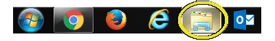
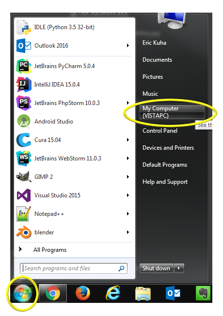
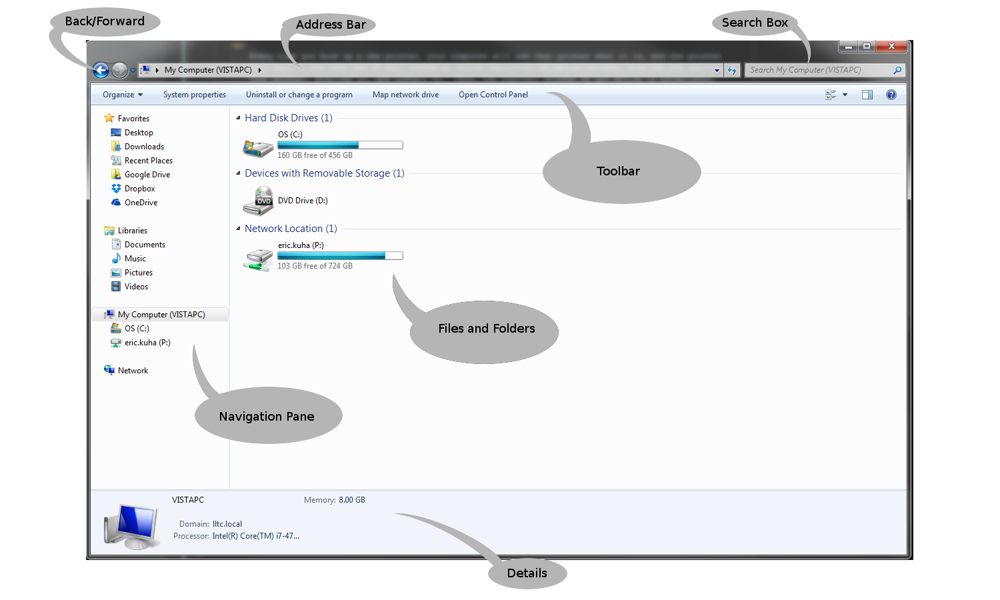

# Introduction

There’s a lot to learn about using a computer and its applications. In fact, we aim to learn a lot about the most important app of all, your operating system (in this case, Windows). But we have to start somewhere, so we’ll start with the file system.

## What is a File System?

The File System is part of an OS that manages long-term storage of data on a computer. This data is stored primarily on the computer’s hard drive. Today’s hard drives can store astonishing amounts of data. Briefly, consider that the most basic data storage unit on a computer is called a binary digit, or a bit. A bit is typically represented as either a 1 or 0. It’s on or off. Clever mathematicians and computer scientists have developed ways of using long strings of bits to represent just about anything, from an email, to a video file to an entire operating system. At the very core, the only thing your computer ever does is manipulate staggeringly long strings of 1s and 0s.

Today, a modern hard drive in a new computer is typically one or two terabytes worth of storage. That’s approximately 8,000,000,000,000 bits. 8 trillion bits. This is enough to store almost 4 million typical resolution image files, around 300 hours of video, or a thousand copies of an old style encyclopedia. Ten terabytes can hold the entire printed collection of the Library of Congress. For more information, [check here](http://www.whatsabyte.com/).

There are many different ways that a computer can divide all those bits and bytes into space for individual files. For example, the typical Windows computer will use either the [NTFS](https://en.wikipedia.org/wiki/NTFS) filesystem or the [FAT-32](https://en.wikipedia.org/wiki/File_Allocation_Table) filesystem, depending on where that file is stored. This is just the tip of the iceberg, and for the purposes of this course, you don’t really need to know this. But if you’re curious, follow the links.

Once again, the computer typically hides all of the complexity of the file system behind a layer of abstraction, so that you don’t really ever have to understand how it works or what it’s doing behind the scenes. Instead, all modern OSs will give you an interface where you can explore your file system and the files in it using some sort of directory system, typically using a [file and folder metaphor](https://en.wikipedia.org/wiki/Directory_(computing)).

Let’s look at an example.

## The Windows Explorer

**Note:** If you are on a Windows machine, see how yours compares to the images below.

You can open your Windows Explorer app by clicking on the folder icon on the system task bar:

 
**The File Manager Icon**

Alternately, you can click on the Windows Start Button and then on the My Computer button:

 
**The Start Menu**

You will see a window open which will look something like this:

**The Windows Explorer App**

Let’s take a look around. Top left, you will see two **navigation buttons** which will allow you to quickly jump back to a previous screen or folder. Moving down, there is the **navigation pane** which features quick links to common and important locations on your computer’s file system. Most of the time, depending on how well you organize your files, what you are looking for will quickly accessible through one of these links. Pay particular attention to the **Libraries** folders. If you are my student at Leech Lake Tribal College, the Documents folder on any computer on campus will link directly to your network drive. Anything you put in that folder will be accessible from any computer on campus. Beware, however, that they will not be accessible unless you are on campus. If you are using your own computer, the **Documents** folder will only be available on that particular computer unless you perform some fairly advanced network drive mapping.

In the above figure, you will also see an **address bar** which will tell you what part of the computer’s file system you are looking at. In this case, it is looking at the very top, root level of the computer. Below that is a context-sensitive toolbar. It will have different tools depending on where in your file system you are. You might see tools for creating new folders, changing the look of the icons, or how much information is displayed. Below that in the main panel of the window, you can see all of the computer’s various storage drives. Windows, by convention, uses letters to name their drives. A: and B: used to be used for old [floppy disk](http://images.google.com/search?tbm=isch&q=floppy+disk) drives and since those are so rare these days, you usually don’t see them. The C: drive is traditionally the drive where the operating system is installed, as well as being the typical general storage drive for all apps and files. You will also see the D: drive which is traditionally the drive letter assigned to an optical drive, in this case, a DVD drive. If you plugged in some sort of USB drive, it would also appear here, usually labeled as E: or F:. Also, you will see any networked drives configured on the computer. In this case, my P: drive is visible. This will take me to the same place as the Documents link in the navigation pane. If you were in any other location of the file system, this main panel will show what files and folders are located there.

The Details pane will show details about the currently selected item. This might include meta data about a file, such as when the file was created, how large it is, and who the author is. It might also tell you how much free hard drive space you have. Finally, in the top right, there is a search box which can be very useful if used within its means. Sometimes, it can be slow though.

Go to your documents folder.

The Documents Folder
The Documents Folder
This is my Documents folder at my workstation at work. Notice that there are many folders for all sorts of different aspects of my job (and hobbies). There are a couple of ways to imagine this all working. You could look at the computer as an enormous file cabinet. And inside each drawer (disk drive) is a bunch of folders (directories). Inside each of those folders are more folders and pieces of paper (files). And each of these folders can be as large or small as you want it to be.

A Directory Tree Representation
A Directory Tree Representation
Another common conceptual model is to look at your directory structure as a sort of branching tree. Each branch of the tree leads to a node which is either a folder or a file. Only folders can lead to other folders or files and the tree can be as large as it needs to be. You can nest folders almost infinitely inside of other folders. Well, most OSs do have an upper limit for the length of a file or folder’s address, but it’s pretty long.

new_folder_button

The most important thing you can do to stay organized is to start being organized right away and maintain constant vigilance. If you start saving stuff to the desktop or ignoring your folders, you’ll end up with something pretty terrible very quickly. So, what you need to do, is decide on an organization scheme now (if you don’t already have one) and stick to it. For the purposes of this class, I recommend at the very least creating within the documents directory a folder for this class, call it ITECH-100, for example. Just navigate to your Documents folder, click the New folder button, and give it a name. Now, every time you create a new file for this class, save it immediately in that folder. This way, you can never lose the file, and no matter which computer you sit down at from day to day, you will always be able to, not only access the file, but actually find it. You could take it a step further and divide files up according to which unit of the class we are working on. For example, separate folders for Word, Excel, and PowerPoint files:

unit_folders_hierarchy
