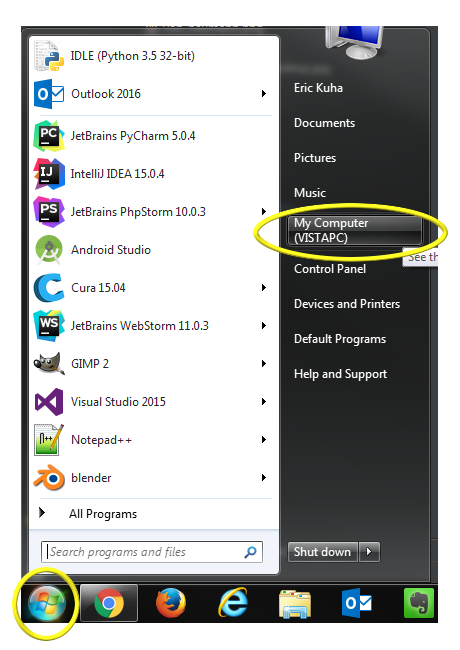
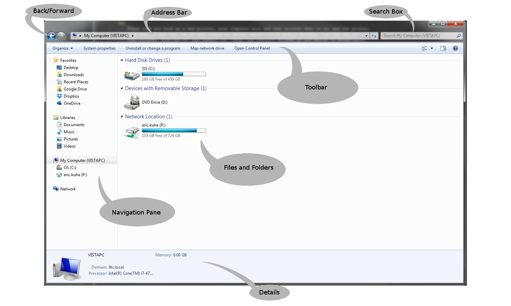
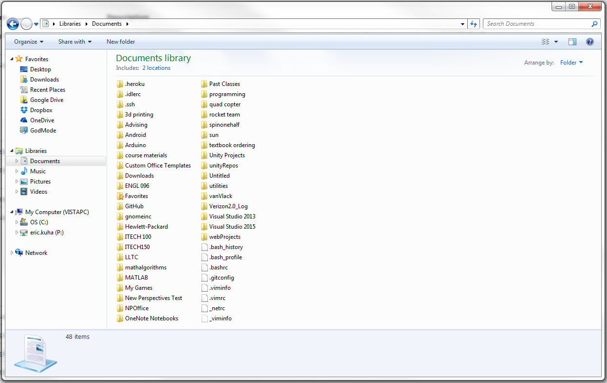
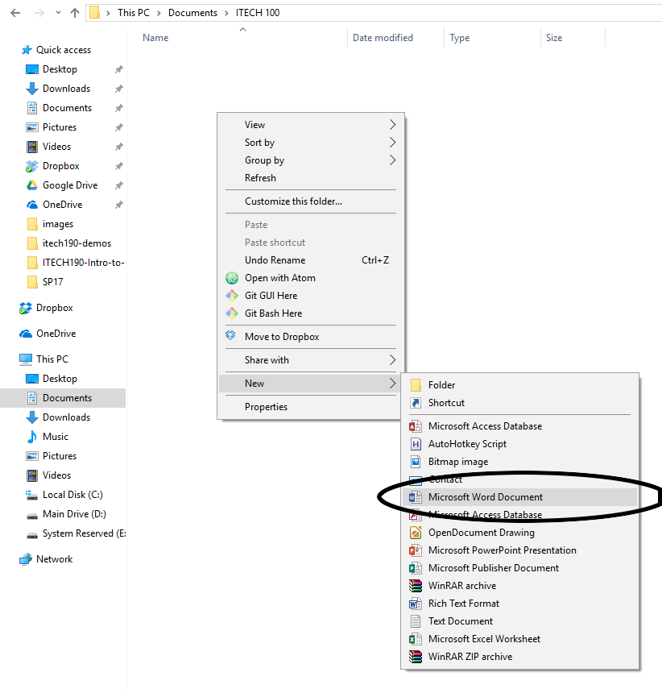

# The File Manager

There's a lot to learn about using a computer and its applications. One of the most important applications on a computer is the file manager app. In Windows, this app is called the Windows Explorer or just Explorer.

## Terms

<dl>
    <dt>Hard Drive</dt>
    <dd>A computer input/output device capable of storing data for long periods of time. It consists of platters covered with magnetic dust. The orientation of those magnets determines the content of that data. Some modern Hard Drives are called Solid-State Drives which are far faster (but more expensive) and do not use mechanical platters.</dd>
    <dt>File</dt>
    <dd>A file is a named system resource stored on a computer hard drive.</dd>
    <dt>Folder</dt>
    <dd>A folder is a an organizational data structure that allows you to group files together into logical places and themes. For example, you might store all of your files for this class in a single folder so that you always know where they are.</dd>
</dl>

## What is a File System?

The File System is part of an OS that manages long-term storage of data on a computer. This data is stored a device called a hard drive. Today's hard drives can store astonishing amounts of data. Briefly, consider that the most basic data storage unit on a computer is called a binary digit, or a bit. A bit is typically represented as either a 1 or 0. It's on or off. Clever mathematicians and computer scientists have developed ways of using long strings of bits to represent just about anything, from an email, to a video file to an entire operating system. At the very core, the only thing your computer ever does is manipulate staggeringly long strings of 1s and 0s.

Traditionally, it takes 8 bits to represent, say, a letter of the alphabet. Today, a modern hard drive in a new computer is typically one or two terabytes worth of storage. That's approximately 8,000,000,000,000 bits. 8 trillion bits. This is enough to store almost 4 million image files, around 300 hours of video, or a thousand copies of an old style encyclopedia. Ten terabytes can hold the entire printed collection of the Library of Congress. For more information, [check here](http://www.whatsabyte.com/).

There are many different ways that a computer can divide all those bits and bytes into space for individual files. And for our purposes, we don't really need to go into all of this. That said, if you would like to learn more about file systems, [Wikipedia](https://en.wikipedia.org/wiki/File_system) is a good place to start.

Most modern computers use a [file and folder metaphor](https://en.wikipedia.org/wiki/Directory_(computing) to organize the data on a computer. While a computer directory system is quite a bit more complex than a filing cabinet, it is very useful to think about it as an infinitely deep file cabinet because it's easier for us to understand.

Let's look at how Windows does this.

## TUTORIAL - The Windows Explorer App

**Note:** If you are on a Windows machine, see how yours compares to the images below.

<ol>
    <li>
        Open your Windows Explorer app by clicking on the folder icon on the system task bar:
        <figure>
            
            <figcaption>The File Manager Icon</figcaption>
        </figure>
        Alternately, you can click on the Windows Start Button and then on the My Computer button:
        <figure>
            
            <figcaption>The Start Menu</figcaption>
        </figure>
    </li>
    <li>
        The application window will open and should look something like this:
        <figure>
            
            <figcaption>The Windows Explorer App</figcaption>
        </figure>
    </li>
    <li>
        Take a look around. There are three main areas of the window. The left sidebar is your <strong>navigation pane</strong> which allows you to quickly jump to common and important folders in your computer's file system. Get to know these links, as they can be very useful if you use them. Pay particular attention to the **Libraries** folders. Among your Libraries is the <strong>Documents</strong> folder which you should make a habit of using to store all of your working files so that they cannot get lost. In fact, on our campus, the Documents library is linked to your account and is accessible from any computer on campus. The main pane of the windows is where you'll see all of the files and folders contained in your active directory. You might see something different depending on how your computer is configured. Above that, you will see the <strong>address bar</strong> which tells you what part of the computer's file system you are looking at. In the screenshot above, it is looking at the top, root level of the computer. Below the address bar, you will see a tool bar that will change depending on where you are in the computer. Pay attention to what tools are available as you navigate through the file manager. Next, at the bottom, you will see the <strong>Details Pane</strong> which shows details about the currently selected item. This might include meta data about a file such as when it was created, how large it is, and who the author is. It might also tell you how much free hard drive space you have. Last, in the top right, there is the <strong>Search Box</strong> which can be very useful to find a particular file in the the current folder.
    </li>
    <li>
        Click on the <strong>Documents</strong> folder in the left navigation pane.
        <figure>
            
            <figcaption>The Documents Folder</figcaption>
        </figure>
        This is my Documents folder at my workstation at work. Notice that there are many folders for all sorts of different aspects of my job (and hobbies).
    </li>
    <li>
        <strong>Right-click</strong> in some empty space inside this folder. A context menu will appear (note, right-clicking on something in Windows will always bring up a context menu).
    </li>
    <li>
        <strong>Left-click</strong> on <strong>New</strong> and from the new menu that pops up, click on <strong>Folder</strong>. A new folder will appear in your Documents library and the name "New Folder" will be highlighted.
    </li>
    <li>
        Type <code>ITECH 100</code> and press <strong>Enter</strong>. You have now created a folder to store all of your files for this class.
    </li>
    <li>
        <strong>Double-click</strong> on the new folder. You are now inside of your new folder and the first thing you will notice, of course, is that it is empty. Let's remedy that.
    </li>
    <li>
        <strong>Right-click</strong> somewhere in the folder. Click on <strong>New</strong> and then click on <strong>Microsoft Word Document</strong>a
        <figure>
            
            <figcamption>Creating a New Word Document</figcamption>
        </figure>
    </li>
    <li>
        <strong>Double-Click</strong> on the new file. Microsoft Word should open and your new empty file should open automatically.
    </li>
    <li>Type some text into the file. Anything, really. Whatever you like. Just get something on the page. We will go into great detail about Word's capabilities in the next chapter, however, for now, anything will do. </li>
    <li>To save the Word Document, left-click on the <strong>File</strong> tab at the top-left of the screen. In the backstage menu that appears, select <strong>save</strong>.</li>
    <li>
        Close the file and the app by clicking the <strong>X</strong> button in the top-right corner.
    </li>
    <li>
        Close all other apps and windows. To complete this tutorial, the instructor will come around to each student and verify that you can locate, open, and the close, the file that you just created. While that's happening, feel free to explore some of the other files. See if you can find anything interesting. If anything seems strange or arcane, see if you can figure out what it does or what it's for.
    </li>
</ol>

## Up Next

In the next section, we will look at what productivity software is and what it's for and compare a few examples.
