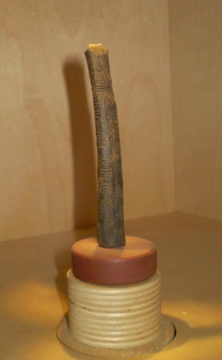
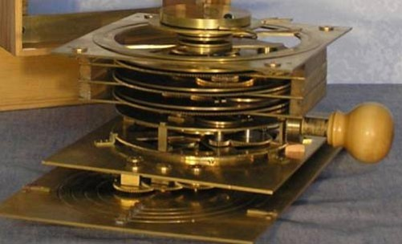
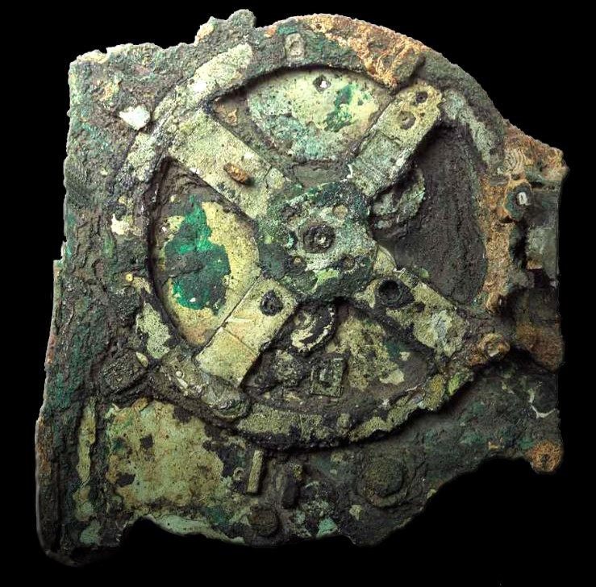
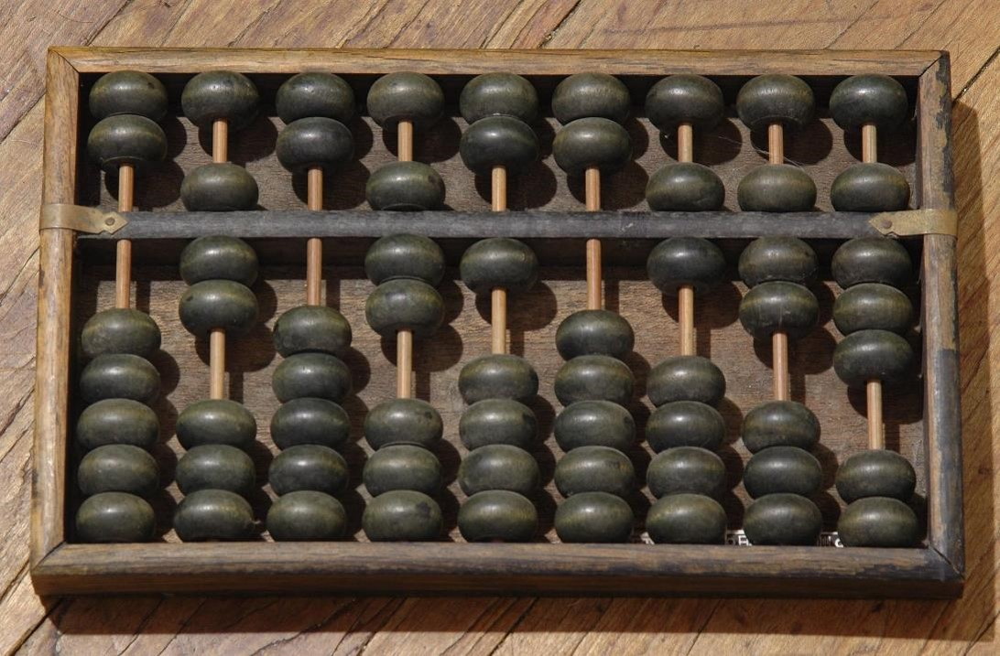
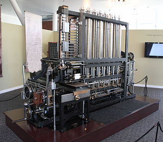
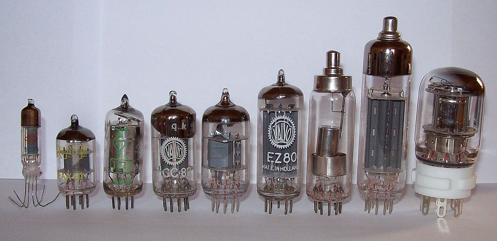
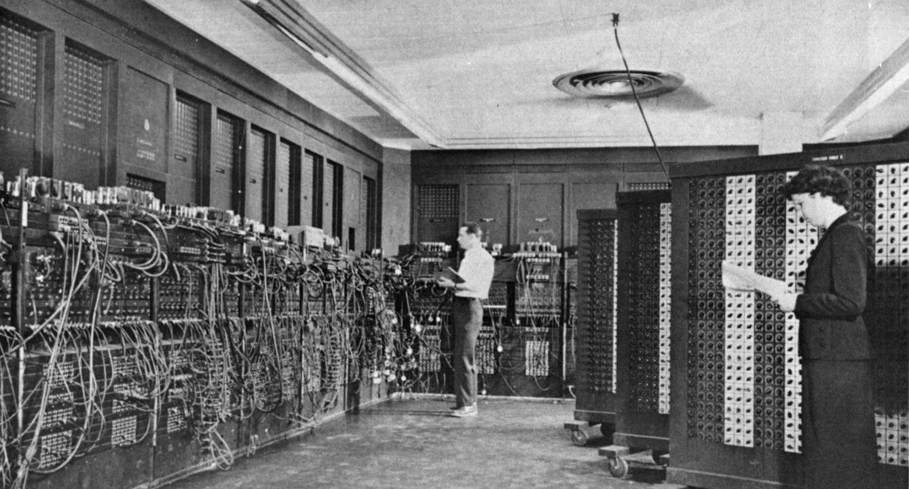
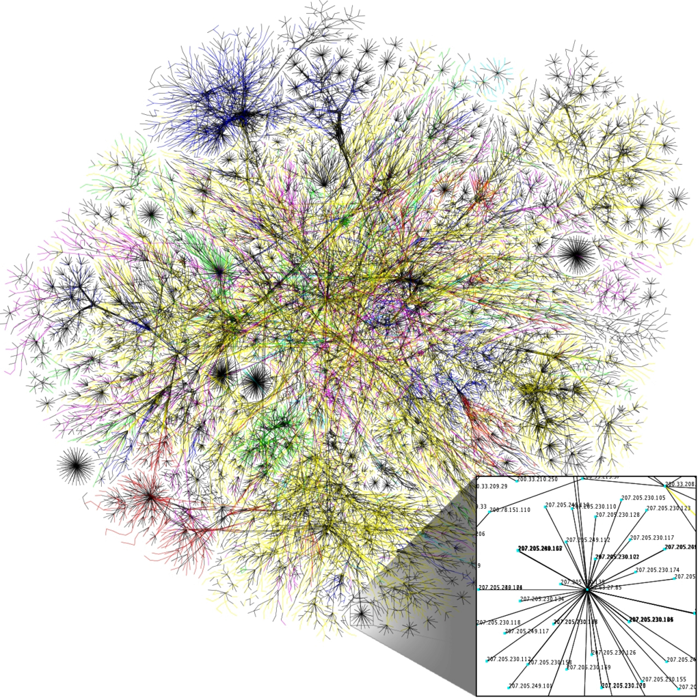

# A Brief History of computing

## Computing Timeline
|     Dates    | Developments                                                                                                                                   |
|:------------:|------------------------------------------------------------------------------------------------------------------------------------------------|
| 20,000 BCE   | Early cultures develop counting and rudimentary record-keeping                                                                                 |
| 150-100 BCE  | Antikythera Mechanism - analog computing device                                                                                                |
| Up to 1800s  | Algebra developed. Algorithms developed and used. Abacus invented and used. First mechanical calculators built and used.                       |
| 1800-1930    | Babbage's Difference Engine. Boolean Logic. Hollerith, punch cards, and the 1890 census                                                        |
| 1930s        | Alan Turing's papers on computability. Claude Shannon and information theory.                                                                  |
| 1940s        | First electronic digital computers - Colossus, ENIAC, etc                                                                                      |
| 1950s        | Symbolic programming languages. Transistors. Data-processing applications (spreadsheets, etc).                                                 |
| 1960-1975    | Integrated circuits. Minicomputers. Time-sharing mainframe systems. Keyboards and monitors. Grace Hopper, compilers, and high-level languages. |
| 1975-1990    | Microcomputers. Mass-produced personal computers. GUIs. Networks and Internet                                                                  |
| 1990s        | Optical storage. World Wide Web. Laptop computers                                                                                              |
| 2000-present | Embedded computing. Wireless computing. Continuing proliferation of the web into every facet of human life.                                    |

## The Early Years

Computational reasoning is not by any stretch a uniquely human trait. Many animals have been shown to, at the very least, add and subtract even if at a very rudimentary level. Of course, no other animal has taken the whole thing quite so far as humans. The digital computer has been in development for a very long time. In fact, the earliest computation and data storage devices go back as far as the earliest humans on Earth.

The **Ishango Bone** is a section of a babboon's femur which has curious notches carved into its surface. The prevailing theory is that it was a counting device, though, as you can probably imagine, many an anthropologist have poured countless hours of fruitless speculation into just what the hatchmarks could possibly be counting. Suffice to say, it is a very early example showing that basic anal retentive record-keeping goes back quite a long way in human history.

  

The **Antikythera Mechanism** is fascinating for so many reasons. For one, it is a magnificent work of art all on its own. Used to calculate the positions of the stars to aid in navigation, it is not only notable for its capabilities or early date (150 BCE), but for its staggering complexity. For while there are no other examples of the mechanism in existence, it is fairly easy to reason that no such device could have sprung up fully formed. There had to have been a progression of less complex versions and it almost certainly had contemporaries, even if only a few.

The **abacus** was an still is one of the most useful ancient arithmetic machines. In fact, it is still in use by some people in Eastern Europe, Russia, China, and Africa. It never needs to charge its batteries and it never needs security updates.

**Algebra**'s earliest roots go back to the Babylonians and many forms of algorithmic computation (or evidence of it) popped up in places all over the world from Hellenic Greece to Egypt to South America. But it was a Persian mathematician named *Omar Khayyam* who laid the foundations for algebraic geometry in 1070. European Algebra got a kick in the pants when an Italian mathematician named Fibonacci revived European algebra in the 13th century.

**[Charles Babbage](https://en.wikipedia.org/wiki/Charles_Babbage)** and **[Ada Lovelace](https://en.wikipedia.org/wiki/Ada_Lovelace)** are interesting figures in the history of computing, though in the end, their actual effect on the future trajectory of the study of algorithmic computing is probably pretty negligible. Most of their work occurred during 1830s. They get lots of credit for some of their ideas though, even if they never saw the light of day until very recently. Babbage designed a device that he called the *Difference Engine* which was a complex mechanical machine with over 18,000 parts which could be used to solve polynomial equations. It was, however, never built. Ada Lovelace, the daughter of the Romantic poet Lord Byron and a brilliant mathematician, had a correspondence with Babbage and, after seeing his plans for the Difference Engine, developed what is widely regarded as the first computer program, an algorithm which the Difference Engine could use to calculate the sequence of [Bernoulli numbers](https://en.wikipedia.org/wiki/Bernoulli_number).

The next really significant development in the progress of computing machines happened in the years leading up to the 1890 census. A man named Herman Hollerith invented an electromechanical punch card tabulating machine which cut the processing time from 8 years (the 1880 census) to only six in 1890. This is made significant especially considering how much larger the population had grown over those ten years. Hollerith went on to found a company called *The Tabulating Machine Company*, which eventually merged with three other companies to become the *Computing-Tabulating-Recording Company* (CTR). In 1924, CTR was renamed to the much more familiar *International Business Machines Corporation* or IBM.

## Theory and foundations

**Alan Turing (1912-1954) -** Along comes perhaps the most famous computer scientist of all time, [Alan Turing](https://en.wikipedia.org/wiki/Alan_Turing). He is perhaps most famous for his work at Bletchley Park cracking the German Enigma Code during World War II. However, he also laid down considerable theoretical groundwork for the field of computer science such that he is often regarded as the father of theoretical computer science. His seminal paper in 1946 was  the first detailed design of a stored-program computer. Today, we call his concept a **[Turing Machine]**. He wrote another influential work on the topic of artificial intelligence and proposed a test (now called the **[Turing Test]**) to create a standard for a machine to be called "intelligent."

Turing is one of the most revered figures in the field of computer science and his story ends tragically as it was revealed that he was homosexual, persecuted mercilessles by the police and government, and eventually committed suicide. His legacy still lives on in modern computer architecture, however. Almost all computer architectures are based at least in part on the Turing Machine model.

**John Von Neumann (1903-1957) -** A mathematician of massive influence, John Von Neumann was also one of the earliest computer scientists. He laid out an architecture for a computer in a paper in 1945. It described how a stored-program computer would be organized, how its parts and components would talk to each other, and how their hierarchies would be structured. Though considerably evolved, today's computers are heavily influenced by the [Von Neumann Architecture].

## The Vacuum Tube Era

The first digital computers used vaccuum tubes to represent binary digits (bits). They reasonably fast, but they were large, clunky, and, like a lightbult, they had a tendency to burn out frequently. And yet, as expensive, inefficient, and frustrating as these early machines were, they were _still_ faster than doing it by hand.

The first programmable, electronic, digital computer was **Colossus**. It was used during World War II to help crack ciphers, and though it was not a stored-program computer, it was fully programmable with switches and plugs.

**ENIAC** was the first "Turing-complete" computer. It was a massive machine consisting of 18,000 vacuum tubes, 1500 relays, weight 80 tons, and used 200 kw of power. It was used to calculate artillery firing tables for the United States military, though the war did not last long enough for this purpose to be its main mission. One of its first programs was a study of the feasibility of a thermonuclear weapon. It was able to complete a calculation that took a human 20 hours to complete in 30 seconds. So while it was prone to breaking down, it's astonishing (for its time) speed and calculating power more than made up for it.

These computers evolved and grew more sophisticated and explored many interesting technologies, however, it was all blown away by one very tiny invention

## The Transistor

A transistor is a tiny semiconductor device which can act as a switch. As they are much smaller, more reliable, and cheaper to produce, they _very quickly_ replaced vacuum tubes as the primary computational element in electronic computers. It wasn't long before they were getting smaller and smaller until a little-known company called Intel manufactured the first **microprocessor**, the Intel 4004. This first processor was a general-purpose chip designed to be the brains in a digital adding machine. It was a calculator chip. It added, subtracted, multiplied, and divided its way through history as the chip that changed everything.

An **integrated circuit** is a piece of computing hardware that miniturizes and standardizes certain tasks in computing. ICs are a way of putting many, many transistors and other electrical components on a thin piece of silicone which makes the chips faster, more efficient, and cheaper to produce. The IC is what made the microcomputer revolution possible.

## Grace Hopper and the compiler
//TODO

## The Internet

Computer technology progressed at a fairly steady clip from the mid-sixties on. Corporations found uses for them, as did the government and univsities. By the mid-eighties, there were relatively affordable home computers and some of them were even fairly useful. Unbeknownst to most people in the 80s, a technology had been incubating on university campuses and government buildings for the past 20 years and was about to change everything.

There were many computer networks that took a crack at the problem of transmitting data over long distances. Most of the successful ones settled on some variety of what is called "**packet switching**," which is to say, breaking up large pieces of data and sending them off across the network in pieces to be reassembled at the other end. The most successful of these networks was ARPANET which went live in 1969, sending its first message from UCLA to the Stanford Research Institute on 29 October, 1969. For 20 years, the ARPANET would grow to connect many universities, corporations, and government organizations together. Massive funding provided by the United States Government helped to push the project forward very quickly. And then along came 1989

The ARPANET and the Internet that would grow out of it use the **TCP/IP** protocol, a unified language and set of rules that all computers connected to the internet must adhere to. In fact, it's not just one or even two protocols, it's what we call a _stack_ of protocols. Shortened to the two main ones, the **Transmission Control Protocol** which is responsible for breaking information up into discrete chunks at one end of a connection and then reassembling them at the other end. And the **Internet Protocol** which is responsible for addressing making sure packets get where they are going.

## The World Wide Web
In 1989, an English scientist named **Tim Berners-Lee** invented a set of technologies for making the internet more accessible and comprehensible. He invented what is now called the **World Wide Web**, a network of interconnected, "hyperlinked" documents and other resources which can be access using a piece of software called a _web browser_. Berners-Lee invented four main technologies:

* The **HTTP protocol**, which is the set of rules that govern the web. It determines how web pages are served up, and how web browsers will interact with the TCP/IP protocols of the web itself.
* **HyperText Markup language** or HTML is a markup language which allows for easy formatting of web documents (web pages). It has gone through many revisions over the years, but Berners-Lee's original HTML is still quite easily recognizable by any modern web developer.
* **Web Server** software was needed to tell a computer how to "serve" a web page to anyone who was trying to access it.
* **Web Browser** software enables a user to "browse" and search the web for information, parsing, interpreting, and formatting the content that it receives so that it's readable by you or me.

## The Smartphone revolution
There were many attempts as, as early as the 90s, to build a hand-held productivity device and while some of them were pretty neat in their time, none of them was so immensely useful that it would ever become ubiquitous. Until the smartphone. It wasn't [the first], but in 2007 a device called the iPhone hit shelves and changed...everything.

Let me just get real with you here, reader. This is written as someone who does not and never will own an iPhone. The effect of the iPhone on modern society has been so profound it will probably take us decades to even come to terms with its existence. Our relationship with _information_ has changed. Our relationships with _each other_ have changed. To say that the iPhone has been a [disruptive technology] would be like saying the atom bomb was a firecracker.

Of course, this is not to overstate the importance of the iPhone. If it hadn't been the iPhone, it would have been the HTC Dream or the Samsung Galaxy or some other [Android phone]. The technology was already there and the time was right for it. Apple was lucky and very, very good at marketing.

This is not to _understate_ the importance the iPhone either. It's the first successful iPhone with the exception of the Blackberry, thought that seemed to be isolated to business people. And just stop and think about the profound ramifications of having a device in the palm of your hand which is essentially a direct link to the sum-total of (effectively) all of human knowledge. Every language. Every book. Every piece of music. Every movie or TV show. All of it can be access with a smartphone.

## Notable machines and other developments
* [Colossus](https://en.wikipedia.org/wiki/Colossus_computer) - The first fully electronic digital programmable computer
* [ENIAC](https://en.wikipedia.org/wiki/ENIAC) - First "Turing-complete" digital computer
  * Weighed 80 tons, used 200 kw of power, had 18,000 vacuum tubes, 1500 relays, and hundreds of thousands of other components.
* The Transistor - 1955
* The integrated circuit - 1949 (work began) - working model 1958
* January 1971 - First Microprocessor
  * Intel 4004 - Adding machine processor
* Grace Hopper and the compiler. 1950s. COBOL. Led to a proliferation of programming languages. Grace Hopper was the Mother of Software Development.
* ARPANET - 1969
* Tim Berners-Lee, the Internet, and The World Wide Web - 1989
* The Smartphone revolution - 2007-present
* Five Generations
  * Mechanical/electromechanical
  * Vacuum Tubes
  * Transistors and Integrated circuits
  * Better ICs
  * Experimental/Theoretical (Quantum computers, DNA computers, etc)
* Closing Thoughts - Moore's Law
  * The number of transistors in a dense integrated circuit doubles approximately every two years.
  * Gordon Moore, founder of Intel. 1965
  * It has held true so far, though there is self-serving bias.
  * Used to set long-term planning goals for semiconductor industry
  * The law is replicated in prices, memory capacity, megapixels in digital cameras, etc.
  * Not technically a law (conjecture/observation)

<!-- Links -->
[Turing Machine]: https://en.wikipedia.org/wiki/Turing_machine
[Turing Test]: https://en.wikipedia.org/wiki/Turing_test
[Von Neumann Architecture]: https://en.wikipedia.org/wiki/Von_Neumann_architecture
[the first]: https://en.wikipedia.org/wiki/IBM_Simon
[disruptive technology]: https://en.wikipedia.org/wiki/Disruptive_innovation
[Android phone]: https://en.wikipedia.org/wiki/Android_(operating_system)
