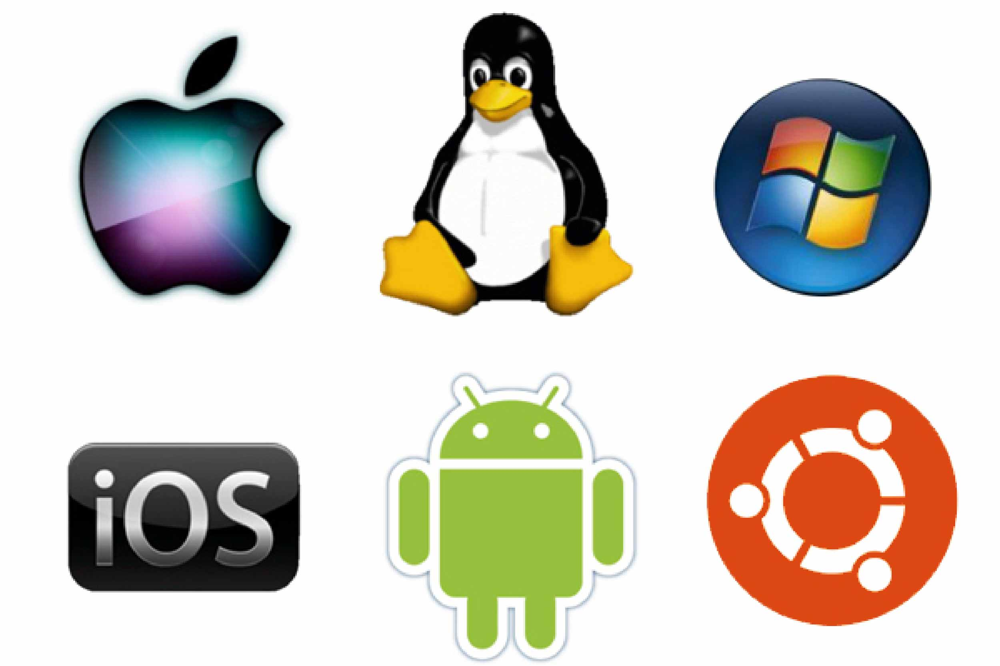
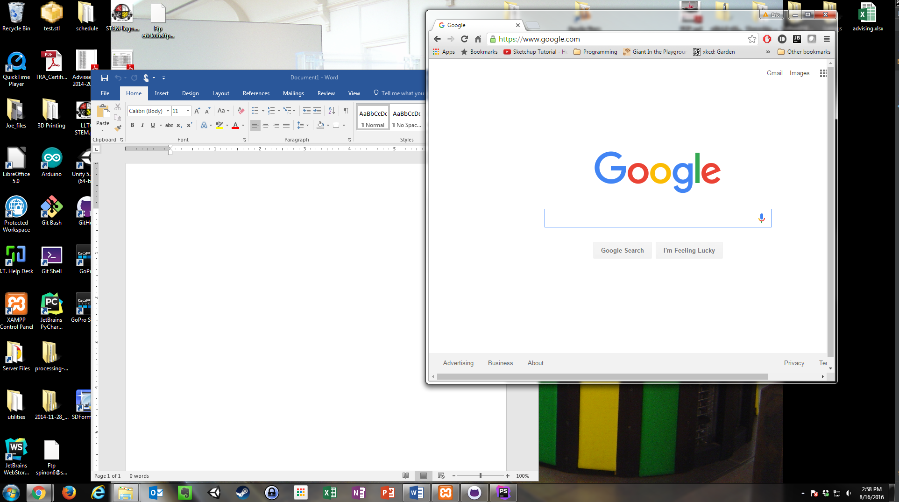

# The Operating System

## Key Terms

<dl>
    <dt>Operating System</dt>
    <dd>The primary software on a computer. Responsible for managing memory, allocating resources, and providing an interface for the user.</dd>
    <dt>Interface</dt>
    <dd>The point where two systems meet and interact</dd>
    <dt>File</dt>
    <dd>A named resource for storing information which is available to a computer program. They are almost always stored in some sort of long-term storage medium, such as a hard drive.</dd>
    <dt>File System</dt>
    <dd>An Operating System component which allows the operating system to store, organize, and locate data on a storage device.</dd>
    <dt>Open-Source</dt>
    <dd>Computer software where the source code is freely available and editable by anyone. Many open-source projects encourage people to contribute time and code
     making the project better.</dd>
    <dt>Bloatware</dt>
    <dd>Unwanted software installed by the company that manufactured the software.</dd>
</dl>

 
**Operating System Logos**

<strong>Windows 7:</strong>For the purposes of this course, we will focus almost all of our attention on Microsoft Windows 7. There are newer versions of Windows, and there are many other operating systems out there, but this is what we use on campus and it is still largely the industry standard operating system (OS).

 
**The Windows 7 Desktop**

An operating system is a computer program. A huge, complex, multi-layered computer program that tells the computer how to be a computer. When a computer turns on, it has no idea what to do. So the first thing it does every time it boots up is look for an operating system. If it doesn't find one, it won’t finish turning on and it will be mostly unusable. But, if it finds one, it (very quickly) reads through that operating system’s list of rules. It tells the computer what kinds of programs it can run, which ones are installed, where data should be stored, how memory should be managed.

In some ways, it's the boss program for all of the other programs on the computer. It creates a set of rules that they must all adhere to. In other ways, it is sort of like an assistant to the other programs, giving them resources when they request them, allocating memory to their operations, and giving them space on the display for the user to interact with. And in still other ways, it's sort of like a referee at a children's soccer game making sure all apps and processes play nice with each other and ensuring that apps that cause problems don't bring the whole system down.

## Operating System Roles

Let's look at each of the roles of the OS in some detail.

### Operating System as *Boss*

The OS sets the rules for the system. When the computer first comes on, the OS software does a system check to see what resources are available, such as storage, memory, graphics, network connections, etc. And then it lays down the ground rules for all the other software on the system so that they can operate within those parameters. Any app on the system has to get permission from the OS in order to do anything.

### Operating System as *Assistant*

When a user starts an app like, say, a web browser, that app will ask the system for resources like a place to store its code in memory, and space on the screen to display output to the user, or access to the speakers to play sounds, or access to the keyboard to get input from the user. It's the OS's responsibility to make sure that each app gets the resources it needs to run.

### Operating System as *Referee*

The modern operating system experience relies heavily on mutlitasking. Users expect to be able to run more than one app at a time. Maybe you're writing a research paper and you need a word processor and a web browser open at the same time. Not only that, but there are probably tons of other tasks and processes running in the background. There's a process that maintains your connection to the internet, one that manages all your I/O devices (mouse, keyboard, screen, etc), and you might even have some anti-virus software. The list goes on. A system might have dozens of processes running simultaneously and all of them demanding resources from time to time. The OS has the task of making that they all play nice together. And not only that, but occasionally, an app messes up throws an error. And sometimes it messes up so badly that it crashes. The OS has the responsibility of making sure that an app that crashes does so gracefully without disrupting the rest of the system or corrupting data. Sometimes malicious software even tries to do this deliberately. The OS keeps all of this in mind as it does its job.

## Operating System Components

You might ask how the OS manages this monumental task. Well, a well-designed OS comes with many different components that can be swapped in and out, each of which has its set of resonsbilities. Here's a brief overview of some of the more vital OS components.

### Kernel 

The kernel is the most basic control system component of the operating system. It provides very basic, low-level control over the system's hardware. The user almost never interacts with the kernel and for the purposes of this class, we will not go into great detail about its structure and operation. It is included here for awareness that there are aspects of the computer that exist behind the scenes that we are mostly unaware of.

The kernel controls the CPU, memory management, and direct access to devices like the mouse, keyboard, and display.

### Program Execution 

An OS provides interface for programs written by programmers to access hardware so that they can run. In a way, what the programmers of an OS do is create a cushion between the program and the hardware. It does all of the hard stuff for us. It makes the job of programming a computer easier, and makes it easier for the user to operate. Imagine you are driving a car. You really have only a few basic controls. A steering wheel, a couple pedals, a gear shifter, and some signalling devices. You don't have keep an eye on the engine idle speed or the oxygen mix in the fuel injector. All you have to do is point the car in the direction you wish to travel. Likewise, the OS creates an interface for a computer program to interact with hardware.

### Resource management

A computer has limited resources. In today's high-tech world full of powerful computers, there are likely a lot of resources. But that just means that people are writing programs that use more and more resources. Somehow, the computer has to decide which programs get which resources. How much memory should this program be allocated? How many CPU cycles should that program get to use? And so on. The operating system is what sets up all of the rules for this and does all of the allocating. In fact, the modern operating system does this so efficiently that each app--and more importantly, app programmers--can behave as though it has unlimited resources at its disposal.

### Multitasking

A CPU, by design, is only physically able to execute one instruction at a time. So if a computer is running more than one program at a time, it must have a way of scheduling when each program gets to access the CPU. In today's computers, each program might get access to the CPU for milliseconds at a time, and these changes of priority can happen at lightning speeds, but somebody has to take care of all of that scheduling. And that's the operating system.

### File System

 
### A Hard Drive

In computer terminology, memory (RAM) is the component that keeps track of all of the things that a computer is doing right now. Once you turn off the computer, all of the RAM is emptied out. All of it. And so, there has to be a system for long-term storage. Computers use pieces of hardware called hard drives to store information for long periods of time. It stores this information in discrete pieces of data called **files**. An OS manages files using a special piece of software called a **file system**. The file system is the software which allows the OS to store, organize, and retrieve data on a storage device.

### Device Drivers 

For every piece of hardware that you connect to a computer whether it is as simple as a keyboard, or as complex as a printer or webcam, a "contract" of sorts must be written by some programmer so that both the OS and the keyboard know how to work together. This contract is a small program called a device driver. Most modern computers have potentially hundreds of pre-installed device drivers and access to thousands more in online repositories.

Every time you hook up a new printer, your computer will ask that printer what it is, and the printer will tell it and then the OS will access an online repository of device drivers, find the one specific to that printer, download it, and install it. Thus, the contract between OS and device is established.

### Networking

These days, networking is so fundamental to any digital experience that it is typically built right into the operating system. Gone are the days when you had to configure your internet connection by hand. Almost all modern computers completely automate this process.

### Security 

Most modern operating systems will have some sort of security built in. Windows, for example, has a program called Windows Defender built in, which is a program which prevents unwanted or unknown computers or malicious files from accessing vital system resources. Most modern operating systems also have some sort of user-specific protection as well. For example, the Windows OS has a built-in user account system so everyone in the family can have their own account on the computer and everyone's files are protected by the user's password.

### User Interface

 
**The WIMP Interface**

Perhaps most importantly for this class, the Operating System provides a user interface. Specifically, most modern OSs provide what's called a Graphical User Interface, or GUI (pronounced "gooey"). Established a long time ago (in the 70s), this interface usually adheres to a "desktop" metaphor. The idea is to simulate the surface of a desk, where you can move documents around, look through file cabinets, and interact with your work. This "desktop" interface is called a WIMP interface, which stands for Window, Icon, Menu, Pointer. So each of these is essential to that experience. The GUI uses windows to display each active application, icons to signify applications that are available or files that can be opened, Menus to access features and tools, and a pointer controlled by a mouse to point to, activate, and interact with each of these.

## What Operating System Do I Have?

### Workstation OSs
There are many operating systems available to the modern computer user and what operating system you use will depend on several things, like experience level, platform, and personal preference. There are three main workstation operating systems: Microsoft Windows, Apple OSX, and Linux. All three are perfectly viable options for any user, though they all have their advantages and disadvantages.

**MICROSOFT WINDOWS**

Microsoft Windows is definitely the most popular for several reasons. One, the machines it runs on are generally less expensive than Apple machines. Two, it has become the defacto operating system for most businesses because of this fact. Inexpensive Windows machines (sometimes called "PCs") can be purchased in bulk and are relatively easy to maintain and replace if needed. There are massive libraries of software available (much of it free and open-source) for Windows PCs and they are highly customizable. Their drawbacks include some security issues, somewhat increased susceptibility to virus infections, and incredible amounts of unwanted or unnecessary or downright awful software included on bargain-rate computers (often called **bloat-ware**).

**APPLE OS X**

Apple OS X is slick, streamlined, user-friendly, and pretty. It comes bundled in proprietary hardware produced by Apple Corporation. These computers are called Macintoshes. There are no other computers that run this OS. If you want OSX, you have to purchase a Mac. This isn't necessarily a problem. They are well-built machines, last forever, and receive constant updates from Apple. They don't have the bloatware issues that Windows PCs suffer from. There are drawbacks, however. They are expensive. Sometimes very expensive. They also have a smaller software ecosystem. Where a Windows PC might have several options for a good photo editor and you would be free to choose which you prefer, on a Macintosh, you typically have a one-size fits all software ecosystem. Only one option to choose from, but it's typically a nice piece of software. Also, if you're used to Windows, its interface can sometimes be a little confusing.

**LINUX**

Linux is a very special operating system. It's not exactly an OS per se. It's a kernal for an OS and hundreds of full-fledged operating systems have been built on this kernel. Some of the more well-known Linux "distros" are [Ubuntu][1], [Red Hat][2], [Kali][3], [Mint][4], and [Debian][5]. Linux is one of the oldest operating systems around, and it is technically the most popular operating system in the world, period. It runs on the vast majority of web servers because of its stability, reliability, and tight security. But for the end user, it is not so common. Which is kind of a shame because some of the more popular Linux distros, like Ubuntu and Debian are very high quality, rivaling any Windows or Macintosh for usability. They are highly customizable, and have massive libraries of high-quality mostly free, open-source software to choose from. Some businesses are making the transition to Linux, but it has been slow. Its main upsides are the fact that it's open-source and well-vetted software, it's typically free (where a Windows license costs about $100 and OSX comes tied to very expensive hardware), and can be installed on just about any machine. The fact that it's open-source means that a large community of programmers have vetted the software and found vulnerabilities. Not to mention that since Windows and OS X are closed-source, there is no way to know what might be lurking behind the scenes, from security vulnerabilities to secret government-controlled back doors.

### Mobile OSs

Mobile devices are becoming increasingly common, to the point where more people than not own a smartphone of some sort. There are three main competing smartphone OSs, but there are many more available to the tech-savvy consumer.

**ANDROID**

[Android](https://www.android.com/) is the (somewhat) open-source mobile operating system maintained by Google. It is currently well over half of the mobile OS market share worldwide. This is largely due to the fact that it is available for a wide ecosystem of devices and many manufacturers are building phones and tablets that run it.

**IOS**

[iOS](http://www.apple.com/ios/) is Apple Corporation's primary mobile operating system. Its key features are a slick reliable interface and a carefully curated app store. iOS, as an Apple product, is only available on devices which Apple has manufactured, such as the iPad and iPhone. These are typically high quality devices, but are also correspondingly more expensive than a bargain rate Android or Windows Phone.

**WINDOWS MOBILE**

Microsoft is doggedly trying to remain relevant in the mobile market by designing their mobile OS, [Windows Mobile](https://en.wikipedia.org/wiki/Windows_10_Mobile), around tight integration with its primary workstation OS, Windows. It is, in almost all respects, a fine mobile operating system, clean and functional, though with a small application ecosystem. It currently has about 3 percent of the market share. It just hasn't really caught on in the face of the Android and iOS juggernauts.

[1]: http://www.ubuntu.com/
[2]: https://www.redhat.com/en
[3]: https://www.kali.org/
[4]: https://www.linuxmint.com/
[5]: https://www.debian.org/
