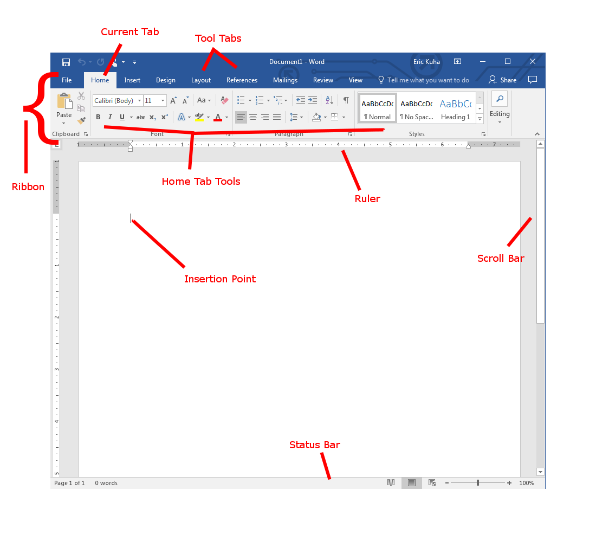

# Introduction

Microsoft Word is a word processing application that can help you create professional documents, fliers, resumes, and much more.

## Word at a Glance</h2>

<dl>
<dt>Ribbon</dt>
<dd>The Ribbon is your main tool belt for Word. It is divided up into separate tabs which contain tools for different tasks. Every major tool for the app can be found in one of these tabs.</dd>
<dt>Tool Tabs</dt>
<dd>Each tab has a specific kind of task that it specializes in.  The Home tab has your most commonly used tools. The Design tab has tools for changing the look, feel, and layout of your document.</dd>
<dt>Current Tab</dt>
<dd>The current tab is always highlighted and easily distinguishable. Above, the Home Tab is highlighted. This is where the most commonly used tools are arrayed.</dd>
<dt>Home Tab Tools</dt>
<dd>The Home Tab has tools for changing basic text styling, such as size, typeface, bold or italic, and theme-based styles (more on this later). It also has useful editing tools including clipboard access and other related tools.</dd>
<dt>Ruler</dt>
<dd>The rulers give you a visual guide for where things lie on the page.  You can easily see how things line up.</dd>
<dt>Insertion Point</dt>
<dd>This is one of your most important tools.  This is the spot where presses on your keyboard will insert letters and other text. It typically blinks, patiently, waiting for your input.</dd>
<dt>Status Bar</dt>
<dd>At the bottom of the window is a row of useful information and tools that can be seen at a glance or activated with a click.</dd>
<dt>Scroll Bar</dt>
<dd>As with nearly all modern windows-style interfaces, a scroll bar allows you to move forward and backward through the document.</dd>
</dl>
