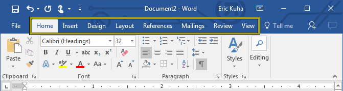
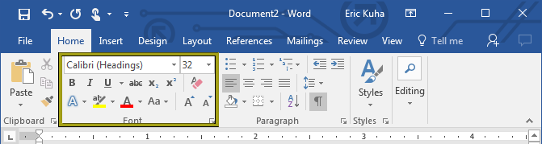
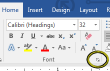
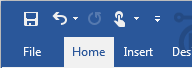
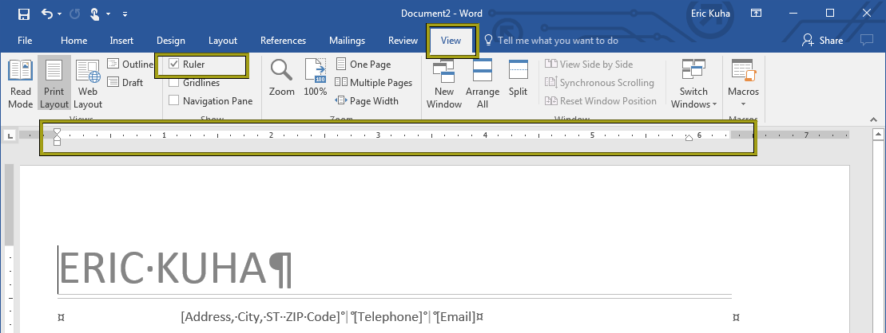
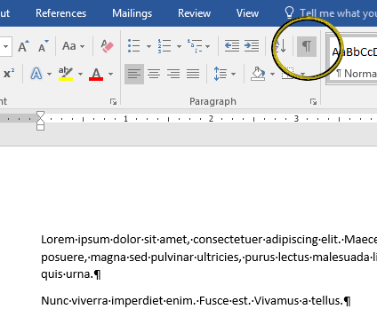

# Introduction

Microsoft Word is a word processing application that can help you create professional documents, fliers, resumes, and much more.

## Word at a Glance</h2>

<dl>
<dt>Ribbon</dt>
<dd>The Ribbon is your main tool belt for Word. It is divided up into separate tabs which contain tools for different tasks. Every major tool for the app can be found in one of these tabs.</dd>
<dt>Tool Tabs</dt>
<dd>Each tab has a specific kind of task that it specializes in.  The Home tab has your most commonly used tools. The Design tab has tools for changing the look, feel, and layout of your document.</dd>
<dt>Current Tab</dt>
<dd>The current tab is always highlighted and easily distinguishable. Above, the Home Tab is highlighted. This is where the most commonly used tools are arrayed.</dd>
<dt>Home Tab Tools</dt>
<dd>The Home Tab has tools for changing basic text styling, such as size, typeface, bold or italic, and theme-based styles (more on this later). It also has useful editing tools including clipboard access and other related tools.</dd>
<dt>Ruler</dt>
<dd>The rulers give you a visual guide for where things lie on the page.  You can easily see how things line up.</dd>
<dt>Insertion Point</dt>
<dd>This is one of your most important tools.  This is the spot where presses on your keyboard will insert letters and other text. It typically blinks, patiently, waiting for your input.</dd>
<dt>Status Bar</dt>
<dd>At the bottom of the window is a row of useful information and tools that can be seen at a glance or activated with a click.</dd>
<dt>Scroll Bar</dt>
<dd>As with nearly all modern windows-style interfaces, a scroll bar allows you to move forward and backward through the document.</dd>
</dl>

## The Ribbon

Unlike many classic application interfaces, Microsoft Office does not rely on the traditional toolbar-and-dropdown-menu interface that's been around since the 70s. Instead, your primary tools will be located on the **Ribbon**.

* The Ribbon is tabbed. So under each tab, you will find tools categorized for different aspects of the word processing workflow. 
* Each tab is further divided into groups of related tools. For instance, the **Font** group on the **Home** tab has tools for manipulating the typeface of the text in your document. 
* Note, some groups also have a tiny triangle at the bottom right corner which will open dialogues with still further tools, features, and options.  

## Quick Access Buttons

At the far top left are a set of tools that are so vitally important that they must be visible no matter which tab you are currently using. From left to right, they are the tools to <strong>save</strong>, <strong>undo</strong>, and <strong>redo</strong>.

* The <strong>save </strong>button is one of several ways to save your data so you don't lose it
* The <strong>undo</strong> button allows the user to undo the last action and continue to move backward through an entire record of actions leading back to when the document was opened.
* The <strong>redo</strong> button allows the user to "undo and undo" in case you decide you like it better how it was. And it can also allow you to repeat certain actions.

## The Ruler

If the <strong>Ruler</strong> is not visible, go to the <strong>View</strong> tab and look for the <strong>Show</strong> group. Put a check in the empty box next to the ruler by clicking on it. Get used to having it on because it will become very useful later on.

## Non-Printing Characters

**Try this:** Type some text.  A few sentences.  Doesn't matter what they are. Then look on the ribbon and ensure that you are currently at the <strong>Home </strong>tab. At the top right of the <strong>Paragraph</strong> group, you will see a button that looks like a paragraph symbol: &para;. Activate the button.  It will become shaded to show that it is active.  This tool shows and hides all non-printing characters. If you work with this activated, you will have a much better idea of the content of your work because it shows all "whitespace" characters so that you can more easily control how Word interprets your work. You'll notice dots between words where your spaces are. And you'll notice the paragraph symbol, &para; at the end of every paragraph.

There are two reasons this is important.  One, you should understand that white space is also text. It's part of the structure of the document. And two, having a working understanding of how Word interprets paragraphs is one of the key aspects of learning how to bend Word to your will and make it do what you want.  For the most part, text that is separated by only spaces is interpreted by Word as a paragraph. It is sort of like Word's basic unit of text. Every time you press the <strong>enter/return</strong> key, Word creates a new paragraph.
