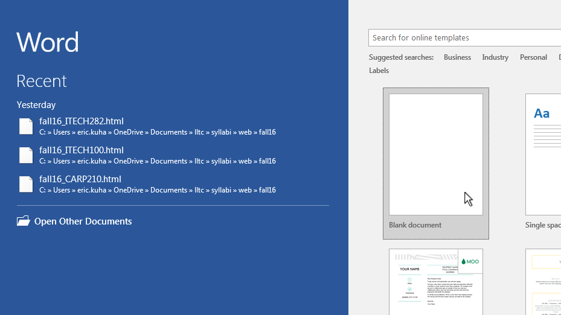
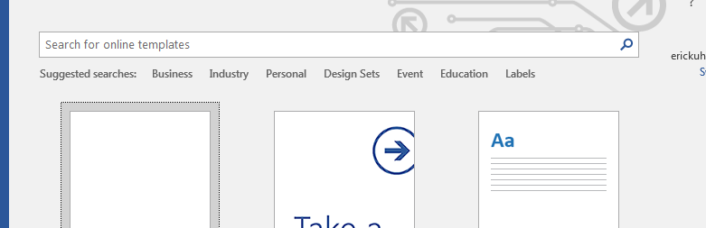
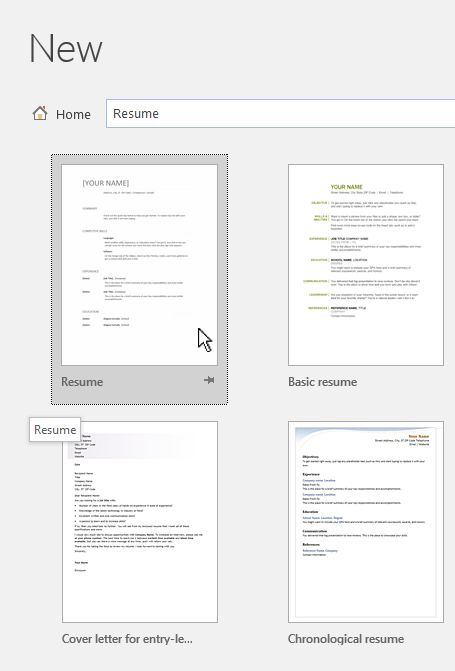
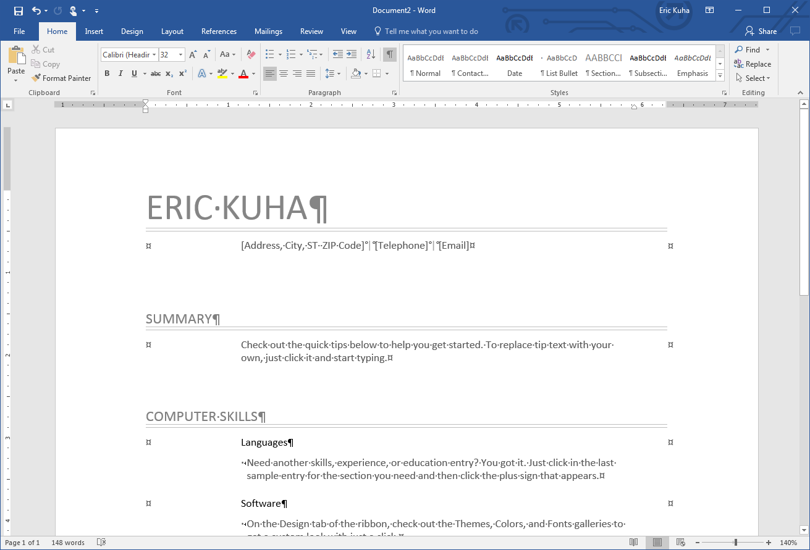
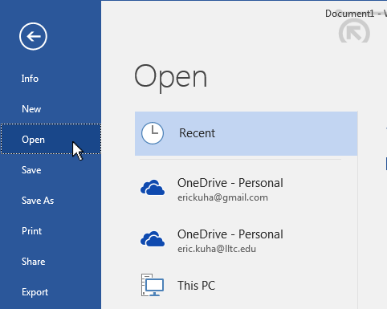

# Creating, Saving, and Opening a Word Document

## To create a new document

To start, let's create a new blank document.

**Note:** Most of these images are from Word 2016, though the interface is not much changed from Word 2013. All of these steps should still be essentially the same.

1. Open Microsoft Word
1. Ensure that you are still in backstage view  
1. Click on the **Blank document** template

## To create a document from a template

Templates are useful documents that lack everything but content. They are pre-formatted and professional-looking so all you have to worry about is filling in your own information.

1. Open Microsoft Word, or, if it is already open, click the File Tab to go to **Backstage** view and then click **New** 

1. Type in the <strong>Search Bar</strong> what sort of template you are looking for and Word will poll a database of thousands of templates.
1. The currently displayed thumbnails will be more focused, allowing you to choose a template that's right for your project.   
1. Now you can being work on your new resume by filling in the blanks.  

## Opening an Existing Document

If you want to continue working with a document that you had previously saved, re-opening it is a simple matter.

1. Navigate to the <strong>Backstage</strong> view by hitting the **File** tab.
1. Click on the <strong>Open</strong> button  
1. If it is already in the <strong>Recent</strong> documents list, click it and you're done.
1. If not, navigate to the folder where your document is located and select the document.
1. Click **Open**.
1. Edit your document.

Note: You can open also open a file by navigating to it through the Windows Explorer. Locate the folder and double click the document's icon and Windows will automatically attempt to find the best app for that file. For a Word document, it will almost certainly open Microsoft Word.

