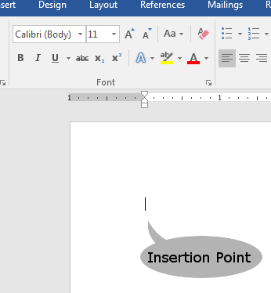
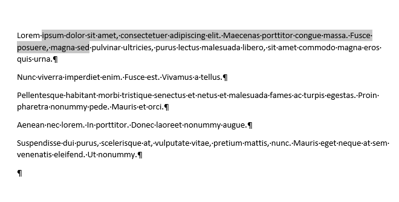

# Basic Text Editing

## The Insertion Point

When you first open a blank word document, one of the first things that you will notice is a blinking vertical line. This is called the **insertion point**. If you type on the keyboard, this is where new text will appear. The same goes for images, word art, and other special effects.  Anything you insert into the document will appear at the insertion point.

## Moving the Insertion Point

You can use the <strong>arrow keys</strong> to move the insertion point up, down, left, and right.  But you can also augment this functionality by using the <strong>ctrl-key</strong>. When you hold down the ctrl-key, and press left or right, the insertion point moves forward or backward by one whole word (to the next whitespace). Likewise, by holding the ctrl-key while pressing up or down, the insertion point will jump entire paragraphs.  Learning keyboard shortcuts and coming to think of them as second nature can lead to a smoother, more effective workflow as your hands will have to leave the keyboard to use the mouse less often.

Also worth noting are some of the other navigation keys on your keyboard.  Locate the <strong>Home</strong> and <strong>End</strong> keys. These will move the insertion point directly to the beginning or end of its current line, respectively. Augmenting them with the <strong>ctrl-key</strong> will move the insertion point to the very beginning or the very end of the <em>document</em>. This can occasionally be fairly handy.

## Selecting Text

Selecting text is a fundamental operation in any text editor and there are several ways of doing it. Which ones you use will depend on how your workflow develops as you get better with the software.

<dl>
<dt>Clicking and Dragging</dt>
<dd>The most obvious is to use the mouse pointer to click and drag to select text. Click at one end of the text you want to select and drag to the other.  Indeed, this method works in almost all software that has text.  Try it here in this web browser.<dd>

<dt>Double-Clicking</dt>
<dd>Point at a word in your document and double-click the left mouse button. The word becomes highlighted. If you have non-printing characters on, you should notice that it also selects the space <em>after</em> the word. This is a potentially useful thing to know when you're editing a document. Click on an empty area of your document and then go back to that word and triple-click it. It will select the entire paragraph from first word to the carriage return symbol (&para;) at the end.</dd>

<dt>The Keyboard Method</dt>
<dd>Place the <strong>insertion point</strong> at the beginning of a section of text that you would like select.  Hold down the <strong>shift key</strong> on your keyboard and tap the left or right <strong>arrow keys</strong> on the keyboard and watch as the insertion point moves, it selects text from the point where the insertion point started.</dd>
</dl>

## Augmenting Keyboard Shortcuts

Many keyboard shortcuts can be further augmented by using the <strong>ctrl-key</strong>.  Just as the ctrl-key can be used to move the insertion point by whole words or paragraphs, if you hold <strong>ctrl </strong>and <strong>shift </strong>keys, you can select entire words and paragraphs with ease.

By holding the <strong>shift-key</strong> and pressing the <strong>End</strong> key, it will select all text from the insertion point to the end of the line. Likewise, using the <strong>Home</strong> key in this way will select all of the text back to the beginning of the line.

Another reasonably useful keyboard shortcut is <strong>Ctrl-a</strong>, which will select all of the contents of the file, all text, images, diagrams, and other content. This can be useful for mass-formatting or styling your text.

Lastly, if you hold the <strong>ctrl-key</strong> while clicking on a word, it will select the entire sentence that contains that word.

## Copying and Pasting

Modern word processor software almost always has some useful mechanism for copying, pasting, and moving text. Not only that, but every operating system you're even remotely likely to use will integrate these features with the **system clipboard**. That is, if I copy some text from a word document, I can paste it into an Excel spreadsheet, a web browser, or just about any other app that accepts text. It is so ubiquitous that it's more noteworthy when it doesn't work or an application does not support it.

### To Copy and Paste

1. Select the text you wish to copy.
1. In the <strong>Home</strong> tab, in the <strong>Clipboard</strong> group, click the <strong>Copy</strong> button. The keyboard shortcut for this operation is <strong>Ctrl-c</strong>.
1. Move the insertion point to where you want to put the text, and press the <strong>Paste</strong> button, or use the keyboard shortcut <strong>Ctrl-v</strong>

### Moving Text

1. Select the text you wish to move.
1. In the <strong>Home</strong> tab, click the <strong>Cut</strong>button or use the <strong>Ctrl-x</strong> keyboard command.
1. Again, move the insertion point to the new location and press <strong>Paste</strong> button or hit <strong>Ctrl-v</strong>

### Click and Drag Test

Microsoft Word has a fairly intelligent feature for moving text with just the mouse. All you do is select the text you wish to move, and move the pointer over any part of the selected text, and then drag the mouse. The insertion point will follow the pointer so you can see exactly where the text will be placed. Release the mouse and the text will appear in its new location.

## Undo and Redo/Repeat

We all make mistakes. It happens all too often that you're trying to insert an image into a Word document and you have it almost positioned properly and then you move it just a little bit more and suddenly your entire document is thrown out of whack.  This is partly due to the way images are represented in a Word document. The software has gotten a lot better over the years when it comes to handling images, but occasionally, a tiny movement can still disrupt your entire document. To fix this, you can <strong>Undo</strong> the last action that you did.

### To Undo Mistakes

1. Make a mistake.
1. In the Quick Access toolbar, click the <strong>Undo</strong>.
1. Heave a sigh of relief.
1. The keyboard shortcut for Undo -- and I highly recommend committing this one to memory -- is <strong>Ctrl-z</strong>

### Explanation

Word keeps a record of all of the changes you've made to the document since you opened it. So, if you press the undo button multiple times, it will undo all of those actions, moving backward, until it's back to the way it was when you first opened the file. The Undo button can save you from a lot of frustration and gives you an easy way to try different techniques or formatting while easily being able to revert your experiments.

#### The Redo/Repeat Button

The <strong>Redo/Repeat </strong>button has different functions depending on context. If you have just used an <strong>Undo</strong> action, the <strong>Redo </strong>button will do just that.  It will redo the action you just undid.

The Redo button can also allow you to <strong>Repeat</strong> certain actions as well.

1. Type some text. More than one word
1. Select one of the words.
1. Click the bold button. (It's in the Font group of the Home tab). That word is now darker and stronger than the rest of the text.
1. Select another word elsewhere in the text.
1. Click the <strong>Repeat/Redo </strong>button. The selected text is now also bold.

The hotkey for the Redo/Repeat button is <strong>Ctrl-y</strong>.
