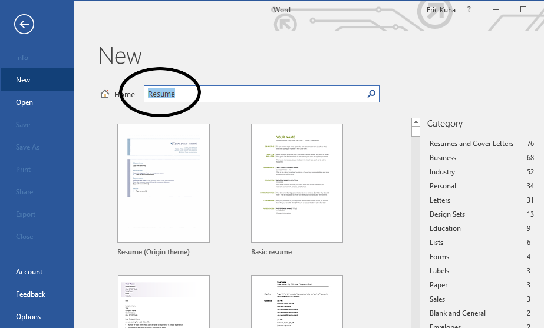
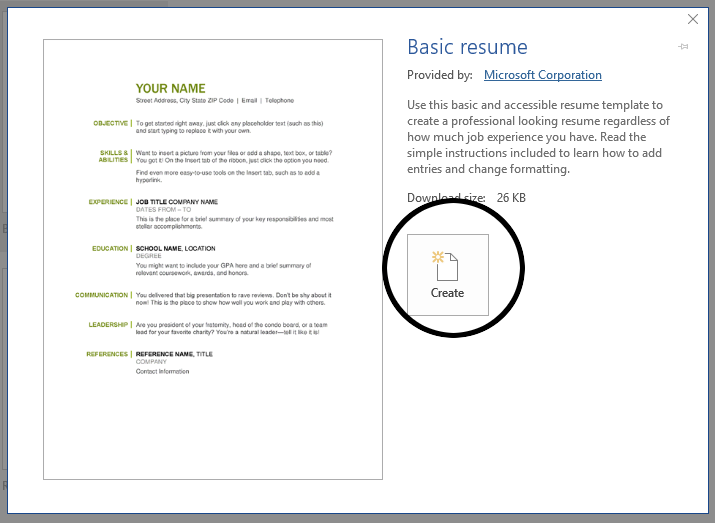

# Project 3 - Resume

[Example File](https://s3.amazonaws.com/lltc-itech/ITECH100/word_resources/project_3.pdf)

## Discussion

It's probably safe to say that at some point in your life, you will have to write a resume or dust of and revise an old one. We all find ourselves looking for new work occasionally. This project is designed to give you practice with working from a template and exporting to an immutable pdf format. It is possible that you will also get a workable resume out of it, though it is highly recommended that you run it by a career counselor before handing it out to prospective employers.

## Skills Covered

* Downloading and working with Word templates
* Working with and exporting to the immutable **Portable Document Format** or **PDF**

## Getting Started

<ol>
    <li>
        Open the Microsoft Word app on your computer.
    </li>
    <li>
        Instead of opening a new blank document, we're going to look for a template. The Microsoft servers have thousands of templates to choose from in a searchable online database. Look for the search bar at the top of the window. Click on it and type "Resume".
        <figure>
            
            <figcaption>Search for a resume template</figcaption>
        </figure>
    </li>
    <li>
        For the purposes of this project, you can choose any template that you like, but I recommend the Basic Resume template as it is easy to use and easy to follow along. Select your chosen resume and click the <strong>Create</strong> button.
        <figure>
            
            <figcaption>The basic resume template is easy to fill in, professional, and appropriate</figcaption>
        </figure>
    </li>
    <li>
        When the file opens up, it's basically a fill-in-the-blank form. Scattered throughout the document is dummy text boxes called **Document Controls**. Click where it says <strong>Your Name</strong> at the top of the page. Notice that whole thing is selected. Simply begin typing your own name and it will replace the document control and already be formatted.
    </li>
    <li>
        Fill in the rest of the heading with your name and contact information. If you don't want to, you don't have to use real information. Feel free to be as creative or silly as you wish, just so long as it <em>looks</em> professional.
    </li>
    <li></li>
    <li></li>
    <li></li>
    <li></li>
    <li></li>
</ol>
