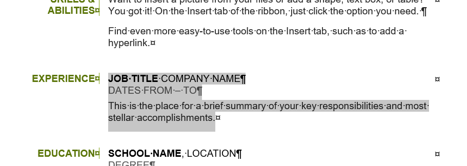
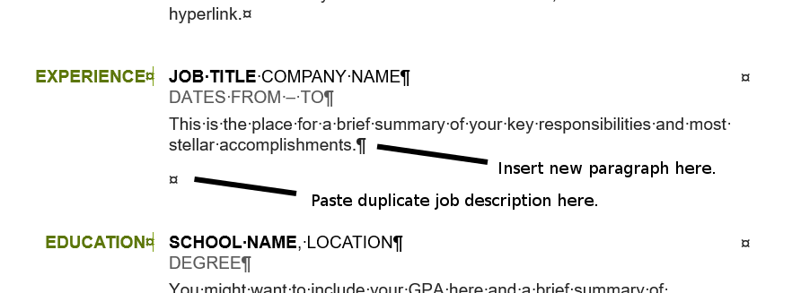
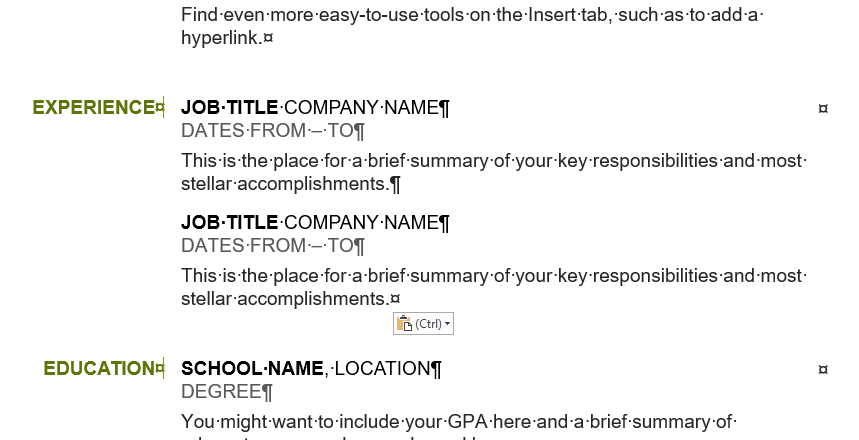
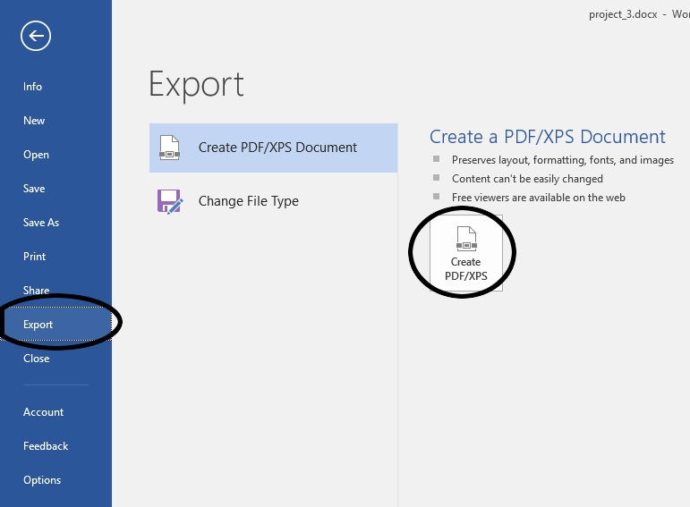
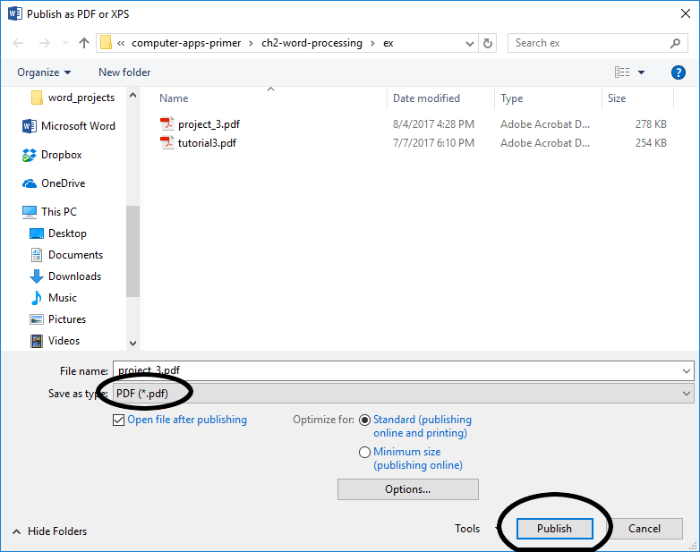

# Project 3 - Resume

[Example File](https://s3.amazonaws.com/lltc-itech/ITECH100/word_resources/project_3.pdf)

## Discussion

It's probably safe to say that at some point in your life, you will have to write a resume or dust of and revise an old one. We all find ourselves looking for new work occasionally. This project is designed to give you practice with working from a template and exporting to an immutable pdf format. It is possible that you will also get a workable resume out of it, though it is highly recommended that you run it by a career counselor before handing it out to prospective employers.

## Skills Covered

* Downloading and working with Word templates
* Working with and exporting to the immutable **Portable Document Format** or **PDF**

## Terminology

<dl>
    <dt>Template</dt>
    <dd>A standard document with pre-determined layout, fonts, colors, and design used to make designing of documents easier.</dd>
    <dt>Document Control</dt>
    <dd>In a template, a bit of dummy text with formatting applied that is meant to be deleted or replaced with real text.</dd>
    <dt>Portable Document Format (PDF)</dt>
    <dd>A type of computer document format that has two main qualities. First, it is difficult to edit (immutable) and change making it ideal for important documents like resumes and cover letters. Second, it contains all of the formatting and layout information in the file so that it will look exactly the same no matter what software, operating system, or hardware the document is being viewed with; thus, how you set it up is how it is going to look for whoever reads it.</dd>
</dl>

## Getting Started

<ol>
    <li>
        Open the Microsoft Word app on your computer.
    </li>
    <li>
        Instead of opening a new blank document, we're going to look for a template. The Microsoft servers have thousands of templates to choose from in a searchable online database. Look for the search bar at the top of the window. Click on it and type "Resume".
        <figure>
            
            <figcaption>Search for a resume template</figcaption>
        </figure>
    </li>
    <li>
        For the purposes of this project, you can choose any template that you like, but I recommend the Basic Resume template as it is easy to use and easy to follow along. Select your chosen resume and click the <strong>Create</strong> button.
        <figure>
            
            <figcaption>The basic resume template is easy to fill in, professional, and appropriate</figcaption>
        </figure>
    </li>
    <li>
        When the file opens up, it's basically a fill-in-the-blank form. Scattered throughout the document is dummy text boxes called **Document Controls**. Click where it says <strong>Your Name</strong> at the top of the page. Notice that whole thing is selected. Simply begin typing your own name and it will replace the document control and already be formatted.
    </li>
    <li>
        Fill in the rest of the heading with your name and contact information. If you don't want to, you don't have to use real information. Feel free to be as creative or silly as you wish, just so long as it <em>looks</em> professional.
    </li>
    <li>
        Start filling in the rest of the resume template with your own information. Use the **document controls** to make this easier as they say exactly what information belongs there.
    </li>
    <li>
        When filling in a section like the work experience section, the template typically only gives you one template to work with. So to include multiple jobs, you'll have to duplicate that template. This is actually pretty easy. First, select the text of the job description template as shown here:
        <figure>
            
            <figcaption>Select text to duplicate</figcaption>
        </figure>
        Next, <strong>copy</strong> the text with either the <strong>Copy</strong> tool in the <strong>Clipboard</strong> group of the <strong>Home</strong> tab, or hit **Ctrl-C** on your keyboard. Now that the selected text is in the clipboard, move the insertion point to the end of the text and press **Enter** to create a new paragraph. It should look like this:
        <figure>
            
            <figcaption>Make some room for the new templaten</figcaption>
        </figure>
        Finally, hit the <strong>Paste</strong> button or press <strong>Ctrl-v</strong> to paste the duplicate template. You should now have two identical sets of document controls to fill in with your information.
        <figure>
            
            <figcaption>Now you have two sets of document controls.</figcaption>
        </figure>
    </li>
    <li>
        The rest of this project should speak for itself. Continue to fill in the rest of the resume with whatever information you wish. Again, be creative if you like, but at least make it <em>look</em> professional. Once you are finished, there is one more thing we need to do before uploading the final project.
    </li>
    <li>
        To export the document to <strong>portable document format (PDF)</strong>, first save your work as normal so you have a backup copy. Next, to export it, click the <strong>File</strong> tab to get to the backstage view. In the backstage menu, click the <strong>Export</strong> option. Next, click <strong>Create PDF</strong>.
        <figure>
            
            <figcaption>Exporting the file to a PDF</figcaption>
        </figure>
        Notice when the save dialog opens, at the bottom of the dialog, the line <strong>Save as type</strong> is set to <strong>PDF</strong>. Press the <strong>Publish</strong> button and your work is done.
        <figure>
            
            <figcaption>Ensure the file type is PDF</figcaption>
        </figure>
    </li>
    <li>Upload the PDF file to the portal to complete this project.</li>
</ol>
