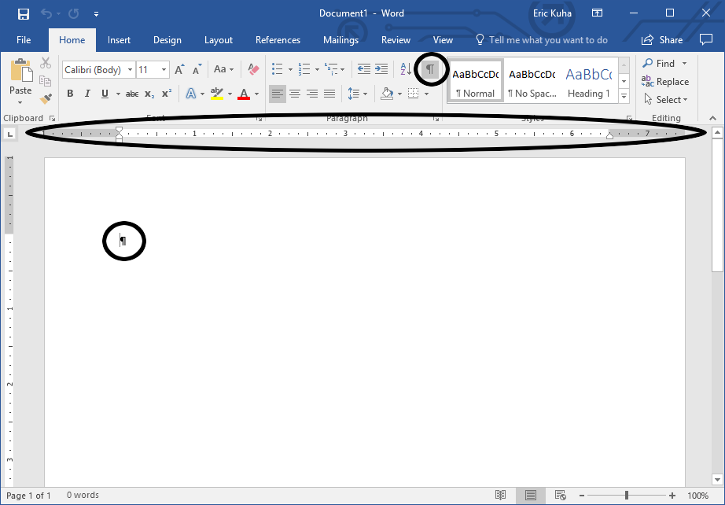
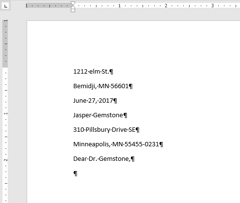
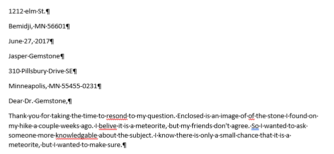
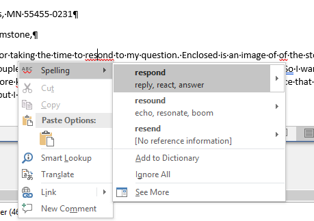
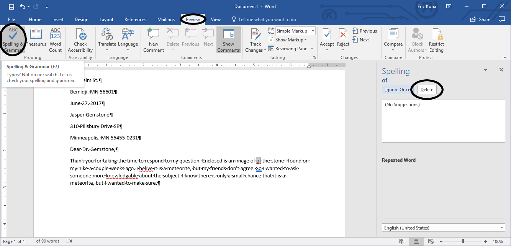

# Basic Text Editing

Word processing is, at its most fundamental, the process of manipulating text. Microsoft Word is a highly robust, feature-rich word processor. However, in order to get at the most advanced features, we should take a look at some of the basic tools and methods at our disposal in the modern word processing environment.

In the following tutorial, we are going to write a basic block-style letter. In the process, we are going to gain experience with the following tools:

<dl>
    <dt>Insertion Point</dt>
    <dd>The blinking line that indicates where text appears when you type.</dd>
    <dt>Paragraph and Line Spacing</dt>
    <dd>How to recognize the default line and paragraph spacing in MS Word and how to change it.</dd>
    <dt>Spellchecking</dt>
    <dd>How Word identifies spelling and grammar errors and how we can use these tools to make our words flow better.</dd>
</dl>

## TUTORIAL

<ol>
    <li>
        Open a new blank document in Word. Ensure that the rulers and non-printing characters are visibile. Check the <a href="introduction.md">chapter introduction</a> if you can't remember where these are. Your window should look like this:
        <figure>
            
            <figcaption>A brand new Word document</figcaption>
        </figure>
    </li>
    <li>
        We are going to write a block-style letter. This means that all of our text will be aligned to the left, paragraphs will be styled as blocks, and we must include the addresses of the sender and receiver at the top of the letter. As luck would have it, most of this fits well with Word's default settings. First, type the address of the sender as follows. Press the <strong>Enter</strong> key wherever you see the carriage return (&crarr;) symbol
        <pre>
        1212 Elm St. &crarr;
        Bemidji, MN 56601 &crarr;
        </pre>
    </li>
    <li>
        Next, type the date:
        <pre>
        June 27, 2017 &crarr;
        </pre>
    </li>
    <li>
        Next, type the sender's address as follows:
        <pre>
        Jasper Gemstone &crarr;
        310 Pillsbury Drive SE &crarr;
        Minneapolis, MN 55455-0231 &crarr;
        </pre>
    </li>
    <li>
        Now, type the salutation:
        <pre>
        Dear Dr. Gemstone, &crarr;
        </pre>
        Your document should look like this:
        <figure>
            
            <figcaption>Addresses, date, and salutation</figcaption>
        </figure>
    </li>
    <li>
        Type the following paragraph <em>exactly</em> as it appears here (typos and all):
        <pre>
        Thank you for taking the time to resond to my question. Enclosed is an image of of the stone I found on my hike a couple weeks ago. I belive it is a meteorite, but my friends don't agree. So I wanted to ask someone more knowledgable about the subject. I know their is only a small chance that it is a meteorite, but I wanted to make sure.
        </pre>
    </li>
    <li>
        When you are finished, notice that Word has detected a number of errors in the text. It has automatically underlined these errors based on what kind of error it is. Underlined in red squiggly lines are spelling and repeated word errors. Double blue underlines are usually punctuation errors. Sometimes, errors automatically correct themselves. In the last sentence, when you typed the word "their", it automatically detected this as the wrong word and corrected it to "there". If, for some reason, it did not, then it at least detected it and will have underlined it in blue.
        <figure>
            
            <figcaption>Spelling and Grammar errors are underlined in different ways.</figcaption>
        </figure>
    </li>
    <li>
        There are a couple of different ways to correct spelling and grammar errors that are detected by Word. <strong>Right-click</strong> on the first error, the word "resond". The context menu will bring up a list of possible replacement words. The first one is often the correct one, but always make sure.
        <figure>
            
            <figcaption>Right-clicking is a good way to quickly fix single errors.</figcaption>
        </figure>
    </li>
    <li>
        To proof the rest of the document, let's use the <strong>Spelling & Grammar</strong> tool. Go to the <strong>Rewview</strong> tab. In the far left <strong>Proofing</strong> group, click on the <strong>Spelling & Grammar</strong> tool. If you copied the above text faithfully, the first error that should pop up is the repeated "of".
        <figure>
            
            <figcaption>The Spelling & Grammar tool gives you a full-featured interface to check for errors in your text.</figcaption>
        </figure>
        Click the <strong>Delete</strong> button to fix the first error. Go through each of the rest of the errors and take the suggested fix for each one. If you have different errors than shown here, feel free to fix those as well.
    </li>
    <li>
        
    </li>
</ol>
