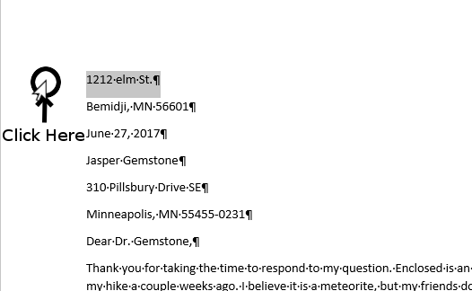
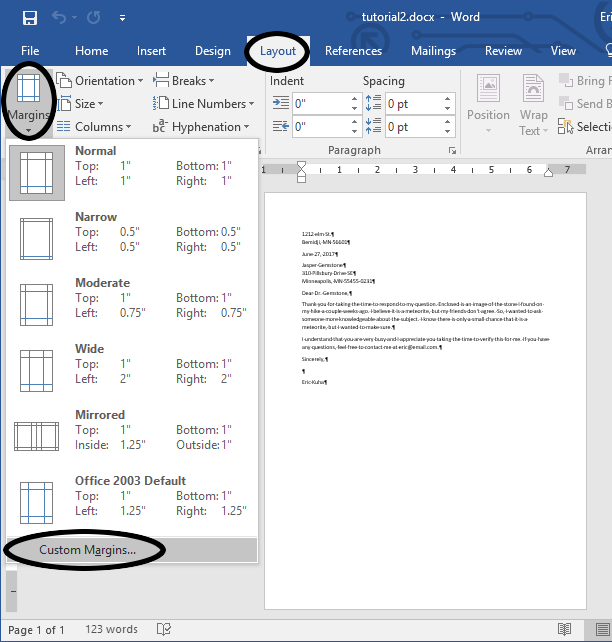
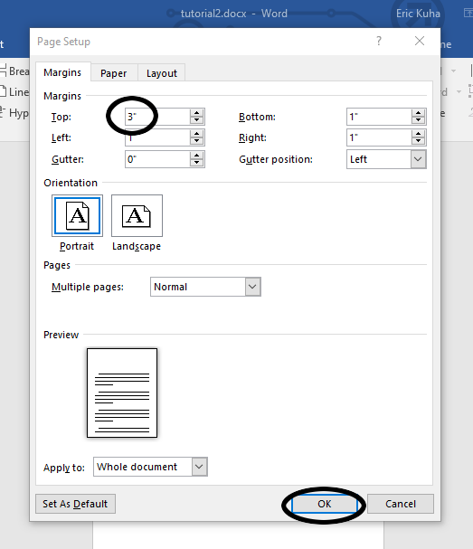

# Basic Text Editing

Word processing is, at its most fundamental, the process of manipulating text. Microsoft Word is a highly robust, feature-rich word processor. However, in order to get at the most advanced features, we should take a look at some of the basic tools and methods at our disposal in the modern word processing environment.

In the following tutorial, we are going to write a basic block-style letter. In the process, we are going to gain experience with the following tools:

<dl>
    <dt>Insertion Point</dt>
    <dd>The blinking line that indicates where text appears when you type.</dd>
    <dt>Paragraph and Line Spacing</dt>
    <dd>How to recognize the default line and paragraph spacing in MS Word and how to change it.</dd>
    <dt>Spellchecking</dt>
    <dd>How Word identifies spelling and grammar errors and how we can use these tools to make our words flow better.</dd>
</dl>

## TUTORIAL

<ol>
    <li>
        Open a new blank document in Word. Ensure that the rulers and non-printing characters are visibile. Check the <a href="introduction.md">chapter introduction</a> if you can't remember where these are. Your window should look like this:
        <figure>
            
            <figcaption>A brand new Word document</figcaption>
        </figure>
    </li>
    <li>
        We are going to write a block-style letter. This means that all of our text will be aligned to the left, paragraphs will be styled as blocks, and we must include the addresses of the sender and receiver at the top of the letter. As luck would have it, most of this fits well with Word's default settings. First, type the address of the sender as follows. Press the <strong>Enter</strong> key wherever you see the carriage return (&crarr;) symbol
        <pre>
        1212 Elm St. &crarr;
        Bemidji, MN 56601 &crarr;
        </pre>
    </li>
    <li>
        Next, type the date:
        <pre>
        June 27, 2017 &crarr;
        </pre>
    </li>
    <li>
        Next, type the sender's address as follows:
        <pre>
        Jasper Gemstone &crarr;
        310 Pillsbury Drive SE &crarr;
        Minneapolis, MN 55455-0231 &crarr;
        </pre>
    </li>
    <li>
        Now, type the salutation:
        <pre>
        Dear Dr. Gemstone, &crarr;
        </pre>
        Your document should look like this:
        <figure>
            
            <figcaption>Addresses, date, and salutation</figcaption>
        </figure>
    </li>
    <li>
        Type the following paragraph <em>exactly</em> as it appears here (typos and all):
        <pre>
        Thank you for taking the time to resond to my question. Enclosed is an image of of the stone I found on my hike a couple weeks ago. I belive it is a meteorite, but my friends don't agree. So I wanted to ask someone more knowledgable about the subject. I know their is only a small chance that it is a meteorite, but I wanted to make sure. &crarr;
        </pre>
    </li>
    <li>
        When you are finished, notice that Word has detected a number of errors in the text. It has automatically underlined these errors based on what kind of error it is. Underlined in red squiggly lines are spelling and repeated word errors. Double blue underlines are usually punctuation errors. Sometimes, errors automatically correct themselves. In the last sentence, when you typed the word "their", it automatically detected this as the wrong word and corrected it to "there". If, for some reason, it did not, then it at least detected it and will have underlined it in blue.
        <figure>
            
            <figcaption>Spelling and Grammar errors are underlined in different ways.</figcaption>
        </figure>
    </li>
    <li>
        There are a couple of different ways to correct spelling and grammar errors that are detected by Word. <strong>Right-click</strong> on the first error, the word "resond". The context menu will bring up a list of possible replacement words. The first one is often the correct one, but always make sure.
        <figure>
            
            <figcaption>Right-clicking is a good way to quickly fix single errors.</figcaption>
        </figure>
    </li>
    <li>
        To proof the rest of the document, let's use the <strong>Spelling & Grammar</strong> tool. Go to the <strong>Rewview</strong> tab. In the far left <strong>Proofing</strong> group, click on the <strong>Spelling & Grammar</strong> tool. If you copied the above text faithfully, the first error that should pop up is the repeated "of".
        <figure>
            
            <figcaption>The Spelling & Grammar tool gives you a full-featured interface to check for errors in your text.</figcaption>
        </figure>
        Click the <strong>Delete</strong> button to fix the first error. Go through each of the rest of the errors and take the suggested fix for each one. If you have different errors than shown here, feel free to fix those as well.
    </li>
    <li>
        Type the following paragraph as it appears here:
        <pre>
        I understand that you are very busy and I appreciate you taking the time to verify this for me. If you have any questions, feel free to contact me at &lt;yourname&gt;@email.com. &crarr;
        </pre>
        Where it says "yourname", enter your name. Notice that when you hit enter to create the next paragraph, the email address is automatically underlined in blue. Word has detected that it is an email address and has converted the text into a <strong>hyperlink</strong>. As a general rule, if you are going to be submitting the document electronically, you would leave the hyperlink as it is, but if you are going to be printing the document and hand-delivering or mailing it, then you should remove the hyperlink since you can't exactly click on a piece of paper.
    </li>
    <li>
        To remove the hyperlink, <strong>right-click</strong> on it and in the context-menu that appears, <strong>left-click</strong> on <em>Remove Hyperlink</em>
        <figure>
            
            <figcaption>Remove the hyperlink</figcaption>
        </figure>
    </li>
    <li>
        To close the letter, type:
        <pre>
        Sincerely, &crarr;
        &crarr;
        &lt;your name&gt;
        </pre>
    </li>
    <li>
        Our last task is to fix some of the formatting. Remember that whenever you press the <strong>Enter/Return</strong> key, Word creates a new paragraph. Observe how the paragraphs of this document are spaced. Notice that inside the longer paragraphs, the lines are single-spaced. That is, they are all scrunched up, visually creating a cohesive unit of information. Between each paragraph, Word inserts an extra line of white space. Normally, this is fine. But at the top of the document, it doesn't look right that the addresses are double-spaced like that. To remove this extra whitespace, click once in the margin to the left of the first line:
        <figure>
            
            <figcaption>Select just the first line of text</figcaption>
        </figure>
        The cursor will flip backwards to indicate that you are in the right place. With the first line selected, in the <strong>Paragraph</strong> group of the <strong>Home</strong> tab, click the <strong>Line and Paragraph Spacing</strong> tool. In the menu that opens, click <strong>Remove Space After Paragraph</strong>.
        <figure>
            
            <figcaption>Remove the space after the paragraph</figcaption>
        </figure>
        The return address should now look like one block of text.
    </li>
    <li>
        Next, we do the same thing with the recipient's address. Observe carefully, though. Only select the first two lines of the address, that is, the name "Jasper Gemstone" and the street address "310 Pillsbury Drive SE".
        <figure>
            
            <figcaption>Just select the first two lines of the address</figcaption>
        </figure>
        Once again, remove the space after the paragraphs in the <strong>Line and Paragraph Spacing</strong> menu. Observe how the addresses and the date now are spaced logically so that the eye sees them as discrete pieces of information.
    </li>
    <li>
        Last, but certainly not least, if you zoom out and look at the document as a whole (you can zoom using the slider at the bottom-right corner of the window), you will notice that all of the text of the letter is scrunched up at the top of the page leaving all of the blank white space at the bottom. It will look better when it's printed if we balance the whitespace equally at the top and the bottom. To do this, we could just add a bunch of new lines at the top of the document. But, for a cleaner approach, we'll just increase the size of the top margin. In the <strong>Layout</strong> tab, find the <strong>Margins</strong> tool in the <strong>Page Setup</strong> group. None of the defaults is appropriate, so we will select the <strong>Custom Margins</strong> option at the bottom of the menu.
        <figure>
            
            <figcaption>Custom Margins</figcaption>
        </figure>
        In the dialog that opens, feel free to browse all of the tools that are available here and when you are ready, change the top margin to <em>3</em> inches and press <strong>OK</strong>.
        <figure>
            
            <figcaption>Change the top margin to 3 inches</figcaption>
        </figure>
    </li>
    <li>
        Your final file should look like this.
        <figure>
            
            <figcaption>The completed document</figcaption>
        </figure>
        Save the document and submit it to the class portal as normal.
    </li>
</ol>
