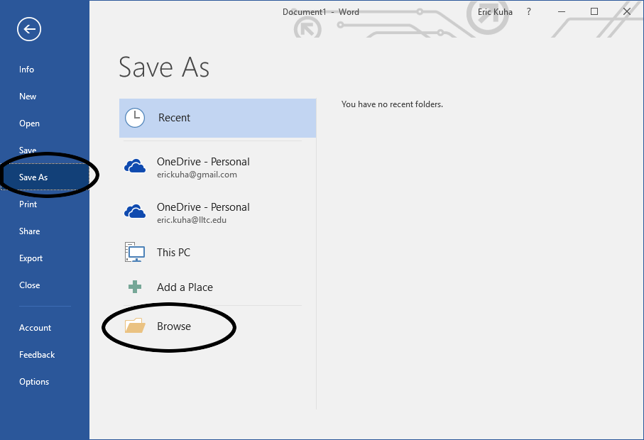

# Creating, Editing, and Saving a Word Document

We are going to create, edit, and save a word document. This document will be submitted to the class portal for grading.

## TUTORIAL

<ol>
    <li>Open Microsoft Word by clicking the <strong>Start Menu</strong> button and either navigating to Word or typing "word" into the search bar.</li>
    <li>
        Word will open into the <strong>backstage view</strong>.
        <figure>
            
            <figcaption>Backstage View</figcaption>
        </figure>
    </li>
    <li>Click on the <strong>Blank Document</strong> template.</li>
    <li>
        In the document, type out a brief introduction for yourself answering these questions:
        <ol>
            <li>What is your name?</li>
            <li>What is your program?</li>
            <li>Do you own a general-purpose computer? What kind? (Smartphones count)</li>
            <li>What do you use it for?</li>
            <li>Do you use a computer at work?</li>
            <li>What do you use it for?</li>
            <li>On a scale of 1-10, how would you rate your experience with digital technology?</li>
            <li>What do you hope to get out of this class?</li>
        </ol>
        <figure>
            
            <figcaption>This is kind of what we're looking for.</figcaption>
        </figure>
    </li>
    <li>
        When you are finished typing, click the <strong>File</strong> tab to return to the <strong>backstage view</strong>.
    </li>
    <li>
        Click <strong>Save As</strong>
        <figure>
            
            <figcaption>Click "Save As"</figcaption>
        </figure>
    </li>
    <li>Click <strong>Browse</strong> to open the file explorer.</li>
    <li>
        Navigate to your itech 100 folder which you created in the file manager tutorial. Give this file a logical name. Ensure that it's being saved as a <strong>Word Document (*.docx)</strong>. Click <strong>Save</strong>.
        <figure>
            
            <figcaption>Your "Save As" dialog should look kind of like this.</figcaption>
        </figure>
    </li>
    <li>
        You can exit Word now. Finally, you will upload this file to class portal. Wait for instructions from the instructor for how to do this.
    </li>
</ol>
