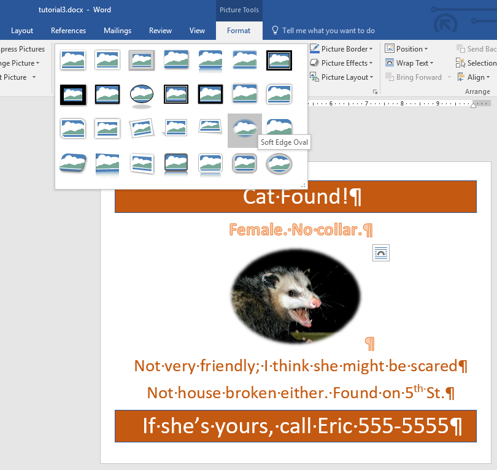

# Formatting and Working with Images

A modern word processor is more than just a tool to write letters. It's also a full-featured desktop publishing app. While perhaps not ideal for very complex layouts -- for that, you'll want an actual desktop publishing app like [Microsoft Publisher](https://products.office.com/en-us/publisher) or [Adobe InDesign](http://www.adobe.com/products/indesign.html) -- but for relatively simple publishing projects, a word processor can be great for quickly throwing together something that looks decent and does the job.

For this tutorial, we will be creating a flyer for a found "pet". The inspiration for this tutorial is based on a popular [internet meme](http://knowyourmeme.com/memes/irl-troll-posters).

## Tools Covered

<dl>
    <dt>Margins</dt>
    <dd>Changing the margins doesn't have to be tricky. Word comes with several useful pre-defined margin settings</dd>
    <dt>Orienatation</dt>
    <dd>Sometimes you want the sheet of paper taller than it is wide, other times, you want it wider than it is tall. Word makes switching this setting easy.</dd>
    <dt>Text Effects</dt>
    <dd>A quick way of giving text some interesting colors and styles</dd>
    <dt>Font Color and Shading</dt>
    <dd>Not all text need be black and white. It's the 21st century and we can use color if we want.</dd>
    <dt>Borders</dt>
    <dd>Using borders can add visual appeal to simple bits of text.</dd>
    <dt>Format Painter</dt>
    <dd>Quickly and easily apply complex formatting from one piece of text to another without having to repeat all of the same steps over again.</dd>
    <dt>Images</dt>
    <dd>What would a modern document be without a few pictures? Word has come a long way in its ability to insert and manipulate images in documents. We'll try out a few of the image manipulation tools that Word provides.</dd>
</dl>

## TUTORIAL

<ol>
    <li>
        Download these two files:
        <ul>
            <li><a href="https://s3.amazonaws.com/lltc-itech/ITECH100/tutorial3.docx">Example File</a></li>
            <li><a href="https://s3.amazonaws.com/lltc-itech/ITECH100/possum.jpg">Example Image</a></li>
        </ul>
        Move both files from the downloads folder to somewhere that you won't lose them.
    </li>
    <li>
        Open the file named <em>tutorial3.docx</em>. The first thing you should notice is that it is just plain text in the default Word format. It's not a bad idea when building a flyer to create the content first and the work on the formatting later.
        <figure>
            
            <figcaption>Start with content</figcaption>
        </figure>
    </li>
    <li>
        First, in the <strong>Layout</strong> tab, under <strong>Margins</strong>, change the page margins to <em>Narrow</em>
        <figure>
            
            <figcaption>Change to Narrow Margins</figcaption>
        </figure>
        This allows you to use as much of the page as possible without sacrificing too much page-padding margin.
    </li>
    <li>
        Next, in the same tab, right next to the <strong>Margins</strong> tool is the <strong>Orientation</strong> tool. Click it and change the orientation to landscape.
        <figure>
            
            <figcaption>Change to Landscape orientation</figcaption>
        </figure>
        The default <em>Portrait</em> orientation is taller than it is wide, but for this flyer, we want the page wider than it is tall.
    </li>
    <li>
        Next, select all of the text (Shortcut: <em>Ctrl-a</em>) and center the text using the center alignment tool in the <strong>Home</strong> tab, <strong>paragraph</strong> group.
        <figure>
            
            <figcaption>The alignment tools</figcaption>
        </figure>
    </li>
    <li>
        Time to make the text pop. First, we'll start making it all bigger. Select the first line of text and increase the font size to 48 using the font size tool in the <strong>Font</strong> group.
        <figure>
            
            <figcaption>The Font size tool</figcaption>
        </figure>
        Select the rest of the text and set the font size to 36.
    </li>
    <li>
        Some fancy formatting is easy. Select the second line of text ("Female. No collar."). In the <strong>Font</strong> group, click the <strong>Text Effects</strong> button and select the effect in the middle of the top row. It's the orange one. These text effects are a quick way to add a little eye-catching flair to a document. Be careful not to overuse it, of course, or you risk your work looking silly.
        <figure>
            
            <figcaption>Text Effects Menu</figcaption>
        </figure>
    </li>
    <li>
        Now, select the third and fourth lines and click on the <strong>text color</strong> tool. Choose the dark orange color, second from the bottom in the middle column of the theme colors pallette.
        <figure>
            
            <figcaption>Font Colors Menu</figcaption>
        </figure>
        It is not a bad idea to get used to choosing colors from the "theme colors" part of the pallette, as these colors are chosen by design experts and designed to look well together.
    </li>
    <li>
        Another way to grab the eye is to change the background color of some text. Select the first line of text ("Cat Found!"). In the <strong>Paragraph</strong> group, select the <strong>Shading</strong> tool -- it looks like a paint bucket -- and select the same dark orange color as you did before.
        <figure>
            
            <figcaption>The Shading Menu</figcaption>
        </figure>
        It is generally considered bad design to have dark text on a dark background. So, with the first paragraph still selected, under <strong>Font Color</strong>, change the text to white.
    </li>
    <li>
        To add just a little bit more interest to the first line, let's add a border. With the line still selected, click on the <strong>Borders</strong> tool in the <strong>paragraph</strong> group. At the bottom of the borders menu, click <strong>Borders and Shading</strong>. Set the border as follows:
        <ul>
            <li>Set <strong>Box</strong> base style</li>
            <li>Set the color to the dark blue one spot to the left of the dark orange color we've been using</li>
            <li>Set the width to 2&frac14;</li>
        </ul>
        <figure>
            
            <figcaption>The Borders and Shading Dialog</figcaption>
        </figure>
        Press <strong>OK</strong>.
    </li>
    <li>
        Now, we want to do all of that again to the bottom line of text. However, there is an easy way to do it. We will use the <strong>Format Painter</strong> tool. Ensure that the first line is still highlighted. In the <strong>Clipboard</strong> group of the <strong>Home</strong> tab, click on the <strong>Format Painter</strong> tool.
        <figure>
            
            <figcaption>The Format Painter Tool</figcaption>
        </figure>
        Finally, simply highlight the bottom line of text. All of the formatting from the first line should be immediately applied to the last line like so:
        <figure>
            
            <figcaption>The result of the Format Painter operation</figcaption>
        </figure>
    </li>
    <li>
        Let's add the image. Move the <em>insertion point</em> to the end of the second line. Press the <em>Enter</em> key (&crarr;) to create a new line. Next, in the <strong>Insert</strong> tab, <strong>Illustrations</strong> group, click the <strong>Pictures</strong> tool.
        <figure>
            
            <figcaption>The Pictures Tool</figcaption>
        </figure>
        In the dialog that opens, navigate to the image file that you downloaded at the beginning of the tutorial, <em>possum.jpg</em>. Select it and click the <strong>Insert</strong> button.
        <figure>
            
            <figcaption>The Insert Picture Dialog</figcaption>
        </figure>
        The picture is very large, and will have pushed all of the other text onto two other pages.
    </li>
    <li>
        To resize the image, you click and drag on one of the eight "handles" on the edges of the selected image. For our purposes, ensure that you <em>always</em> use the corner handles. If you use the edge handles, it will stretch and distort the image. To maintain its <strong>aspect ratio</strong>, we click and drag from the corners. Try it now. Drag one of the corner handles until the image is smaller. Keep resizing the image in small increments until all of the content fits on one page again. In the <strong>Picture Tools</strong> tab, on the right, the height and width of the image should be a little less than 4 inches by 3 inches.
        <figure>
            
            <figcaption>Resizing the Image</figcaption>
        </figure>
    </li>
    <li>
        Now, let's style the image. With the image selected, ensure that you are in the <strong>Picture Tools/Format</strong> tab. In the <strong>Picture Styles</strong> group, click the <em>More</em> button (the little down arrow) to expand the styles menu. Select the <strong>Soft Edge Oval</strong> style. Resize the image again if you need to. The result should look something like this:
        <figure>
            
            <figcaption>Styling the Image</figcaption>
        </figure>
    </li>
    <li>
        Replace the name at the bottom with your own and adjust font sizes as needed to fit everything on one page. With that, the flyer is complete. Submit the completed file to the class portal.
    </li>
</ol>
