# Styles and Themes

One of the most important rules when it comes to building professional documents is consistency. When you create a heading for a section in your document, you want all other headings to look the same, otherwise it just won't look right. You might confuse your reader about what sort of importance a section has. And yet, applying several different formats (color, font, size, etc) to a some text can be tedious, especially if you have to do it over and over again to multiple section headings. Most modern word processors have built-in systems for styling a document quickly and consistently. You can apply styles for titles, lists, and multiple levels of headings among other things. Let's look at an example. This tutorial takes the unformatted text of a purchase proposal document and transforms it into a professional-looking and, hopefully convincing, argument in favor of a large purchase.

## Tools Covered

<dl>
    <dt>Styles</dt>
    <dd>Quick-Styles allow you to easily and consistently apply uniform styling to your document</dd>
    <dt>Themes</dt>
    <dd>Themes are specially tailored sets of formatting which can change the look and feel of an entire document.</dd>
    <dt>Headers and Footers</dt>
    <dd>Bands of white space at the top and bottom of the page that can be used to add repeated information such as the author's name or the page number.</dd>
</dl>

## TUTORIAL

[Start File](https://s3.amazonaws.com/lltc-itech/ITECH100/word_resources/tutorial4_start.docx)

<ol>
    <li>
        Download the start file and open it in Microsoft Word. Look over the document to get a feel for what is here.
        <figure>
            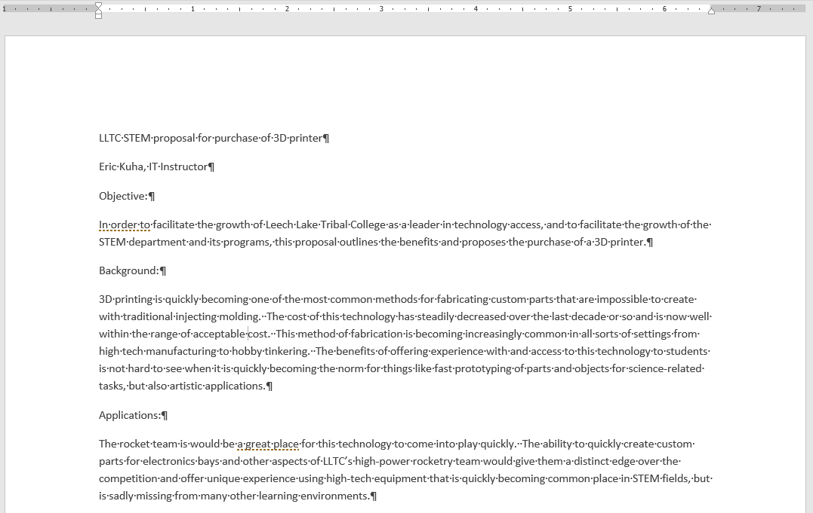
            <figcaption>A proposal to purchase a 3D printer</figcaption>
        </figure>
    </li>
    <li>
        First, select just the first line of text. In the <strong>Home</strong> tab, look at the <strong>Styles</strong> group. Depending on your screen's resolution, yours might look different. Expand the menu and see what styles are in the menu.
        <figure>
            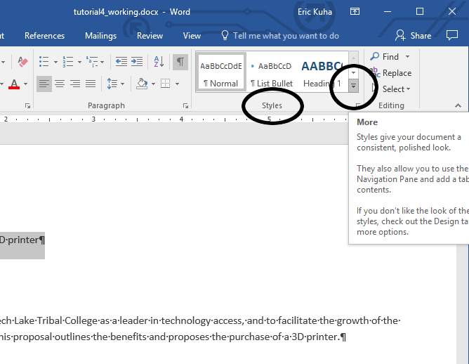
            <figcaption>Open the Styles Menu</figcaption>
        </figure>
        If you hover the mouse cursor over any of the styles in the menu, Word will allow you to preview what the style will look like when applied. Click on the <strong>Title</strong> style.
        <figure>
            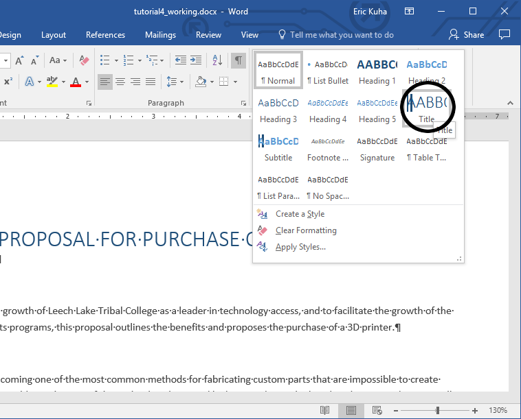
            <figcaption>Select the Title style</figcaption>
        </figure>
        Observe the effect.
    </li>
    <li>
        An interesting thing about the Title and the various Heading styles is that they always affect entire paragraphs, so you don't actually need to select the paragraph that you want to change. You just need to move the insertion point to somewhere in the paragraph and then select it. Move the <strong>insertion</strong> point to somewhere in the third paragraph, the one the says "<strong>Objective:</strong>". In the <strong>Styles</strong> menu, select the <strong>Heading 1</strong> style.
        <figure>
            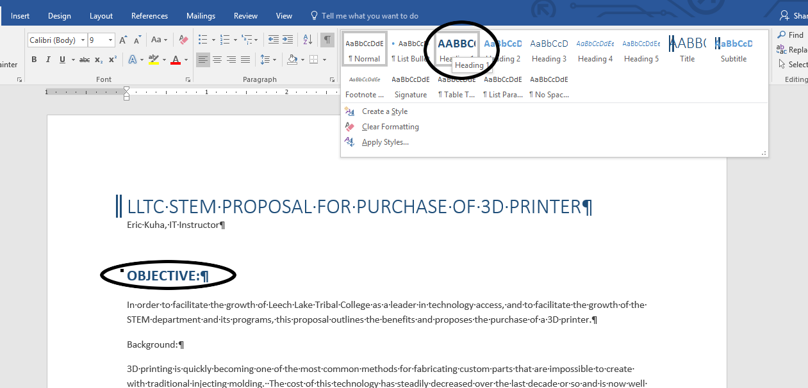
            <figcaption>Apply the Heading 1 style</figcaption>
        </figure>
        Notice that there are more than one level of headings. This allows you to arrange information in a document according a hierarchy. It is unlikely that you will have more than a few levels of headings in any normal document, however, the option exists if you want it. It's usually best to use the lowest level heading that keeps your document's hierarchy clear.
        <figure>
            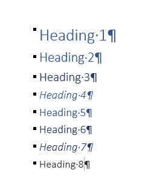
            <figcaption>Eight levels of headingst.</figcaption>
        </figure>
    </li>
    <li>
        Apply the <strong>Heading 1</strong> style to each of the other section headings: <em>Background</em>, <em>Applications</em>, <em>Proposal</em>, <em>Costs</em>, and <em>Conclusion</em>
        <figure>
            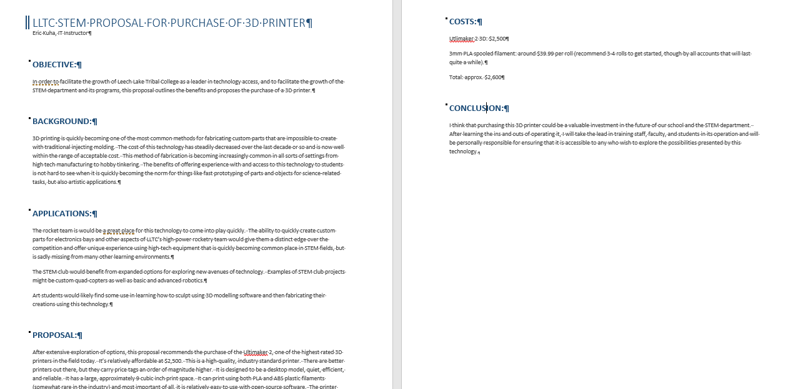
            <figcaption>All section headings formatted</figcaption>
        </figure>
    </li>
    <li>
        Scroll down the <em>Costs</em> section. There are three paragraphs that list the projected costs of the purchased equipment. Select all three paragraphs. In the <strong>Paragraph</strong> group of the <strong>Home</strong> tab, click on the <strong>Bullets</strong> button to convert these three lines into a bulleted list.
        <figure>
            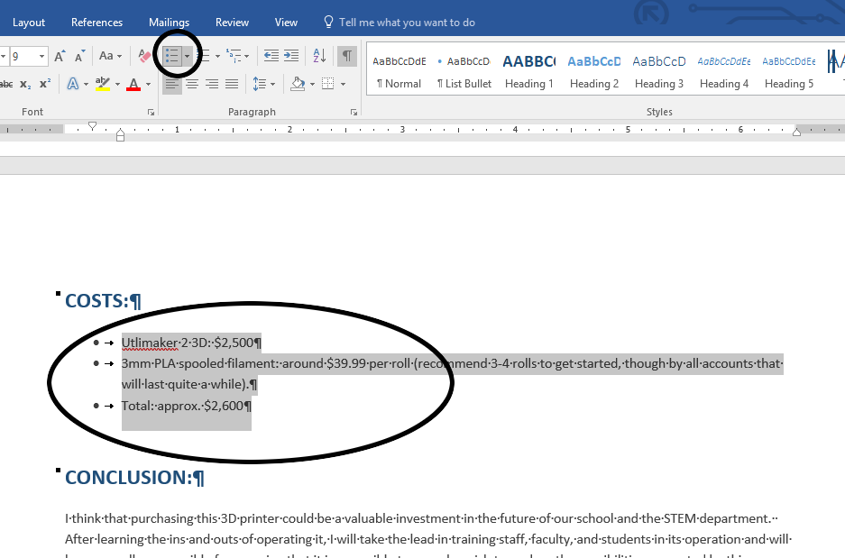
            <figcaption>A bulleted list</figcaption>
        </figure>
        Bulleted and numbered lists are essential to all design. By using a list format, you can make information easy to read and digest. People like lists.
    </li>
    <li>
        To add the <strong>header</strong>, go to the <strong>Insert</strong> tab and find the <strong>Header & Footer</strong> group. Click on the <strong>Header</strong> tool. Inside the Header menu are a number of useful pre-made header templates, but we are just going to add a blank one.
        <figure>
            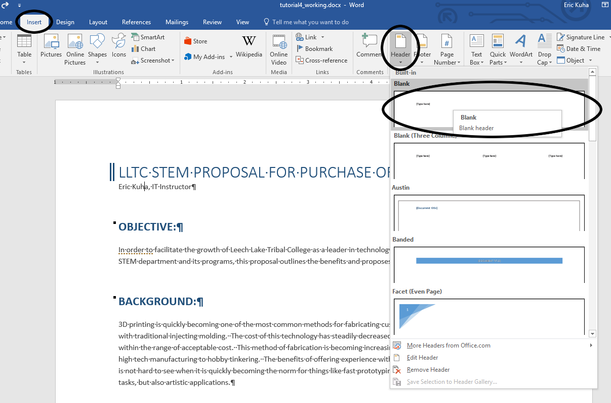
            <figcaption>Add a blank header</figcaption>
        </figure>
        A document control that says <strong>[Type here]</strong> will already be selected. Type "Leech Lake Tribal College". Go to the <strong>Home</strong> tab and right-align the header text.
        <figure>
            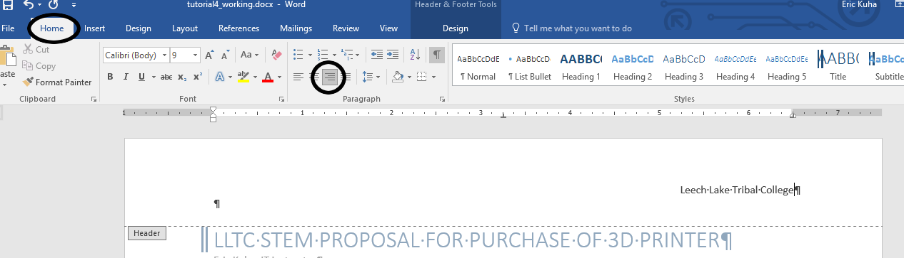
            <figcaption>Righ-align the header text</figcaption>
        </figure>
        Scroll down to the next page and note that the text is also included at the top of this page. In fact, what you type into a header will be repeated on every page.
    </li>
    <li>
        Next, we're going to add page numbers. With the insertion point still inside the header, go to the <strong>Header & Footer Tools</strong> context tab and click the <strong>Go To Footer</strong> tool.
        <figure>
            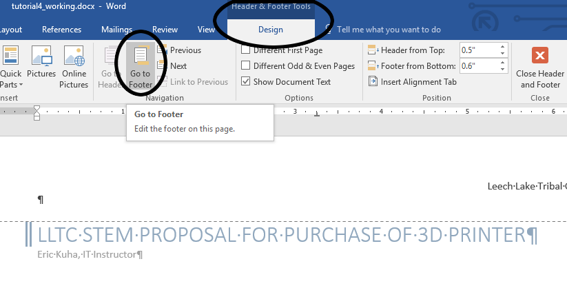
            <figcaption>Go to the footer</figcaption>
        </figure>
        Next, click the <strong>Page Number</strong> tool at the top left. Inside, the Page Number menu, select <strong>Bottom of Page</strong> and finally select <strong>Plain Number 2</strong> which will create a centered page number on each page of the document in the footer.
        <figure>
            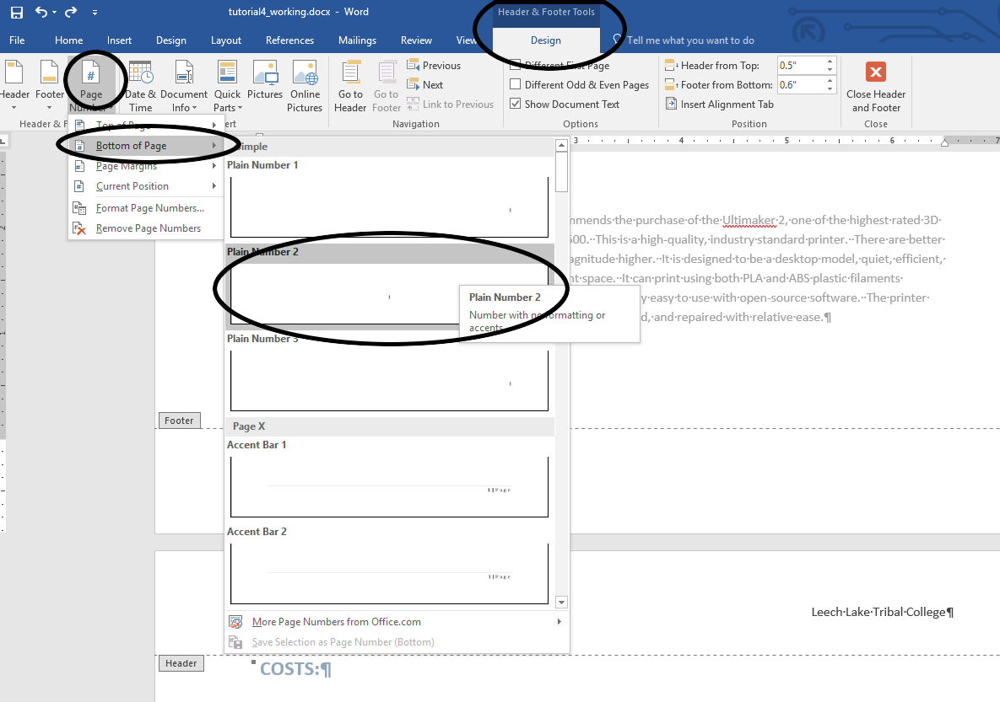
            <figcaption>Create a centered page number on each page</figcaption>
        </figure>
        Finally, click <strong>Close Header and Footer</strong> to leave the Footer.
    </li>
    <li>
        Our last task will be to change the <strong>Theme</strong> of the document. Themes are built-in sets of fonts, styles, colors, and other formatting that are designed to go together harmoniously. Since most people aren't real great at design, why not let Word do all of the hard work for you? Go to the <strong>Design</strong> tab. At the left end of the ribbon, there is a <strong>Theme</strong> tool which will open a menu with several pre-designed themes for you to choose from. Hover the moust over a few of them and observe how they change the entire look of the document. Select the <strong>Facet</strong> theme.
    </li>
    <li>
        Save your document and upload it to the class portal.
    </li>
</ol>
