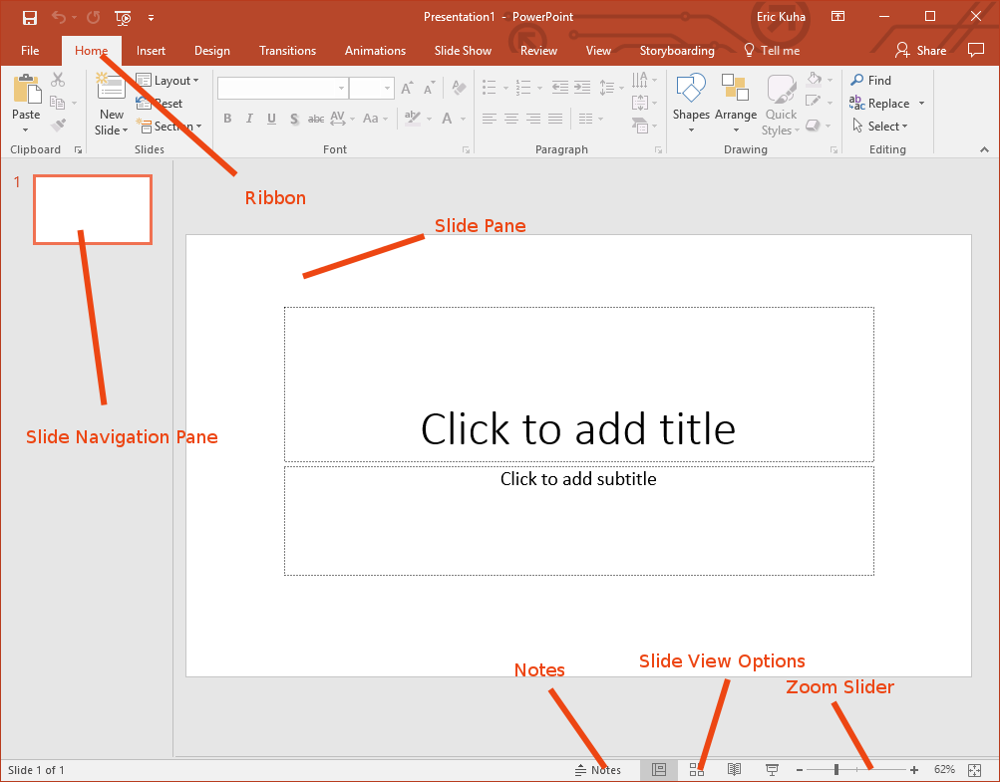

# Introduction

Microsoft PowerPoint is a presentation graphics application that includes a suite of tools and utilities to create professional presentations.

## PowerPoint at a Glance

<figure>
    
    <figcaption>The MS PowerPoint Interface</figcaption>
</figure>

<dl>
    <dt>Ribbon</dt>
    <dd>The Ribbon is your main tool belt for PowerPoint. It should look familiar to you if you worked through the chapter on Microsoft Word. Many of the tools are very similar and these will work about as they do in Word. You should take some time to explore each of these tabs and figure out what each of these tools do.</dd>
    <dt>Slide Pane</dt>
    <dd>The main work area which takes up most of the screen space. This shows the currently selected slide from your slide show.</dd>
    <dt>Slide Navigation Pane</dt>
    <dd>This is an outline view of your presentation. It shows thumbnails of all of the slides in your slide show and allows you to quickly jump back and forth between them.</dd>
    <dt>Notes</dt>
    <dd>This tools opens a <strong>Notes</strong> pane in which you can type notes for yourself for when you are actually giving your presentation. PowerPoint includes a feature where you can see the notes on your screen, but the audience cannot see them on the projector. Highly useful.</dd>
    <dt>Slide View Options</dt>
    <dd>Most commonly, you'll use this set of tools for starting the slide show in presentation mode. However, you can also use it to jump to various other views for doing such things as rearranging the slides in your presentation</dd>
    <dt>Zoom Slider</dt>
    <dd>Allows you to zoom in and out on your current slide to do detail work or see the big pictures.</dd>
</dl>

## PowerPoint Principles

PowerPoint (and most other presentation software) is built around the metaphor of a slide show. Each slide is a discrete panel with some information in the form text, graphics, or images. The presenter can advance the slide show by hitting the spacebar, clicking a mouse, or using a special wireless clicker that they can hold discretely in the palm of the hand. The basic concepts are simple enough. However, there are a few things that you should keep in mind as you explore this and other software like it.

First, the most important thing to remember is that *the slide show is not the presentation*. You speaking and interacting with your audience is your presentation. The slide show is a supplement. It's a visual aid. It is used to highlight and accentuate key points, but it is *not* the presentation itself.

Now, this is not always the case. Some people do share slide files as a way of passing along information in a structured way. Indeed, it's a fairly common practice, but by and large, it is not what we are going to be using it for in this class. Personally, I find it really obnoxious to read a PowerPoint when I could be reading an essay or article.

Since this is not a public speaking course, the art of rhetoric is not covered in detail here, however, it is necessary to talk a little bit about the rhetoric of a slide show. So throughout this chapter, we will occasionally discuss ways in which to blend the art of speaking with the art of crafting a slide show. We will talk about how to make your slide show complement your speech without drawing too much of your audience's attention.
