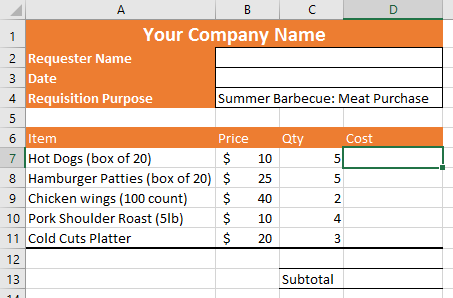
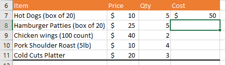
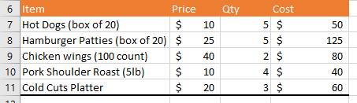
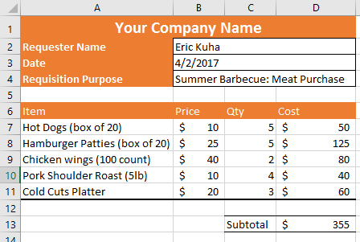

# TUTORIAL 1 - Formulas Tutorial

Here is a brief tutorial to walk you through some of the ideas covered in the [previous section](http://itech.erickuha.com/spreadsheets/formulas/). In this scenario, your co-worker brings you a budget spreadsheet showing the meat quantities for a company barbecue. Only problem is, your co-worker does not know how calculate the totals in the spreadsheet. That's where you come in.

1. Download the [start file](res/formulas_start.xlsx).   
2. Fill in the information at the top of the screen.
3. Examine the spreadsheet and get a sense of what it's for. Fill in the first empty space with your name and the date with today's date.
1. Next, we want to fill in rest of the form. Now, we _could_ get out a calculator and do all of these calculations by hand, but we are not going to because that's how mistakes are made. We are going to let Excel do all of the work.
2. Start by deciding what calculation we need to perform in order to calculate just the cost of the Hot Dogs. The price is $10 for a box and we are ordering 5 boxes. It would be really easy to just put $50 in the Cost column. But instead, in cell `D7` enter the formula `=B7*C7`. Hit **Enter** and observe that the cost is, as we guessed, $50. Notice that Excel even automatically decided on an appropriate number format!   
3. For the next line, instead of typing in the formula by hand, try this. Click on cell `D8`. Then press the **equal sign** (=). Now click on cell `B8`, then press the **asterisk key** (\*). Last click on cell `C8` and press **Enter** on the keyboard. You will now see that the result is $125.
4. Fill in the next three lines of the table in this manner. It should look like this:   
1. To calculate the total, we need to add up all of the numbers in the column together. There are easier ways to do this, but for now, simply use the same technique that we've been employing.  Press the **equal sign** (=), and then alternate clicking on each cell and pressing the **plus sign** (+). Your formula will be `=D7+D8+D9+D10+D11`. When you hit **Enter**, the result will be $355.
2. The completed purchase requisition will look like this:   

Finally, upload your completed file to the [class portal](http://my.lltc.edu/ics).
