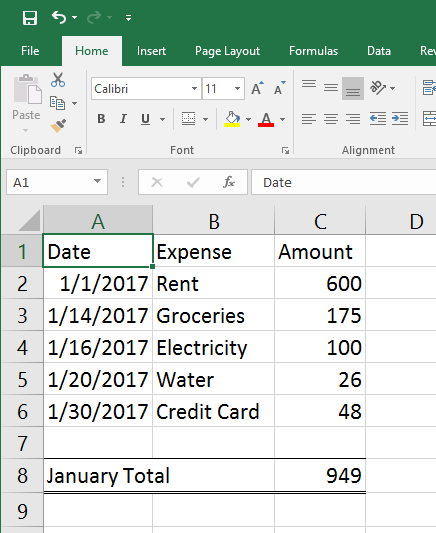

# What is a spreadsheet?

<figure>

    <figcaption>An ancient ledger. <a href="https://commons.wikimedia.org/wiki/File%3AHauptbuch_Hochstetter_vor_1828.jpg">via Wikimedia Commons</a></figcaption>
</figure>

One of the most fundamental tasks of a computer is to automate tasks that, not so long ago, had to be done by hand. _The goal of a computer is to save you time and work_. Spreadsheet software is one of the most fundamental and oldest software paradigms to do this.

Consider that a long time ago, if you owned a shop or had a job, the only way you had of knowing whether you had made any money was by counting your money at the end of the day and hoping it was more than you had yesterday. Throughout history, many civilizations and enterprising people developed all sorts of ways of keeping track of numbers for various reasons. Maybe they were financial. Perhaps scientific. No matter the reason, it was all done by hand.

So in the 70s, you can imagine how many accountants, business people, family budget balancers, and scientists were pretty eager to find out just how these new computing machines could help them simplify the process of keeping track of numbers. And indeed, this was one of the places where the earliest computers truly shined.

## Terms

<dl>
    <dt>Spreadsheet</dt>
    <dd>A software tool which simplifies the process of entering, manipulating, and storing <strong>tabular data</strong></dd>
    <dt>Data</dt>
    <dd>Raw, unorganized facts. Unprocessed information. Seemingly random and meaningless</dd>
    <dt>Information</dt>
    <dd>Data that has been given structure, organized, given context, or in some other way made useful</dd>
    <dt>Tabular Data</dt>
    <dd>Data that has been organized into information by organizing it into a table. Typically, numerical data.</dd>
</dl>

If I pull out my smartphone and check the weather, I will have a pretty good idea about whether I need to wear a coat or bring an umbrella. 

But, if I were to list the outside temperature at my home hour by hour, day after day, year after year, somehow, I should be able to use that data to predict whether I should wear a coat on a particular day of the year. However, if I just handed you a list of dates, times, and temperatures, it actually wouldn't mean that much to you. That's because it's just <strong>raw data</strong>. You could read down the list and maybe find out what the temperature was on your birthday, but other than that, you can't really learn anything from this list of temperatures.

So we need to find a way to process that raw data into useful <strong>information</strong> and maybe we can learn something deeper. Converting that data into a line graph, for instance, might give you an interesting visual idea of the temperature changes throughout the day. Or the year. Perhaps I can go a step futher and learn something about yearlong trends in temperature in my region. Perhaps I can include data points about rainfall and see if there's a relationship between temperature and rain. Maybe you could take thirty or even a hundred years of temperature data to determine the effects of climate change in my region.

Spreadsheet software does all of this and more. We are going to start relatively simple, but our goal in this course is a deep enough understanding of the sofware to do things like keep track of your finances, build a budget, and even build a business plan or scientific data analysis.

## An Example

The basic file format of a spreadsheet file, as seen earlier, is a **workbook**. Each workbook is divided into **worksheets**. Each worksheet is divided into **cells**. The cells are regularly aligned and spaced into **rows** and **columns**. Each cell is capable of holding data of many different types.  Each cell can be identified by the letter of its column and the number of its row. This is called the **name** or **address** of the cell. The upper limit of cells that a spreadsheet can support is around 16,000 columns and a little over a million rows.

To follow along, download the <a href="http://erickuha.com/primer/excel_resources/example1.xlsx">example file</a>.

It should look like this:

<figure>
    
    <figcaption>A simple budget</figcaption>
</figure>

Try selecting the cell in **column C** and **row 2**. We shorten this to **cell C2**. Once you click on it, a few things happen. The cell selector moves to outline that cell. The column and row headings for the cell are now highlighted (in this case, th ecolumn heading D and the row heading 3). Now, look at the name box in the top left corner; it now contains the letters C2. This is, again, the name of the currently selected cell. Lastly, look at the formula bar, it also shows the contents of the cell, in this case, the number 600.

To see something a little different, click on **cell C8**. Notice that while the cell contains the value 949, the formula bar contains something much different. It contains the **formula** `=SUM(C2:C7)`. This is called a formula and it will be discussed in the sections to come. In this particular case, this formula calculates the total of all of the bills for the month of January.

You can also select more than one cell. You can select cells in rows, columns, or blocks by simply clicking and dragging the mouse. Try selecting all of the cells between **A2** and **C8**. Click on A2, drag the mouse down to cell C8, and release the mouse button. To address or name a range of cells, you typically name just the top-left and bottom-right cells separated by a colon. In this case, Excel sees the block of cells as **A2:C8**.

In the next section, we will look at some basic formatting.
