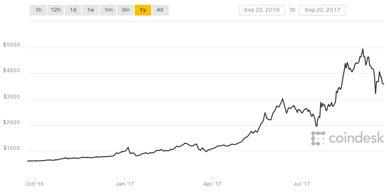
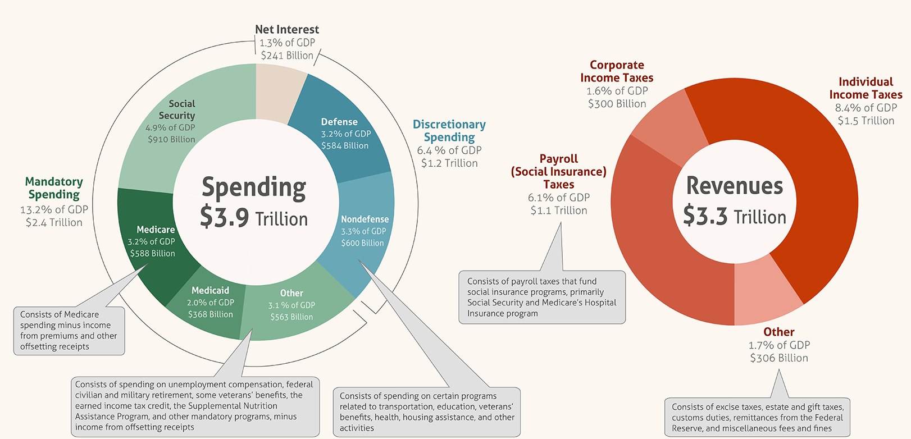
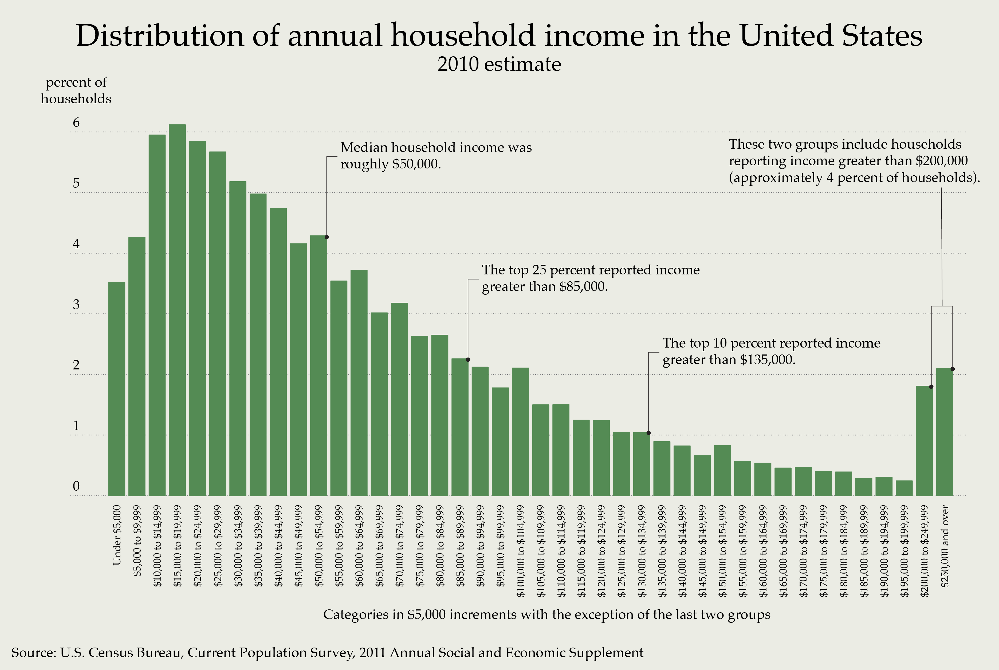
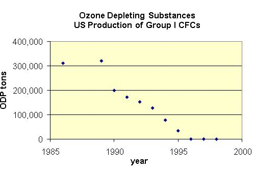
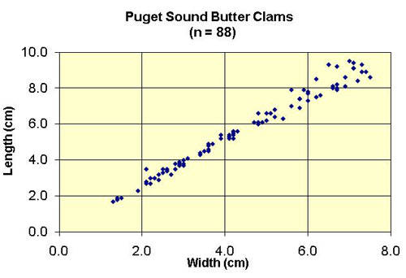
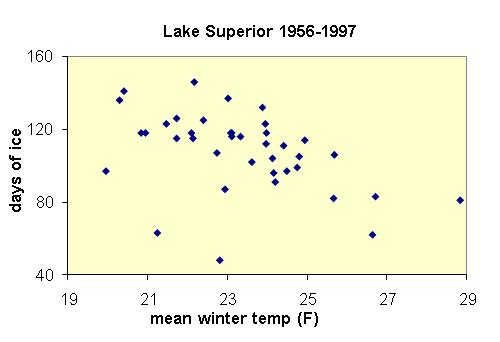

# Functions and Basic Charts

It's not time to look at how we can visualize data. Let's create some charts!

For this tutorial, we'll look at some basic charting as well as some more statistical functions.

## Charts

First, though, we should think about charts and what they're for. Charts and graphs are for visualizing data, but it can often be tricky to decide just what kind of chart to use. So how do we decide? Here's a basic rundown, then we'll look at a couple of examples:

| Chart Type   | When to use it                                                                                                                                           |
|--------------|----------------------------------------------------------------------------------------------------------------------------------------------------------|
| Line Graph   | Line graphs are used to track changes over time. So if there's a time dimension, use a line graph                                                        |
| Pie Chart    | Use a pie chart to compare parts of a whole. Like a pie!                                                                                                 |
| Bar Graph    | Like a line graph, used to compare changes over time, but usually best for large changes. Can also be used to to compare things between different groups |
| Scatter Plot | If you have two variables that relate to each other, you can set one to the X axis and one to the Y axis. It shows the relationship between two things   |

What does each one look like?

### Line Graph

A line graphs are really great for showing changes over time. A very common example would be to show stock prices changes over time. For a fun contemporary look at a line graph, here's the price of BitCoins over the last year.

<figure>
    
    <figcaption>The price of a Bitcoin in USD($) over the last year.</figcaption>
</figure>

As you can see, it gives a fantastic visualization of the change in price over the last year for the most famous crypto-currency. By the way, if you're curious, you can get a good overview of Bitcoin on [wikipedia](https://en.wikipedia.org/wiki/Bitcoin). If you're really interested, the original [whitepaper](https://bitcoin.org/bitcoin.pdf) for Bitcoin is only 8 pages long and is a pretty interesting read as well.

### Pie Chart

A pie chart is great to compare parts of a whole. A particularly infamous example would the United States budget. Here's a comparison of US spending vs US revenue in two pie charts:

<figure>
    
    <figcaption>The FY 2016 US federal spending vs revenue. Source: Wikipedia</figcaption>
</figure>

### Bar Graph

Bar graphs are great for comparing different groups of things. For instance, this chart shows the what percent of US households earn what amount of money in $5000 increments. Except for the last couple of bars, which are clearly labeled. The purpose of the chart is to show income inequality in the United States and illustrates the point quite nicely. Though, of course, it only tells part of the story. The whole story is, perhaps, somewhat bleaker even than this. But that's beyond the scope of this tutorial.

<figure>
    
    <figcaption>Distribution of Annual Income Source: US Census Bureau</figcaption>
</figure>

### Scatter Plot

Scatter plots allow you to examine potential correlations between two variables. Sometimes there's a correlation and sometimes there isn't. Here's an example:

<figure>
    
    <figcaption>Source: seattlecenteral.edu</figcaption>
</figure>

This scatter plot correlates ozone-depleting chemicals with time, showing a promising trend after the ban of CFCs.

<figure>
    
    <figcaption>Source: seattlecenteral.edu</figcaption>
</figure>

This scatter plot shows the correlation between the length and width of a particular species of clam. This one is interesting in that it shows what's called a linear correlation. That is, you could easily draw a straight line through the points that would be very close to all of them.

<figure>
    
    <figcaption>Source: seattlecenteral.edu</figcaption>
</figure>

This plot shows the relationship between days of ice on Lake Superior and the mean winter temperature. This one is not so easy to draw a line through, but a weak correlation can be seen where the more days of ice on the lake *tend* to mean that the winter is colder. Or vice versa.

#### Spurious Correlations

Some scatter plots contain spurious correlations however. That is, they look like they show a real correlation, but there is no way the correlation can possibly be causal. For some entertaining spurious scatter plots, check out [this website](http://www.tylervigen.com/spurious-correlations).

## Tutorial

We're going to take another look at the yearly bills worksheet that we saw in a previous tutorial.

1. Download the [start file](http://erickuha.com/primer/excel_resources/charting_start.xlsx)
1. Reacquaint yourself with the data in the table. It has already been formatted for you. Let's add some more data
1. Add a total row and a total column in the way that you wish. Ensure that it looks like this:   ![1][1]

Now we're going to add some columns for statistics. In particular, the **AVERAGE()**, **MAX()**, **MIN()** functions and a "percent of total" column. This way we can get some more data to include in our charts. 

| Function  | Purpose                                                    |
|-----------|------------------------------------------------------------|
| AVERAGE() | Adds all cells together and divides by the number of cells |
| MAX()     | Finds the highest number in a range of cells               |
| MIN()     | Finds the lowest number in a range of cells                |

### Getting started

1. In cell **O2**, enter the new column heading *AVERAGE*. Hit **ENTER**.
1. In cell **O3**, enter the average function. Type ``=AVERAGE(``, then highlight the range **B3:M3**. Make sure you do not include the average column. Notice that when you hit enter, the entire column fills with averages. Excel has intelligently predicted what you are trying to do as a consequence of formatting the data as a table. Adjust the number of decimal places shown so it looks nice.   ![2][2]
1. Follow the same process for Columns **P** and **Q** and the MAX() and MIN() functions. The result should look like this:   ![3][3]
1. In cell **R2**, enter the new heading *Percent of Total*.
1. Select cell **R3**. Enter `=`, click on cell **N3** (the total for the heating bill), press `/` for division, and click on cell **N7** (the total for all bills), finally press **F4** on the keyboard to convert the reference to **N7** into  an absolute reference. The final formula will end up looking like this (note how Excel automatically re-labels some cell references): `=[@Total]/$N$7`. When you hit **Enter**, it should fill in the rest of the column autmoatically!
1. Change the number format of these cells to percentages, resize the column, and you should have something that looks like this:   ![4][4]

### A bar graph

Now, we want to make some charts. It would be useful to see how various bills fluctuate throughout the year. So we'll want to build a basic bar graph.

1. Select the cell range `A2:M7`. That is, grab all of the month data plus to the total row, but not the total column.
1. In the **Insert** tab, **Charts** group, select the **Column** tool and select the first option, **Clustered Column**:   ![5][5]
1. The first thing you'll notice, is that our chart looks terrible. That's because it's being correlated by bill and not by month. Let's fix that. You should be in the new **Chart Tools: Design** tab. In the **Data** group, select the **Switch Row/Column** tool. It will look a lot more reasonable.   ![6][6]
1. Examine your chart. The chart is still a little weird and if you look carefully at the legend on the bottom of the chart, you might see why. Notice that in each month, we have a bar for heat, water, internet, electricity, and Total. Total doesn't belong here because it's literally the total of the other four. So it's basically drowning out all of the other bars and dominating the entire chart. So we're going to do a little surgery on our chart to make this look a little more reasonable.
1. While still in the **Chart Tools: Design** tab, click **Change Chart Type** in the **Type** group.
1. Select the **Combo** type.
1. In the dialog, make sure all four of the bills are still set to *Clustered Column*, and the total is set to *Line*. Last, check the *Secondary Axis* box next to the Total line.   ![7][7]
1. Press **OK**.
1. To polish up our Chart a little bit, double click on the Chart Title to edit it and change it to **Yearly Bills**.
1. Finally, in the **Chart Tools: Design** tab, click **Move Chart** and select **New Sheet** and change the name to *Bills Chart*. This moves it to its own sheet in your workbook.
1. If you like, feel free to change the **Chart Style** to something that looks nice.

### A pie chart

Next, let's make a pie chart to visualize how the year end totals relate to each other.

1. Make sure you're on the Bills sheet.
1. Select the cell range `A3:A6`, the names of the four bills. Next, hold the *Ctrl* key while selecting the range `N3:N6`. This allows us to select both the names and the totals of each bill.   ![8][8]
1. In the **Insert** tab, select the **Pie Chart** tool and select the first 2D pie chart.   ![9][9]
1. Now, select **Add Chart Element**, **Data Labels**, and select the **Data Callout** option. This puts the bill name and percentage on each pie slice.   ![10][10]
1. Again, in **Add Chart Element**, **Legend**, select **None** since we don't need it with the data callouts.   ![11][11]
1. Finally, change the chart title to **Total Bills** and move it to its own chart sheet.

<!-- images -->
[1]: images/tutorial_charts/1.png
[2]: images/tutorial_charts/2.png
[3]: images/tutorial_charts/3.png
[4]: images/tutorial_charts/4.png
[5]: images/tutorial_charts/5.png
[6]: images/tutorial_charts/6.png
[7]: images/tutorial_charts/7.png
[8]: images/tutorial_charts/8.png
[9]: images/tutorial_charts/9.png
[10]: images/tutorial_charts/10.png
[11]: images/tutorial_charts/11png
[12]: images/tutorial_charts/12png
