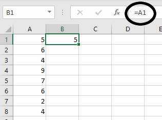

# References: Absolute and Relative

You will have noticed that when you use the fill handle, it has all sorts of interesting effects. For example, if you open a blank spreadsheet and put a **1** into any cell and then drag the fill handle down, it will fill in the cells below it with 1s.

<figure>
    
    <figcaption>A single number will copy itself</figcaption>
</figure>

Now, try this, put a **1** in a cell and then a **2** in the cell directly beneath it. Now, drag the fill handle down and observe the result.

<figure>
    
    <figcaption>Two numbers will increment based on the pattern.</figcaption>
</figure>

The numbers automatically increment, counting by ones. In fact, you can do this all sorts of ways. Simply establish a pattern with the first two cells, and the fill handle will fill in the rest of the cells with numbers that obey this pattern. In this manner, you can count by 1s, 5s, 10s, or any other increment. It's a powerful feature with lots of other effects.

You can also use it to increment units of time, days of the week, or months of the year. For example, put the word **Sunday** into a cell and drag the fill handle down and it will fill in with the days of the week. Same with Months of the year and also the three-letter abbreviations of the days and months:

<figure>
    
    <figcaption>The fill handle also autmoatically increments days and months</figcaption>
</figure>

## References and the Fill Handle

You have already seen this in action. When you make a total column or rwo and use the fill handle to fill it in, Excel automatically adds the correct cells together. However, let's look at this at a slightly more abstract level for a moment so that we can see what's going on.

Open a blank workbook and enter a series of numbers in the first column. Whatever numbers you like. Like this:

![4][4]

Now, in cell **B1**, enter the formula `=A1`. In this case, the result should be _5_. Now, if you drag the fill handle downward, it should fill in the rest of the column with formulas that reference the corresponding cell in the first column.

![5][5]

Look at the formulas that have been input in each cell. They are `=A2`, `=A3`, `=A4`, and so on. Each formula had the row number of the coordinate in its reference incremented by one. That is, it had 1 added. This makes sense since each time you dragged the fill handle down by one row, it should be referencing the same column, but the new row.

The same works with columns, by the way. You can conduct the same test horizontally as well and it will increment the column letter whil leaving the row number intact.

This is the default behavior when using the fill handle or copying and pasting from one cell to another. However, this is not always the way we want things to work.

## Absolute References and the Fill Handle

Another way to work with references is to make them absolute. You see, when we drag the fill handle on a normal cell reference, it increments it _relative_ to the cell that you started with. So, if I'm referencing the cell to the left and drag it down, each cell below will reference the cell to the left. In order to make a cell reference absolute, we need to add a little syntax to it. Take the previous example. Clear out the second column and once again, enter the formula `=A1` into cell **B1**.

<figure>
    
    <figcaption>Start with a relative reference</figcaption>
</figure>

Now, in the **formula bar**, change the formula by inserting dollar signs ($) before the two coordinates so that it reads `=$A$1`, like so:

<figure>
    
    <figcaption>Creating an absolute reference</figcaption>
</figure>

What happened? The value didn't change at all, but it looks like no other cell reference that we've used. Now, try dragging the fill handle down and see what happens. Verify that the formula in each cell now is exactly the same, `=$A$1`.

<figure>
    
    <figcaption>Absolute References do not increment</figcaption>
</figure>

Absolute references do not increment at all. They are _absolute_. We can use this information to do some interesting things. Think of it like the dollar signs locking in the individual coordinates. 

## Tutorial

### Payroll

There are two sheets in the start file. In the first part, we will fill in a payroll report which will require us to use absolute references to calculate taxes. We did something similar in the first tutorial. In the second sheet, do something that we did a long time ago in grade school. We will build a times table which would normally be very tedious, but in this case will be quite straightforward. 

1. Download the [start file](http://erickuha.com/primer/excel_resources/tutorial_references_start.xlsx)
1. **Open** the file and you should be in the first sheet, the payroll sheet. All of the data is already here for you, so all you need to do is fill in all of the blanks. Let's just fill in the first row, though.
1. Select cell **D3**. This cell should contain the value for Frank's gross pay. Think about how we calculate gross pay. It's derived by multiplying the number of hours you work by your rate of pay. In this case, you will enter the formula `=B3*C3`. Remember, you can get the cell references by simply clicking on the cells rather than typing in their coordinates.   ![9][9]
1. Select cell **E3**. To calculate the taxes that would be taken out of Frank's paycheck, we need to use the tax rate (this is highly simplified flat tax situation) of 27%. We simply multiply the tax rate by the gross pay. Thus, we get the formula `=D3*B9`. ![10][10]
1. Finally, select cell **F3**. To calculate the net pay or "takehome" pay, you simply subtract the taxes from the gross pay. So, the formula is `=D3-E3`.   ![11][11]
1. Now, to fill in the rest of the table. Select the first row of your calculations, the cell range **D3:F3**.
1. Drag the **fill handle** down to complete the table. Only something's gone wrong:   ![12][12]   Apparently, three of our employees do not pay taxes!
1. To fix this, we must use an absolute reference to the tax rate cell. Select cell **E3**. Convert the reference to cell **B9** to an absolute reference by inserting dollar signs ($) before the _B_ and the _9_. the formula should now read `=D3*$B$9`.   ![13][13]
1. Once again, select cell **E3**, drag the fill handle down, and fill in the rest of the column. The table should now read correctly and all values will be accurate. Observe carefully in the cells in column E the formulas will increment the relative reference, but not the absolute reference.   ![14][14]
1. For fun, use the **AutoSum** tool to fill in the total row and see what the totals for payroll are this pay period.   ![15][15]

## Times Table
So the first sheet is about filling in a payroll form and that's pretty neat. On the next sheet of this workbook, you might be surprised to discover that it is, in fact, blank. We're going to build a times table from scratch here. But we're going to do it Excel-style using a mixture of absolute and relative references. Specifically, we're going to see what happens when we employ what are called **Mixed References**. That is, references that lock in one or the other coordinate. For example, **A5** is a relative reference, **$A$5** is an absolute reference. There are two **Mixed References** as well: **$A5** and **A$5**. There are a few places where this is a very useful tool and this times table is our first attempt at this.  Follow along.

1. Select the **Times Table** sheet by clicking on its tab at the bottom of the Excel window.
1. Select cell **A1** and type "X" for times table.
1. Select cell **B1** and type a _1_, then in cell **C1** enter a _2_.
1. Now, select both cells **B1** and **C1**, and drag the fill handle to the right until the tooltip says _10_.  ![16][16]
1. Follow the same steps to create a column of numbers from 1 to 10 in column **A**, so that it looks like this:   ![17][17]
1. Style your new header row and column up however you like. Just dow something to make them stand out a bit. I decided to use dark-colored heading styles from the **Cell Styles** menu:   ![18][18]
1. Now, think about how a times table works. What goes in cell **B2**? It should be the product of the numbers in cells **B1** and **A2**, right? So enter the formula: `=B1*A2`. The result is 1.   ![19][19]
1. Next, ensure that cell **B2** is selected and drag the fill handle to the right to fill in the first row of the times table. I think you'll notice immediately that something isn't right:   ![20][20]
1. Let's investigate the error. Our first clue is in the formula box. Since we know that 1 * 10 should equal 10 and _not_ 3,628,800. Since we used relative references, it incremented the coordinates for each cell that you dragged. Instead of multiplying the top row by the top column, it multiplied the cell above by the cell to the left. **Double-click** cell **K2** to see what I mean:   ![21][21]

Okay, so what went wrong? We're multiplying the wrong cells together. The problem will only get worse if we use the fill handle to fill in the entire table. The numbers will get so large that they will overflow Excel's abillity to represent a number. So how about we use an _absolute reference_? Well, that doesn't work either since the cells don't increment _at all_. If you filled in the table, then every cell would just be multiplying B1 by A2 and every cell would just contain a 1. So is there some way that we can build this table without having to manually enter each cell? Yes! We will use what are called **Mixed References**.

First we have to start thinking about the dollar signs ($) in our absolute reference syntax as locking in their corresponding coordinates. We just need to lock in the right coordinates on each of our operands in the first cell and we can just fill-handle the whole table.

1. First, let's delete everything from the table except the contents of cell **B2**.   ![22][22]
1. Now, let's look closely at the formula in the cell. `=B1*A2`. In every cell in this entire table, we will be mutliplying a number from Row **1** by a number from column **A**. So those coordinates in this formula need to stay the same, right? Let's lock them in with dollar signs. The formula becomes `=B$1*$A2`.
1. Look very carefully at what's different here. We're locking in the **1** from the first operand and the **A** from the second operand.   ![23][23]
1. Last step: Make sure that **B2** is selected and then **drag** the **fill handle** to the right. And then **drag** it down. And voila. The entire table is completed in a matter of seconds   ![24][24]

Save your file, upload it to the portal. And try to think of other ways in which you can use mixed references like this.

<!-- images -->

[4]: images/tutorial_ref/4.png
[5]: images/tutorial_ref/5.png
[9]: images/tutorial_ref/9.png
[10]: images/tutorial_ref/10.png
[11]: images/tutorial_ref/11.png
[12]: images/tutorial_ref/12.png
[13]: images/tutorial_ref/13.png
[14]: images/tutorial_ref/14.png
[15]: images/tutorial_ref/15.png
[16]: images/tutorial_ref/16.png
[17]: images/tutorial_ref/17.png
[18]: images/tutorial_ref/18.png
[19]: images/tutorial_ref/19.png
[20]: images/tutorial_ref/20.png
[21]: images/tutorial_ref/21.png
[22]: images/tutorial_ref/22.png
[23]: images/tutorial_ref/23.png
[24]: images/tutorial_ref/24.png
