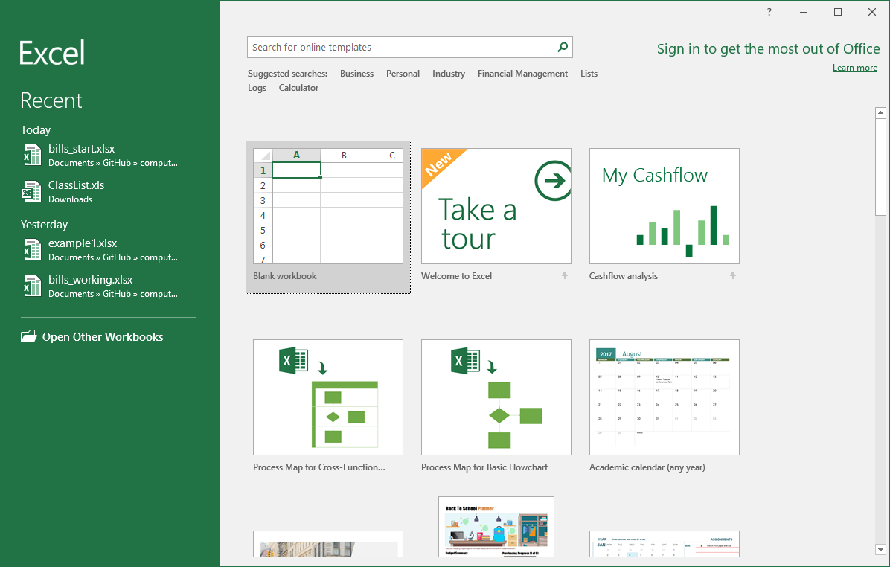
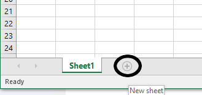
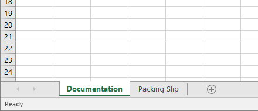

# Basic Formatting and Data Entry

Let's get started with something really straightforward. For this scenario, imagine that you have started a web store where you sell widgets. The widgets come in all sorts of styles and designs and functions.

<dl>
    <dt>Widget</dt>
    <dd>A small gadget or mechanical device, especially one whos name is unknown or unspecified.</dd>
</dl>

Your job is to put together packing lists of widgets when customers order them. Let's follow along

## Key Tools and Concepts

<dl>
    <dt>Workbooks and Worksheets</dt>
    <dd>You will create new worksheets and rename them to keep things organized</dd>
    <dt>Documentation</dt>
    <dd>You should always document everything you do so that you will help yourself or others know what it was that you did the next time the file is opened.</dd>
    <dt>Numbers and Text</dt>
    <dd>Learn to recognize how Excel treats numeric and alphanumeric data differently.</dd>
    <dt>Data Entry</dt>
    <dd>At some point, you do have to just enter some data by hand. It's tedious, but it's gotta be done. Once it is, you can do all of the fun Excel stuff to manipulate that data.</dd>
    <dt>Tabular Data</dt>
    <dd>Some of the data we enter here will be tabular. Tables are arranged by rows and columns and typically have some sort of heading row to identify the contents of each column.</dd>
</dl>

## Tutorial

There is no start file for this tutorial.

### Create a new Excel workbook

We are going to start from scratch in this tutorial.

<ol>
    <li>
        Open the Microsoft Excel app and from the backstage view, select <strong>Blank workbook</strong>.
        <figure>
            
            <figcaption>Create a new blank workbook</figcaption>
        </figure>
    </li>
    <li>
        Once again, acquaint yourself with the basic interface a get a sense for what's where. When you are ready, move on to the next part.
    </li>
</ol>

### Create worksheets

This book will follow the common convention in Excel that the first sheet in the workbook is a "documentation" sheet. It will display basic meta-information about the workbook that the user is reading like the name of our company, the creator of the workbook, the date it was created, and describes its purpose. So let's set up our tabs.

<ol>
    <li>
        At the bottom of the window, you have only one sheet. Click the plus icon next to <strong>Sheet1</strong> to create a new sheet called <strong>Sheet2</strong>.
        <figure>
            
            <figcaption>Create a second worksheet</figcaption>
        </figure>
    </li>
    <li>
        To rename a sheet, you simply double-click the left mouse button on the sheet's name. <strong>Double-click</strong> on Sheet 1 and type <strong>Documentation</strong>.
    </li>
    <li>
        Next, <strong>Double-click</strong> on Sheet2 and type <strong>Packing Slip</strong>.
    </li>
    <li>
        Select the <strong>Documentation</strong> sheet before moving on.
        <figure>
            
            <figcaption>Rename your worksheets</figcaption>
        </figure>
    </li>
</ol>

### Set up the documentation sheet

The documentation sheet will be used to document basic information about the workbook. This is a good practice to get into. Imagine getting a new job working for a company as a data entry or IT specialist. You inherit a folder full of spreadsheets and you have literally no idea what any of them are for. What documenting your workbooks can do is give other people a fighting chance at understanding what you were thinking about when you created, revised, or edited a particular workbook file.

<ol>
    <li>
        Select cell <strong>A1</strong>. Type <strong>We Got Widgets</strong>.
    </li>
    <li>
        In cell <strong>A3</strong>, type <strong>Author</strong>.
    </li>
    <li>
        In cell <strong>A4</strong>, type <strong>Date</strong>.
    </li>
    <li>
        In cell <strong>A5</strong>, type <strong>Purpose</strong>.
    </li>
    <li>
        Next, you're going to fill in some information. In cell B3, type your name. In cell B4, type today's date as <strong>MM/DD/YY</strong> (Notice what happens here). Lastly, in cell B5, type <strong>This is a packing slip for sending with shipments of widgets.</strong>
    </li>
    <li>
        Your documentation sheet should look something like this when you have reached this point.
        <figure>
            
            <figcaption>The documentation sheet</figcaption>
        </figure>
    </li>
</ol>

### Starting the Packing Slip

The first thing that any good packing slip needs is the address of the customer. This will give us a little practice with basic data entry.

1. Select cell **A1** if it is not already selected. Type **Packing Slip**. Press **Enter** twice. Cell **B3** should be selected.
1. Type **Ship To**. and press **Enter**.
1. For each of the cells from A4:A10, enter the following:
  * Name
  * Address
  * City
  * State
  * ZIP
1. Click **B4** to make it active and enter the following data, pressing **Enter** after each.
  * **Ned Flanders**
  * **744 Evergreen Terrace**
  * **Springfield**
  * **NT** (This is often cited as the fictional town where the Simpsons live)
  * **42364**
1. Your final product will like this   ![packing slip][5]

### Fixing alignment

Now, we need to fix some alignment issues which gives us a good opportunity to talk about how Excel treats numbers and text differently. When Excel sees a cell with any letters in it, it automatically assumes it's "text" in the sense that it's made up of words or phrases. Whenever you enter only numerical data, Excel sees a number and allows you to do some different things with it. For one, it will format them differently. Numbers always right-align by default and text always left-aligns by default. Think about how we read from left to right, but we add/subtract/multiply from right to left. In this particular case, we have a problem with the ZIP code because ZIP codes aren't really numbers in the traditional sense. You never add or multiply ZIP codes, so on the packing slip, it would look nicer if we format the ZIP code as if it were treated as text.

1. Select cell **B8**.   ![6][6]
1. Click inside the forumla bar and place the insertion point at the beginning of the ZIP code before the first **4**.   ![7][7]
1. Type an apostrophe, the **'** symbol. This is Excel's way of knowing that this all-numerical data is actually text. Once you hit **Enter**, you'll notice that the text left-aligns within the cell like the rest of the address. The only difference is that there is a tiny green arrow in the corner of the cell. You can safely ignore this.   ![8][8]

### Fixing the documentation sheet

If you click back over to the documentation sheet, you have entered today's date in cell B4. The interesting thing here is that Excel treats dates as numbers because you *can* add to a date. If you add 1 to a date in Excel, it will advance the date by one day which can be a very handy feature. We don't want to lose that, but we do want to play around with some of the formatting. So follow along.

1. Ensure that you are on the **Documentation** sheet. First, we need to widen **column B**. Click on the line between the headers for columns **B** and **C**. Drag it all the way to the right so that it accomodates all of the data in column **B**. The width should be about 53.   ![9][9]
1. Notice now that the date is right-aligned. This looks funny. But instead of converting the date to text, we will simply right-align it. Select cell **B4**. In the **Alignment** group, click the **Align Left** tool.   ![10][10]
1. One of the fun things that we can do with numbers is change the way that they are displayed. Consider the dozens of different ways you can display a date. Let's change the way this date is displayed. With cell **B4** still selected, in the **Number** group. Click the drop-down that currently says **Date**. From the list, choose the **Long Date** format. Notice how the date is displayed.   ![11][11]

### Entering Tabular Data

Now, we want to actually create a table of data. Let's say Ned Flanders orders a bunch of our fine widgets and he orders a wide variety of them. Let's build a table that will clearly display all of the different widgets that he has ordered.

| BARCODE    | CONDITION | FINISH | WIDGET                      | PRICE | QUANTITY |
|------------|-----------|--------|-----------------------------|-------|----------|
| 7276-86434 | New       | Glossy | rockwell retro encabulator  | 12.45 | 4        |
| 6128-89793 | Used      | Matte  | unilateral phase detractors | 67.45 | 2        |
| 7599-14097 | Used      | Greasy | cardinal gram meters        | 19.99 | 16       |
| 8169-64109 | New       | Satin  | hydrocoptic marzel veins    | 8.75  | 1        |
| 5468-32757 | New       | Wood   | panametric fans             | 123.4 | 1        |

1. Click on cell **A10**.  In cells **A10:F10** enter the headings for our table as follows (this time, press the **tab** key between each entry to avoid having to using the mouse):
  * BARCODE
  * CONDITION
  * FINISH
  * WIDGET
  * PRICE
  * QUANTITY   ![12][12]
1. Under the headings, enter the data as shown in the table above in the cell range **A11:F15**. Some of the data won't appear to fit in the cells and will not be visible when you are finished. We will fix this next.   ![13][13]
1. Now, resize the columns so that all of the data fits well. A quick way to do this is, instead of **dragging** the border between headers, simply **double-click** on the border between headers and Excel will autmoatically resize the column to the width of the longest content in that column.   ![14][14]
1. Finally, let's set some number formats. Select cells **E11:E15**. In the **Number** group, in the big dropdown, select the **Currency** style.

![15][15]

And there we have it. Compare yours to the above and if it looks reasonably similar, move on to the next part of the tutorial.

<!-- Images -->
[5]: images/tutorial1/5.png
[6]: images/tutorial1/6.png
[7]: images/tutorial1/7.png
[8]: images/tutorial1/8.png
[9]: images/tutorial1/9.png
[10]: images/tutorial1/10.png
[11]: images/tutorial1/11.png
[12]: images/tutorial1/12.png
[13]: images/tutorial1/13.png
[14]: images/tutorial1/14.png
[15]: images/tutorial1/15.png
