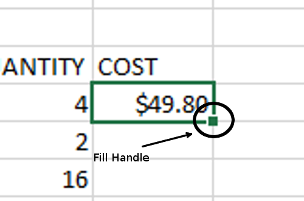

# Basic Formulas and Formatting

We will be continuing our exploration of basic Excel tools. This tutorial continues our look at **We Got Widgets** and the order the Ned Flanders placed for a variety of high-quality, only vaguely defined, high-tech gadgetry.

## Background

A spreadsheet's primary duty is to make complex calculations easier, especially very repetitive calculations like those that would be performed on large tables of data. We already know that cells can contain text or numerical data. And we have the sense that it treats these two types of data slightly differently. But the problem is, that kind of data is static. It doesn't do anything. A huge table of data might be impressive, but once someone asks you what it means, you really won't be able to aticulate much. You can make it look nice, but you can't make it dance.

So what we want to do is create dynamic data. That is, we want to be able to put data in a cell that will change if data elsewhere in the spreadsheet changes.

Let's look at some of the basics of data analysis in Excel

### Formula basics

**Formula** - A formula is a mathematical expression that uses some combination of numbers **cell references**, and mathematical symbols to generate dynamic data

Creating a formula is relatively simple and follows rules that might seem familiar if you think back to high school mathematics. here are some of the most fundamental rules:

* Each formula *must* begin with an equal sign (=)
    * Think of the equal sign as your signal to Excel that _"Math is happening here!"_
* Each formula must be some combination of numbers and cell references
    * Formulas can contain any real number and as many of them as you like. But what really makes them shine is that you can include _references_ to other cells (more on this in a bit).
* Formulas can contain all of the basic arithmetic operators
    * The five basic arithmetic operations are all valid, though they might use different symbols than you are used to (see below). Plus, you can use **parentheses** for manipulating the order of operations.
* Formulas will obey the basic mathematical **order of operations**
    * Do you remember the mnemonic device: _Please Excuse My Dear Aunt Sally_? It's a way of remembering the order of operations. All arithmetic operations in a formula will follow this order: **P**arentheses, **E**xponents, **M**ultiplication, **D**ivision, **A**ddition, **S**ubtraction. Remember that multiplication and division have the same priority and happen left-to-right. Likewise with addition and subtraction. If you're a little rusty, click [here](https://www.mathsisfun.com/operation-order-pemdas.html)

Here are some of the arithmetic operators that Excel accepts:

| Operation      | Symbol |
|----------------|--------|
| Addition       | +      |
| Subtraction    | -      |
| Multiplication | *      |
| Division       | /      |
| Exponent       | ^      |
| Grouping       | ()     |

Using these basic rules, you can create just about any simple mathematical expression that you can imagine. Try these examples on a blank spreadsheet (don't forget to use the correct symbols and to start with an equal sign):

* 6 + 7 x 8
* 16 &divide; 8 - 2
* (25 - 11) x 3

### Cell References

In order to take full advantage of Excel, an important thing to get used to is the concept of a **cell reference**. You can use the addresses of other cells as though they were numbers and Excel will treat those references as though they were the values in the referenced cell. That way, if you cange the value of the referenced cell, the result of the formula will change as well.

## Tutorial

In this tutorial, we are going to create some dynamic content by using formulas. We will use the same file that you used in the last tutorial, so hopefully, you did not delete it or lose it. Go ahead and open it now and we'll get started.

### Adding a Cost Column

Our next step in making this a useful spreadsheet is to find out just how much Ned Flanders spent. With just a little bit of practice, you'll be able to do this in less than a minute, but let's take this step by step. First, let's look at each line item. Ned ordered four "rockwell retro encabulators" at $12.45 each. How much is that? Sure, you could do it longhand or even pull out your calculator and then type in the result, but this is tedious. Excel _is_ a calculator and it will do all of this _for_ you. First of all, we need to be sure we know exactly what mathematical operation we need to perform. Here, we have 4 items at $12.45 each and so, we are multiplying 12.45 by 4. But, rather than multiply the two number, let's multiply two _cell references_. Let's see what we mean: 

1. Select cell **G10**. Type the new heading **COST** and press **Enter**.
1. Now, in cell **G11**, you are going to enter your first formula. Type `=F11*E11`. Remember that the "*" is the Excel multiplication operator. Press **Enter** and observe the result.   ![1][1]

### Copying and Pasting Formulae

You could pretty quickly just repeat this process in the remaining four cells. However, this is not a pratical solution if you had a file with even a few dozen rows (not to mention a few thousand). There are two primary ways of accomplishing this and it all comes down to personal preference. You can either **copy-and-paste** or you can use the **Fill Handle**. We'll experiment with both. First, copy and paste:

1. Select cell **G11** again.
1. Copy the contents of the cell by pressing **Ctrl-c** on the keyboard, or clicking on the **Copy** tool on the ribbon in the **Home** tab.
1. Click on cell **C12**.
1. Paste your formula into this cell by pressing **Ctrl-v** on the keyboard, or clicking the **Paste** button on the far left of the ribbon.

Why didn't it just copy the previous cell exactly? Well, as it turns out, Excel is pretty smart. Its default behavior when you copy and paste a formula is to interpret cell references (like **F11** and **E11** in this case), _relative_ to the cell where the formula is being pasted. Think of it this way. From Excel's point of view, cell **G11** is multiplying the two cells to left of it. When you paste this formula into cell **G12**, it will do the same thing only it will multiply the two cells to the left of _it_, that is, **F12** and **E12**. This behavior is very, very important to our understanding of Excel and learning how to make it do what we want. Let's look at an even quicker way of handling this problem

### Use the Fill Handle

There's a quicker way to fill in a column of data like this by using the **fill handle**. The fill handle allows us to quickly copy and paste the contents of one cell into other cells while also updating the cell references in formulas. Let's try it out to see how it works.

<figure>
    
    <figcaption>The Fill Handle</figcaption>
</figure>

1. Select cell **G11** again.
1. Hold the mouse over the **Fill Handle**
1. Notice how the cursor changes to a plus sign. **Click and drag** the fill handle down until the outline surrounds the entire column.   ![drag fill handle][3]
1. **Release** the mouse button.
1. Verify that the formulas in each cell have been updated and were correctly applied. It should look like this:   ![fill handle result][4]

We will talk about the fill handle more in later sections as it is an immensely useful tool and this only scratches the surface of its capabilities.

### Adding it all up - Formulas

The next step is to get the subtotal of the packing slip. We want to know what the before-tax cost of all of the widgets will be. As it turns out, there is a very simple shortcut that can do this in less than a second, however, there's a lot going on behind the scenes to make it easy.

We're going to use a **formula** to find the sum of all of the costs in the last column of our table. First, let's do it and then we'll look at what happened.

1. Select cell **F16**. Type: **Subtotal**. Press **tab** to move to the next cell.
1. In the **Home** tab, **Editing** group, there is a button with a Sigma (&Sigma;) symbol in it. This is the **AutoSum** tool. **Click it.**
1. Observe what appears in the cell, the formula: `=SUM(G11:G15)`. Press **Enter**. The total, **$636.69** should appear.   ![formula result][5]

The entry in cell **G16** a special kind of formula. It's a **function**. A function is a special, named tool for doing complex and repetitive computations quickly. Essentially what the `=SUM()` function does is add up all of the numbers that you put between the parentheses. In this case, it adds together the range of cells `G11:G15`. 

### Sales Tax and Shipping

Since we live in a world where the government always gets its share, we need to include sales tax in our final tally. This is fairly easy to implement, but we want to ensure that our spreadsheet is re-usable and easy to change if the taxes change, so we're not going to hard-code it into the sales tax cell, we're going to create a tax box that we will pass by reference to our total. Let's see how it's going to work.

1. Select cell **F9**. Type _Sales Tax_ and press **Tab**.
1. Type _5%_. Press **Enter**. Note, that when you type a number and the percent symbol, Excel automatically formats it as a percentage and treats 5% as 0.05 for all mathematical operations with it.
1. To make things look nicer, select the border between the row 9 and 10 headers and drag it down a little bit to make the row a little wider. This separates the table headings from the Sales Tax cells.   ![Sales Tax][6]
1. Select cell **F17** and type _Tax_. Press **Tab**.
1. In cell **G17**, enter the formula `=G16*G9`. Press **Enter**. Thus, on this order, Ned will be spending $31.83 in taxes.
1. In cell **F18**, enter _Shipping_. Pres **Tab**.
1. In Cell **G18**, enter the amount _$45.00_. Press **Enter**.   ![shipping][7]
1. Now let's create a total row. In cell **F19** type _Total_. Press **Tab**.
1. To get the final total for the order, we need to add the Subtotal, the Tax, and the Shipping. In this case, the AutoSum tool will not work, because it will behave unpredictably since we already have a sum function in the column. So, we need to do something else, We could enter a formula adding them all together, like `=G18+G17+G16`. However, let's use a function instead. Only we're going to enter the function by hand. So, ensure that cell **G19** is selected.
1. Type `=SUM(`.
1. Now, use the mouse to select cells **G16:G18**. Type `)`. Press **Enter**. The final formula (with the SUM() function) will look like this: `=SUM(G16:G18)`   ![total][8]

### Inserting a row

You notice, when looking over Ned's order, that he also ordered 5 sets of capacitive directants, so that needs to be included on this packing slip and the total needs to be updated accordingly. As it turns out, Excel makes this easy.

| BARCODE   | CONDITION | FINISH | WIDGET                | PRICE  | QUANTITY |
|-----------|-----------|--------|-----------------------|--------|----------|
| 1423-4667 | Used      | Clean  | capacitive diractants | $45.99 | 5        |

1. Select all of **Row 13** by clicking on the row heading   ![select row 13][9]
1. In the **Cells** group of the **Home** tab, press the **Insert** button. You now have a new row.
1. Let's populate it with the necessary details from the above table.
1. For the _COST_ column, simply click on cell **G12** and drag the **fill handle** down one cell.   ![fill handle][10]
1. Notice now that the Subtotal, Tax, and Total cells have all automatically updated.   ![finished][11]

### Adding Borders and Touches

We're going to need to make it look nice printed since a packing slip is usually sent along with an order to verify that everything that was ordered was shipped. So we're going to add some cell borders and do a few other finishing touches.

First, let's add the name of the company to the top of the packing slip and make it stand out.

1. Just like the previous part, select all of **row 1** by clicking on the row 1 heading and clicking the **Insert** tool.
1. In cell **A1**, type _We Got Widgets_. Hit **Enter** and re-select cell **A1**. Increase the font size of this cell to _28_.

Next, let's add some cell borders.

1. Select the cell range **A5:B9**.
1. Click the down arrow next to the border tool and press the **All Borders** option from the border menu:   ![borders][12]
1. Observe that the address section has all borders marked.   ![borders done][13]
1. Select cell **A4** and click the **Borders** button. It will now default to "all borders" since it was the last border tool that you used.   ![next borders][14]
1. Do the same with the following cells and cell ranges: **F10:G10**, **A11:G17**, **F18:G21**.  ![all borders][15]

If you were to hit print riht now, you would find that the way the content is arranged on the page, it will not fit on one sheet of paper. In order to remedy this, we just flip the orientation.

1. Click on the **Page Layout** tab. Under the **Orientation** tool, select **Landscape**.   ![orienation][16]
1. Click the **File** tab and select **Print**. Observe that the entire packing slip now fits neatly on a single page.
1. Do not actually print the page.

Save your work and submit it to the portal.

<!-- Images -->
[1]: images/tutorial1-2/1.png
[3]: images/tutorial1-2/3.png
[4]: images/tutorial1-2/4.png
[5]: images/tutorial1-2/5.png
[6]: images/tutorial1-2/6.png
[7]: images/tutorial1-2/7.png
[8]: images/tutorial1-2/8.png
[9]: images/tutorial1-2/9.png
[10]: images/tutorial1-2/10.png
[11]: images/tutorial1-2/11.png
[12]: images/tutorial1-2/12.png
[13]: images/tutorial1-2/13.png
[14]: images/tutorial1-2/14.png
[15]: images/tutorial1-2/15.png
[16]: images/tutorial1-2/16.png
