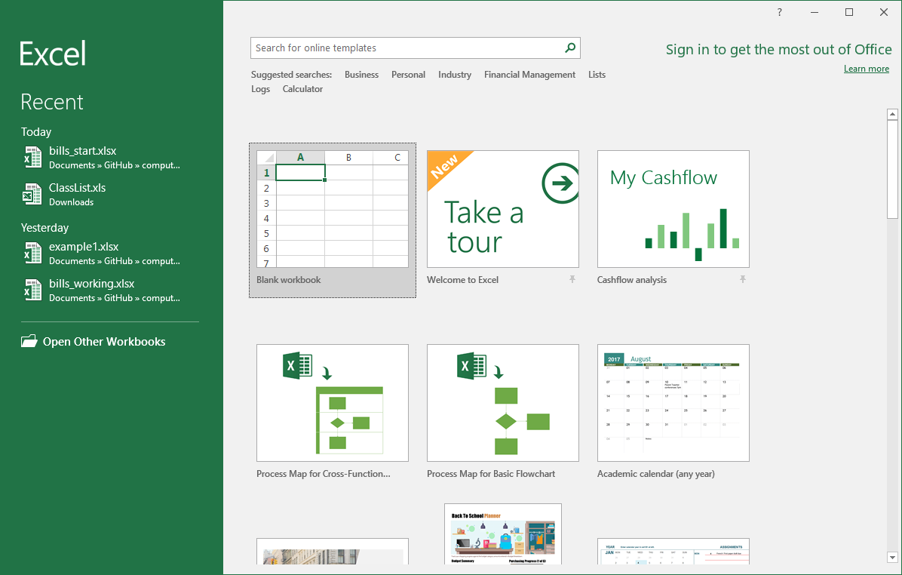
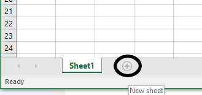
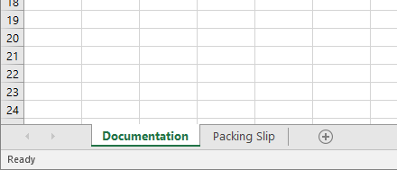
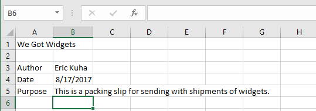

# Basic Formatting and Data Entry

Let's get started with something really straightforward. For this scenario, imagine that you have started a web store where you sell widgets. The widgets come in all sorts of styles and designs and functions.

<dl>
    <dd>Widget</dd>
    <dt>A small gadget or mechanical device, especially one whos name is unknown or unspecified.</dt>
</dl>

Your job is to put together packing lists of widgets when customers order them. Let's follow along

## Tutorial

There is no start file for this tutorial.

### Create a new Excel workbook

We are going to start from scratch in this tutorial.

<ol>
    <li>
        Open the Microsoft Excel app and from the backstage view, select <strong>Blank workbook</strong>.
        <figure>
            
            <figcaption>Create a new blank workbook</figcaption>
        </figure>
    </li>
    <li>
        Once again, acquaint yourself with the basic interface a get a sense for what's where. When you are ready, move on to the next part.
    </li>
</ol>

### Create worksheets

This book will follow the common convention in Excel that the first sheet in the workbook is a "documentation" sheet. It will display basic meta-information about the workbook that the user is reading like the name of our company, the creator of the workbook, the date it was created, and describes its purpose. So let's set up our tabs.

<ol>
    <li>
        At the bottom of the window, you have only one sheet. Click the plus icon next to <strong>Sheet1</strong> to create a new sheet called <strong>Sheet2</strong>.
        <figure>
            
            <figcaption>Create a second worksheet</figcaption>
        </figure>
    </li>
    <li>
        To rename a sheet, you simply double-click the left mouse button on the sheet's name. <strong>Double-click</strong> on Sheet 1 and type <strong>Documentation</strong>.
    </li>
    <li>
        Next, <strong>Double-click</strong> on Sheet2 and type <strong>Packing Slip</strong>.
    </li>
    <li>
        Select the <strong>Documentation</strong> sheet before moving on.
        <figure>
            
            <figcaption>Rename your worksheets</figcaption>
        </figure>
    </li>
</ol>

### Set up the documentation sheet

The documentation sheet will be used to document basic information about the workbook. This is a good practice to get into. Imagine getting a new job working for a company as a data entry or IT specialist. You inherit a folder full of spreadsheets and you have literally no idea what any of them are for. What documenting your workbooks can do is give other people a fighting chance at understanding what you were thinking about when you created, revised, or edited a particular workbook file.

<ol>
    <li>
        Select cell <strong>A1</strong>. Type <strong>We Got Widgets</strong>.
    </li>
    <li>
        In cell <strong>A3</strong>, type <strong>Author</strong>.
    </li>
    <li>
        In cell <strong>A4</strong>, type <strong>Date</strong>.
    </li>
    <li>
        In cell <strong>A5</strong>, type <strong>Purpose</strong>.
    </li>
    <li>
        Next, you're going to fill in some information. In cell B3, type your name. In cell B4, type today's date as <strong>MM/DD/YY</strong> (Notice what happens here). Lastly, in cell B5, type <strong>This is a packing slip for sending with shipments of widgets.</strong>
    </li>
    <li>
        Your documentation sheet should look something like this when you have reached this point.
        <figure>
            
            <figcaption>The documentation sheet</figcaption>
        </figure>
    </li>
</ol>

### Starting the Packing Slip

The first thing that any good packing slip needs is the address of the customer. This will give us a little practice with basic data entry.

1. Select cell **A1** if it is not already selected. Type **Packing Slip**. Press **Enter** twice. Cell **B3** should be selected.
1. Type **Ship To**. and press **Enter**.
1. For each of the cells from A4:A10, enter the following:
  * Name
  * Address
  * City
  * State
  * ZIP
1. Click **B4** to make it active and enter the following data, pressing **Enter** after each.
  * **Ned Flanders**
  * **744 Evergreen Terrace**
  * **Springfield**
  * **NT** (This is often cited as the fictional town where the Simpsons live)
  * **42364**
1. Your final product will like this   ![packing slip][5]

### Fixing alignment

Now, we need to fix some alignment issues which gives us a good opportunity to talk about how Excel treats numbers and text differently. When Excel sees a cell with any letters in it, it automatically assumes it's "text" in the sense that it's made up of words or phrases. Whenever you enter only numerical data, Excel sees a number and allows you to do some different things with it. For one, it will format them differently. Numbers always right-align by default and text always left-aligns by default. Think about how we read from left to right, but we add/subtract/multiply from right to left. In this particular case, we have a problem with the ZIP code because ZIP codes aren't really numbers in the traditional sense. You never add or multiply ZIP codes, so on the packing slip, it would look nicer if we format the ZIP code as if it were text.

<!-- Images -->
[5]: images/tutorial1/5.png
