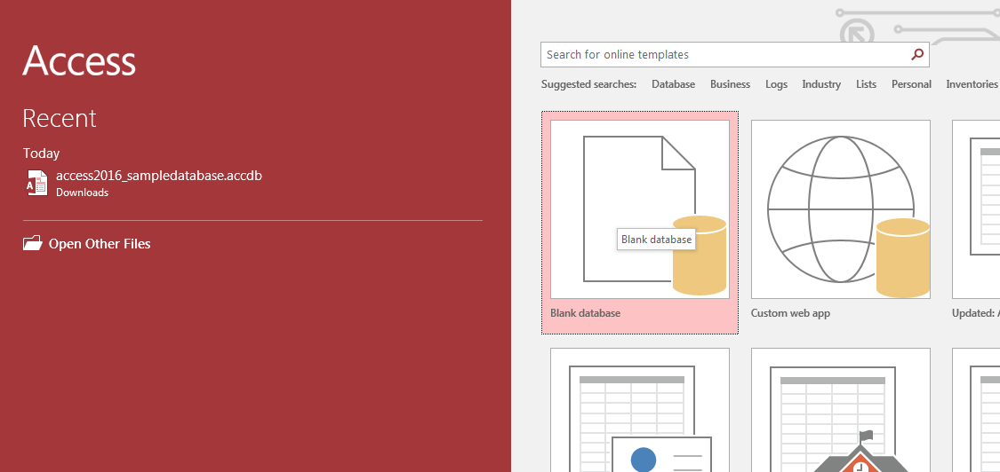
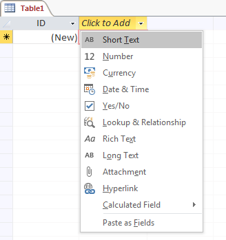
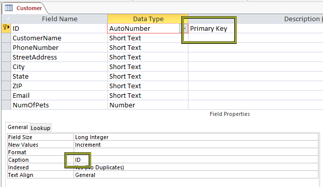

# Working With Tables - Part 1

The most fundamental object in a database is the table. The table is where all of the data goes. Everything in a database is derived from the data definitions in the table fields and the actual data in records in the table. We will start from the ground up. Follow along with this tutorial starting with an empty database, and you will have gained some experience building, editing, and tweaking tables as well as doing some light, not-too-strenuous data entry.

# Design your Database

We are going to build our veterinarian database from the ground up and enter some data into it. There is no start file. You're starting clean. But there is one important step that we have to complete before we begin, we need to plan our basic database structure. How many tables do we want? What fields should each table possess? What data types should each field possess? There are many, many considerations in database design, but we will look at a simple example. Let's say we just want basic patient information for our veterinary clinic. We will have three tables:
* Customers
* Pets
* Pet Species (this limits the sorts of pets we accept)

Here is a UML diagram of our basic table design ([UML](https://en.wikipedia.org/wiki/Unified_Modeling_Language) is a modeling and design language that software engineers use to visualize the overall design of a system like a database or a complex program):

These tables could be tweaked a little bit. It's always debatable whether you need separate fields for all of the different parts of a street address. Some people say you should always err on the side of more fields, others say you should always use as few fields as possible. We'll advocate for a middle-of-the-road approach here. Take a moment to examine the chart, see what each field represents, and what datatypes they are. Another big debate is whether *Name* should be split into First and Last name fields or just be one. For a veterinary clinic, we'll just leave it as one name field, though we may come to regret it later.

Look at the connections. We have one field in the **Pet** table called *Owner*. It has a relationship to the *ID* field in the **Customer** table. This is called a one-to-many relationship. Every pet has one owner, but any owner can possess as many pets as he or she likes. This relationship allows for that. There is also a relationship between the *ID* field in the **Species** table and the *Species* field of the **Pet** table. Each pet can only have one species (we would hope), but the clinic can accept as many species as it wants. In this way, we can also limit our clinic to accepting only certain species, or we can query our pet list based on species.

Let's start building our first table.

# Create a Database

The first step is to create a database. Open Microsoft Access and follow along.

1. Create a blank database.  
2. Call it vet.accdb  
3. Take a look around. There are two main work areas. The left pane shows a list all of the objects in your database. That is all of your **tables**, **forms**, **queries**, and **reports**. The main panel has your primary interface. It is here that you will work on whatever object you are currently editing. Right now, it's displaying a blank table called **Table1**.  
4. Your first table already has one field, called **ID**. Let's add a field for the customer name. Click where it says *Click to Add* and select Short Text. Name the field **CustomerName**. Note, you should not simply use the word *Name* for this field as this is a reserved word in Access and can cause strange behavior.   
5. Add the rest of the fields as they are laid out in our UML diagram. As for the **NumOfPets** field, let's just leave it as a number for now and come back to it. <table><tr><td>ID</td><td>Number</td></tr><tr><td>CustomerName</td><td>Short Text</td></tr><tr><td>PhoneNumber</td><td>Short Text</td></tr><tr><td>StreetAddress</td><td>Short Text</td></tr><tr><td>City</td><td>Short Text</td></tr><tr><td>State</td><td>Short Text</td></tr><tr><td>ZIP</td><td>Short Text</td></tr><tr><td>Email</td><td>Short Text</td></tr><tr><td>NumOfPets</td><td>Number(?)</td></tr></table>  **Note:** It is important to note that most of our fields are, in fact, text fields. This highlights the text-centric nature of databases.
6. Hit Ctrl-S to save the table and name it **Customer**.

# Refine the table

1. With the **Customer** table still open, in the **Home** tab, click the **View** button to switch to the **Design** view.   This view gives us a little more granular control over the different features and details that make up our table.
2. Let's start with the **ID** field. This field is what's known as the **Primary Key**. What this means is that Access uses this as the main identifier for each record. Because of this, it strictly enforces a unique number for each record. More than one customer can have the same name, but no two customers can _ever_ have the same ID.
3. In this view, we are going to edit a few properties of each field to streamline the database and add some constraints. For the ID field, _do the following_:
    3. Under **Description** type `Primary Key`.
    4. Also, go ahead and change the **Data Type** to just **Number**. Normally, we would leave it as Autonumber, however, for the purposes of this tutorial, this is going to make it easier to import data. Just know that in the future, you will probably just leave it as an auto-incrementing number.
    4. In the bottom panel **Field Properties** in the **Caption** property, type `ID`. Since Access requires that all field names be one word with no spaces, we often name fields using what's called "camel case," like `CustomerName`. The **Caption** property allows us to set what it displays as when we print or otherwise show our database. We are only doing this for the ID field for consistency with the other fields. 
5. For the rest of the fields, enter the following values: <table><tr><th>Field</th><th>Field Size</th><th>Caption</th><th>Required</th></tr><tr><td>CustomerName</td><td>100</td><td>Customer Name</td><td>Yes</td></tr><tr><td>PhoneNumber</td><td>12</td><td>Phone Number</td><td>No</td></tr><tr><td>StreetAddress</td><td>100</td><td>Street Address</td><td>No</td></tr><tr><td>City</td><td>20</td><td>City</td><td>No</td></tr><tr><td>State</td><td>2</td><td>State</td><td>No</td></tr><tr><td>ZIP</td><td>10</td><td>ZIP Code</td><td>No</td></tr><tr><td>Email</td><td>50</td><td>Email Address</td><td>No</td></tr><tr><td>NumOfPets</td><td>Integer</td><td>Number of Pets</td><td>No</td></tr></table>  Later on, we'll add **Formats** and **Input Masks**, but for now, this will do.
6. Next, let's input a few data records. In the **Home** tab, click the **View** button to switch back to the _Datasheet View_. In the first row of your table, click in the first record. Enter the **ID** "1". Under **Customer Name**. Type your name. In each of the other fields, make up some value. Leave the Number Of Pets field at 0. 
7. Enter five more records using the following data: <table><tr><th>ID</th><th>Customer Name</th><th>Phone Number</th><th>Street Address</th><th>City</th><th>State</th><th>ZIP Code</th><th>Email Address</th></tr><tr><td>2</td><td>Aguilar, Anastasia L.</td><td>903-516-2425</td><td>8902 Tempor Av.</td><td>Blackduck</td><td>MN</td><td>56630</td><td>sed@ultricesposuerecubilia.org</td></tr><tr><td>3</td><td>Booker, Noah I.</td><td>489-193-6563</td><td>750-6247 Eget St.</td><td>Cass Lake</td><td>MN</td><td>56633</td><td>vulputate@IntegerurnaVivamus.edu</td></tr><tr><td>4</td><td>Giles, Carissa A.</td><td>724-225-8375</td><td>Ap #715-580 Pharetra. Avenue</td><td>Fosston</td><td>MN</td><td>58542</td><td>vitae.erat@necluctus.ca</td></tr><tr><td>5</td><td>Lambert, Amber M.</td><td>121-724-4167</td><td>7106 Rutrum. Av.</td><td>Bagley</td><td>MN</td><td>56621</td><td>sed.est@leo.ca</td></tr><tr><td>6</td><td>Morton, Brian M.</td><td>599-471-9063</td><td>Ap #454-2715 Laoreet, Street</td><td>Walker</td><td>MN</td><td>56484</td><td>non.arcu@ullamcorper.edu</td></tr></table>  After that, the table should look something like this:
8. To fill out the table, we will practice adding data from an external file. Download [this pipe-delimited csv file](res/data.csv). Go ahead and open it with a text editor to see what's inside.
    9. Next, under the **External Data** tab in Access in the **Import & Link** group, click _Text File_. You should see this dialog:  
    10. Navigate to the `data.csv` file you just downloaded.
    11. Check the radio box for the **Append a copy of the records to the table:** option. Click **OK**.
    12. In the next page of the dialog, ensure that **Delimited** is selected. Hit OK  
    13. Select **Other** as your delimiter and enter a pipe (|) into the box. Check _First Row Contains Field Names_. **Warning: Do not forget that last part!**  Click OK.
    14. Click through any warnings (though you may want to read them just to make sure you understand them) and you should be in business. Here's what mine looks like.:   

In the next section, we will add two more tables and populate them with data. For now, don't forget to save your work. As one last little task, after you save, under the **File** tab, in the backstage view, click the large button that says **Compact and Repair**. This shrinks your database's file size without losing any data through some sort of algorithmic wizardry. Try to do this every time you close up for the day.
