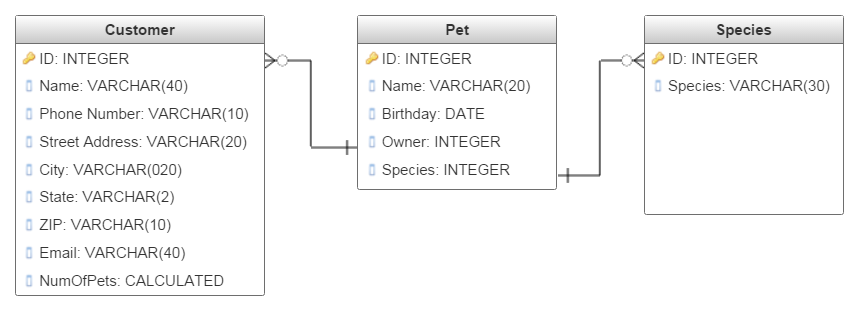

# Working with Tables - Part 2

In this tutorial, we will build two more tables to round out the main part of our database. We will also establish relationships between these tables so that we can see how a **relational database** truly operates.

So open up your copy of _vet.accdb_. If you haven't already, complete the [previous tutorial](5-3-tables-1.md).

Now, let's refresh our memories about our database design:

We still need to create two more tables. The **Species** table and the **Pet** table. The former will just a list of the species of animals that our veterinary office accepts. The **Pets** table will be a list of all of the animals which are current and former patients.

## Create the Species Table
2. In your database, go to the **Create** tab and click **Table Design**. This puts us directly into **Design View** which saves us a little time getting there. This table only needs two fields.
    3. **ID**
        * _Field Name_: ID
        * _Data Type_: AutoNumber
        * _Caption_: ID
        * _Description_: Primary Key
        * Lastly, right-click on the gray box next to ID and click **Primary Key** in the context menu to establish this field as your primary key.  
    5. **SpeciesName**
        6. _Field Name_: SpeciesName
        7. _Data Type_: Short Text, Field Size: 50
        8. _Caption_: Species Name
1. Save the table and call it **Species**.
9. Switch to *Datasheet View** and admire your handiwork. Add the following records to the table: Dog, Cat, Rodent, Other Small Mammal, Lizard, Turtle, Other Reptile, Large Bird, Small Bird, Large Mammal. If you don't use exactly these species names, the file you are going to import will give you lots of annoying trouble.

## The Pets

1. Create a new table. However you like, add three fields for **ID**, **PetName**, and **Birthday**. Give each field appropriate properties, and ensure that ID is set as the **Primary Key**. (**Hint:** For the Birthday field, don't forget to set an appropriate **Format!**).
2. Go ahead and save the table now and name **Pet**
3. Add a field called **Species**, give it a **Number** data type, and in the _Description_, call it a **Foreign Key**.
4. Add another field called **Owner**, give it a **Number** data type, and again, give it the _Description_ **Foreign Key**.
1. Admire the finished product:

So what did we just do? We set aside two number fields and described them as **Foreign Keys**. What this means is that we are deciding now that the values in these two fields will not just be values we include here. We want to _constrain_ the values that are legal in these fields to values in the **Customer** and **Species** tables.
A **Foriegn Key** is a field that is defined in a second table and refers to the primary key of the first table. In other words, we _define_ the foreign key in the **Pets** table, but it _refers_ to the **primary key** in the **Customer** table. Ya dig?
Let's establish that relationship now.

1. Save and close all your tables. Go into the **Database Tools** tab. In the **Relationships** group, click **Relationships**. 
2. Double-click on all three table names to add them to your relationship diagram. Close the _Show Table_ dialogue. This is what's called a UML diagram (or similar to one) which allows us to see an overview of the relationships between our tables.
3. Create a link between **Customer** and **Pet** by clicking on the _ID Field_ of the Customer box and dragging the cursor to the _Owner Field_ of the Pet and then releasing. A dialog will open:  
4. Ensure that you check the boxes for **Enforce Referential Integrity**, **Cascade Update Related Fields** and **Cascade Delete Related Fields**. If we delete a customer, we want to make sure they take all of their pets with them. Don't need any orphaned Pet records floating around in our nice neat database tables.
5. Notice that the relationship line shows a 1 next to the ID of the customer and an infinity sybmol next to the Owner field of the Pet:     This defines this relationship as a **one-to-many** relationship. That is, one owner can have many pets, but each pet can only have one owner. You could also define a **many-to-many** relationship, but it likely would not make much sense in this particular context.
6. On your own, establish a **one-to-many** relationship between Species and Pet such that each pet can only have one species but you can still enroll as many dogs as you like.

## Adding Some Pets

Next, we'll populate our **Pets** table with some actual imaginary pets. This time, instead of using a .csv file, we'll take the data right out of an Excel spreadsheet.

1. Download the [pets.xlsx file](res/pets.xlsx).
1. Make sure all tables are closed. Under the **External Data** tab, in the **Export & Link** group, click **Excel**.
2. In the dialog that opens, navigate to the file, wherever it downloaded to. Check the radio box to append the the records to an existing table and then select the **Pet** table from the dropdown. Click **OK**.
3. If it warns you to close the current table, say **OK**.
4. You will see a mockup of the table in the dialog. Hit **Next**.
5. Ensure that you are importing to the correct table. Click **Finish**.
6. You don't need to save your import steps. Now, open the **Pet** table and observe the results: 

That's it for now. We will add more tables later, but this is enough to do some simple **queries** and searches. Save your tables, close them, and don't forget to **Compact & Repair**.
