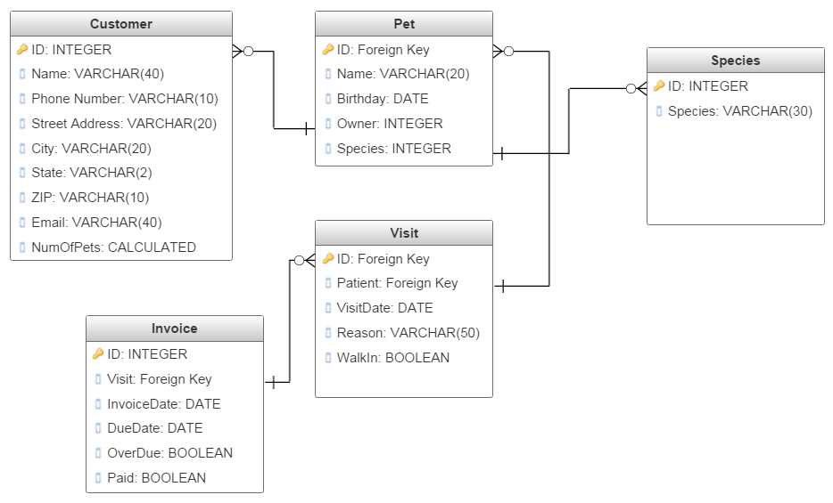

# Database Tools and Queries

A database is only as good as its tools for organizing, searching, and sorting its tables. In 1876, a man named Melvil Dewey built a system for organizing books and cataloguing them in a collection with index cards and codes. Today, this system is called the _Dewey Decimal System_ and it is the basis for all library databases today, digital or otherwise. The reason the Dewey Decimal System was so popular was how easy it was to implement and reference. As long as a librarian keeps books where they belong and stay on top of organization, a library is the ultimate research tool. This remains true today.

For the following tutorials, we will add two more tables, and then build a series of queries for searching and sorting the database. First, let's re=think our table relationships. We need to have a system for keeping track of patient visits and billing for those visits. So we'll put together a table for visits and a table for invoices. This is complicated because the relationship between pets/patients and visits will be a one-to-many relationship. However, there will only ever be one invoice per visit, so that will be a one-to-one relationship.  Here's our new class relationship diagram:

## Just Two More Tables

If your database has been compromised in some way, you can download an in-progress version [here](vet3_start.accdb) (Righ-click and press **Save link as...**).

First, create a table called **Visit** with the following design in your database. Don't worry about populating it with data. That will be supplied for you.

| Field Name | Data Type  | Description | Field Properties                       |
|------------|------------|-------------|----------------------------------------|
| ID         | AutoNumber | Primary Key |                                        |
| PatientID  | Number     | Foreign Key | Caption: Patient ID                    |
| VisitDate  | Date       |             | Caption: Visit Date, Format: Short Date |
| Reason     | Short Text |             |                                        |
| WalkIn     | Yes/No     |             | Caption: Walk-in?                      |

Second, create a table called **Invoice** with the following desgin in your database. Again, the data will be provided for you.

| Field Name | Data Type  | Description | Field Properties                        |
|------------|------------|-------------|-----------------------------------------|
| ID         | AutoNumber | Primary Key |                                         |
| VisitID    | Number     | Foreign Key | Caption: Visit ID                       |
| VisitDate  | Date       |             | Caption: Visit Date, Format: Short Date |
| DueDate    | Date       |             | Caption Due Date, Format: Short Date    |
| Overdue    | Yes/No     |             | Caption: Is Overdue?                    |
| Paid       | Yes/No     |             | Caption: Is Paid?                       |

Now let's populate them with some data.

_To Be Continued..._
