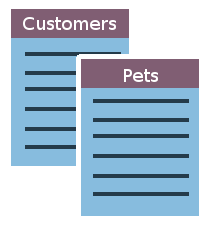
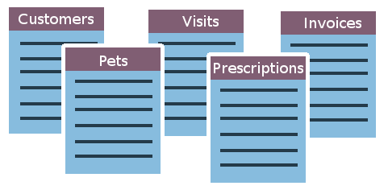
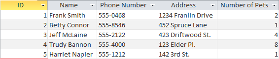
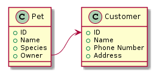

# Database Fundamentals

Microsoft Access is a database management system from Microsoft. It combines two important tools to create a unified application. Behind the scenes it has a database [engine](https://en.wikipedia.org/wiki/Software_engine) called Microsoft JET Engine (of course), which is a database framework for storing, retrieving, and changing data. The engine, as its name implies, is what's under the hood of Microsoft Access. On top of the engine, Access has a sophisticated user interface which allows interacting with the database in an intuitive way.

## What is a database?

A **database** is a collection of data stored in a computer system. You have probably seen them many times. If you go to the doctor's office, you'll notice that the doctor takes notes on a computer. All of that information is being stored in a database so that the next time you come back, it will still be there, nice and organized, so that any nurse, other doctor, or receptionist will be able to quickly and accurately reference your information. This prevents mistakes, miscommunications, or worse. You may have used one as well if you've ever worked retail. Ever had to look up an item on a computer to see if it was in stock? You're referencing a database.

A database, at its most fundamental, is a collection of **tables**. A table is basically just a list. For example, in the doctor's office, there is a list of patient contact data. When you walk in to the doctor's office and see the receptionist, they will ask you for your last name and date of birth and will look up your entry in the database from that information. It pulls your information from a massive list of patients. What other lists of information might a medical database include?

It might have lists of contact information, lists of past appointments and notes about them, lists of immunization records. A mature and much used database might have many more lists, all cross-referenced, and easily searchable to find exactly what you're looking for.

So let's say you're a veterinarian and all of your information is stored in stacks of notebooks. You decide to modernize and so you want to start building up a database of information so it's easier to reference information, treat pets, and, most importantly, bill customers! What sorts of lists might you need? First, you'll need a list of customer information. And then you'll need a list of their pets. Once you put these two lists together, you're well on your way to building a database!

As your business grows, so will your lists, and so will the *number* of lists. Your database itself will become more complex.

In Access, a list is a little more complex than just your grocery list -- though even these days, some people store their grocery lists *in* a database. Access stores these lists in a special type of data structure called a **table**. Consider the following **Customer** table for our veterinarian.

The resemblance to Excel should be obvious, but there are a few key differences. Notice that the columns have actual names rather than column letters. And the rows are identified by an *ID* number -- called a **Primary Key** -- rather than a row number. In fact, an Excel spreadsheet *is* a database of a sort. However, as we shall see, **Access** gives us a much different set of tools for how we access and manipulate that data.

## Why not just use a spreadsheet?

The fact of the matter is, for many smaller applications, a spreadsheet works great. In fact, it excels at handling *numerical* data. For manipulating numbers and building relationships between them, there is no better tool than Excel and, indeed, there are many ways in which Access and Excel can be made to work together!  However, a database is far more powerful when it comes to manipulating *non-numerical* data (i.e. text). Any database software will have sophisticated algorithms that allow for easy sorting, searching, and analysis of text data.

The thing that really sets it apart, though, is the way you can build *relationships* between different **tables** (lists). Access utilizes what we call a **relational database**. With a relational database, we can build connections between tables in ways that are very difficult with a traditional spreadsheet.

For an example, let's look at the veterinarian database again. You want to organize all of your data using tables, but with a table for pets and a table for customers, you need a way to connect the two together. So each pet needs an owner. On a conceptual level, this is what our tables should look like:

We want to build a relation between our customer table and our pet table. More specifically, in each entry in the **Pet** table, there will now be a column or *field* which represents the owner of the pet.

Let's say we want to create another table for **Office Visits**. This table would probably need to have a relation to the **Pet** table, so that each office visit would involve some pet, and then, by relation, the owner of the pet.

In the other tutorials in this chapter, you will learn the basic building blocks of an Access database: **Tables**, **Forms**, **Queries**, and **Reports**. Along the way, you will pick up some of the philosophy behind databases and what they are for.
